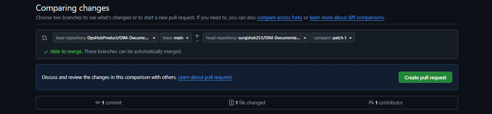
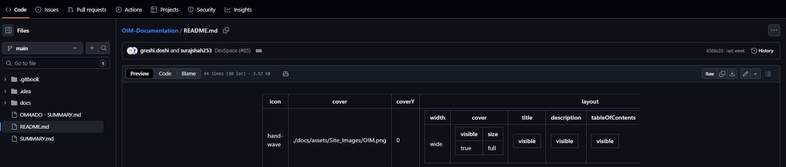
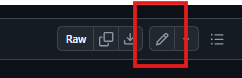
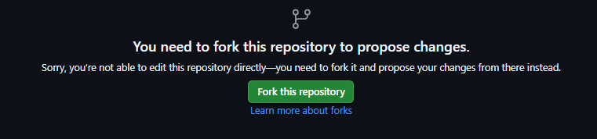
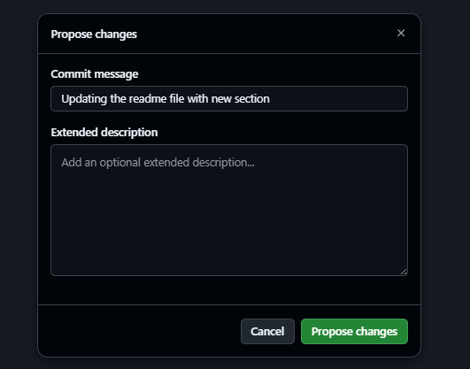

# Industry-Standard Fork → Edit → PR Workflow
- This repository is public, and **no contributor has direct write access**.
- All contributions must follow the **Fork → Edit → Commit → Pull Request** workflow.
- This ensures security, review quality, and governance — matching the standards used by large open-source foundations and enterprise GitHub projects.

# ⚠️ Public Repository Rules
- Because this is a **public repository**:
    - Anyone can **view**, **fork**, or **clone** the repository.
    - **No one** (including internal OpsHub members) can push directly.
    - All changes must come through a **Pull Request (PR)**.
    - Never commit or upload:
        - passwords, API keys, tokens
        - customer data
        - server URLs or internal IPs
        - proprietary or confidential information
    - Every change is reviewed before merging.

# 🚀 How to Contribute
- There are **two supported methods** — both are industry standard.

## 1️⃣ Standard Git Contribution Workflow (Recommended)

### Step 1: Fork the Repository
Click **Fork** on the top-right of the GitHub page.

### Step 2: Clone Your Fork
```bash
git clone https://github.com/<your-username>/OIM-Documentation.git
cd OIM-Documentation
```

### Step 3: Add the Upstream Remote

```bash
git remote add upstream https://github.com/OpsHubProduct/OIM-Documentation.git
```

### Step 4: Create a Working Branch

```bash
git checkout -b feature-your-change
```

### Step 5: Make Documentation Changes

Edit `.md` files using your preferred editor (e.g., VS Code, IntelliJ).

### Step 6: Commit Your Changes

```bash
git add .
git commit -m "Update: improved documentation for XYZ section"
```

### Step 7: Push Your Branch

```bash
git push origin feature-your-change
```

### Step 8: Open a Pull Request

1. Go to **your fork** on GitHub.
2. Click **Compare & Pull Request**.
  <p align="center">
  
  </p>
3. Set:
    - Base branch → **DevSpace**
    - Compare branch → **your branch**
4. Submit the PR for review.


## 2️⃣ Contribute Using GitHub UI (No Git Required)
- Even without Git, GitHub will automatically:
    - Create a **fork** for you
    - Allow editing the file in the browser
    - Commit changes to your fork
    - Prompt you to open a Pull Request

### Steps (UI Contribution)

1. Open the file you want to edit on GitHub.
  <p align="center">
  
  </p>
2. Click **Edit (✏️)**.
  <p align="center">
  
  </p>
3. GitHub will show: **“You don’t have write access, so we created a fork for you.”**
  <p align="center">
  
  </p>
4. Make edits.<br>
5. Add a commit message.
  <p align="center">
  
  </p>
6. Commit changes.<br>
7. Click **Create Pull Request** when prompted.
  <p align="center">
  
  </p>


# 🔁 Keeping Your Fork Updated

Before starting new work, sync your fork:

```bash
git fetch upstream
git checkout DevSpace
git merge upstream/DevSpace
git push origin DevSpace
```

# 📝 Pull Request Review Process

- Reviewer checks content, formatting, and structure.
- Reviewer may request changes.
- Update your branch → PR updates automatically.
- Reviewer merges PR once approved.


You are now ready to contribute professionally using open-source industry standards! 🚀