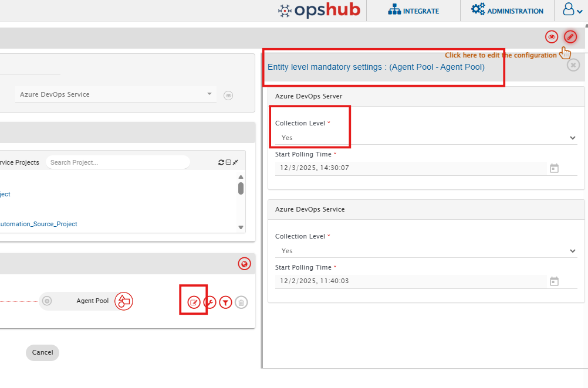

**Common**
* Impersonation is not supported due to TFS/ADO API limitation.
* These artifacts do not have history, attachment, comments and inline image, as they will not be synced.

**Entity Specific:**
Following are the limitations and behaviors specific to the individual entities in addition to the common:

**Agent Pool Entity**

**Known Behaviour and Limitations:**
* By default, <code class="expression">space.vars.SITENAME</code> synchronizes project-level Agent Pools [the collection level pools which are associated with projects].
* To synchronize collection-level Agent Pools as well, set the “Collection Level” option to Yes, at the integration of Agent Pool as shown in the below image:
  

    
  

* When this option is enabled, both project-level and collection-level Agent Pools will be synchronized.

**Service Connection Entity**

**Known Behaviour and Limitations:**
* After a successful synchronization of the Service Connection, you need to enter the password manually in the target project as Microsoft API does not expose this sensitive data due to security concerns.
* Service Connections of type **Azure Resource Manager** cannot be synchronized from **Azure DevOps Services** to **Azure DevOps Server**.
  * Reason: There is a template mismatch in Azure Resource Manager between Azure DevOps Services (cloud) and Azure DevOps Server (TFS). Due to these template differences and API limitations, this service connection will not be synced from ADO Cloud to TFS.

**Variable Group Entity**

**Known Behaviour and Limitations:**
* Variable Groups of type **Azure Key Vault** will not be synchronized from **Azure DevOps Services (Cloud)** to **Azure DevOps Server (TFS)**.
    * Reason: Azure Key Vault–based Variable Groups require a reference to a Service Connection of type **Azure Resource Manager**. Since this type of Service Connection will not be synchronized from Azure DevOps(Cloud) to TFS, the associated Variable   Groups also cannot be synchronized.

