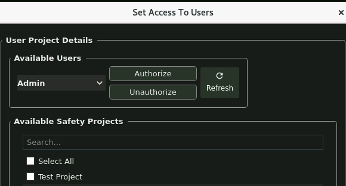
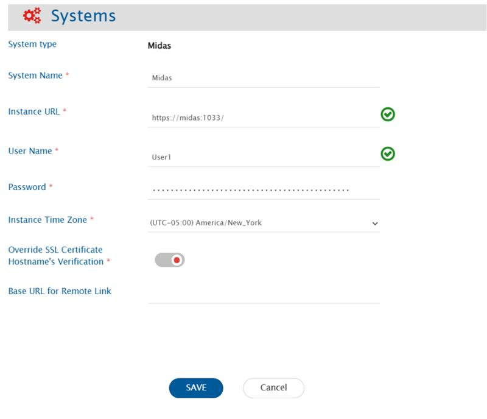
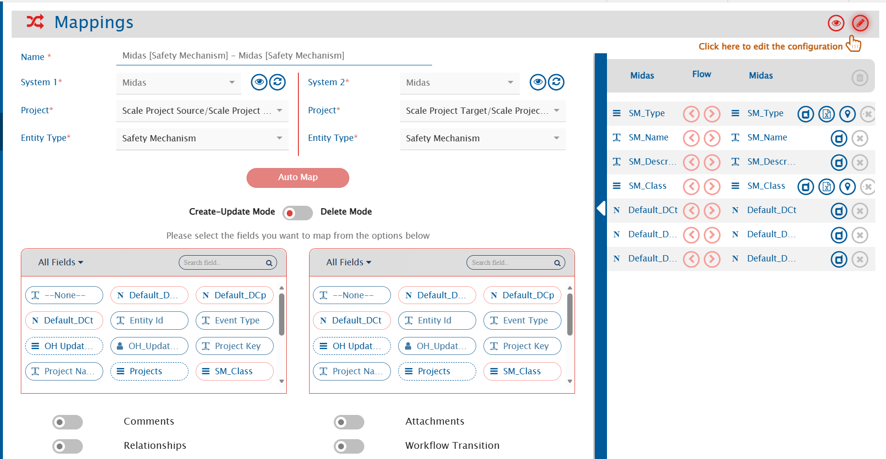
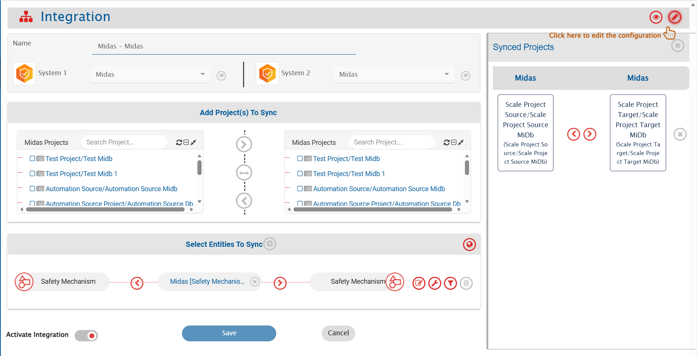

## Pre-requisites

### User Privileges
- Create a dedicated user in Midas for <code class="expression">space.vars.SITENAME</code>.
- The user must have access to the project to be synchronized.
- The user must have **Safety Project Level permission**[Refer to the image below. Click on the user name, then select the list of available projects, and finally click on "Authorize."]
- <p align="center">
  
</p>


# System Configuration

Before you continue with the integration, you must first configure the Midas system in <code class="expression">space.vars.SITENAME</code>.

Click **System Configuration** to learn the step-by-step process to configure a system.

Here's the screenshot:
<p align="center">
  
</p>
---

## Midas System Form Details

| Field Name | When Field is Visible | Description                                                                                                                                                                                                                                                                                                                                                                        |
|------------|--------------------|------------------------------------------------------------------------------------------------------------------------------------------------------------------------------------------------------------------------------------------------------------------------------------------------------------------------------------------------------------------------------------|
| **System Name** | Always | Provide a unique name for the Midas system.                                                                                                                                                                                                                                                                                                                                        |
| **Instance URL** | Always | Provide the Server URL of the Midas instance. This URL will be used for communicating with the Midas API. Format: [https://serverIP:port](https://serverIP:port)                                                                                                                                                                                                                   
| **User Name** | Always | Provide the username of a dedicated user that will be used for communicating with Midas API. This user should have the required privileges to use the Midas API. For more details, refer to the Midas documentation.                                                                                                                                                               |
| **Password** | Always | Provide the password for the user given in Midas User Name field.                                                                                                                                                                                                                                                                                                                  |
| **Instance Time Zone** | Always | Provide the timezone of your Midas instance by running "timedatectl" or "cat /etc/timezone" in the terminal of the system where Midas is installed.                                                                                                                                                                                                                                |
| **Override SSL Certificate Hostname Verification** | Always | The HTTPS certificate of Midas server often contains different Common Name (CN) and Hostname that can create conflicts in hostname verification. Enable this input if a conflict exists.If input is disabled, generate a certificate on the Midas server and add it. Refer to [Steps to upload the server certificate:](Midas.md#steps-to-upload-the-server-certificate) section . |


---

## Mapping Configuration

Map the fields between Midas and the other system to ensure that the data synchronizes correctly.

Click **Mapping Configuration** to learn the step-by-step process to configure mapping between the systems.
<p align="center">
  
</p>
---

## Integration Configuration

Set a time to synchronize data between Midas and the other system. Define parameters and conditions, if any, for integration.

Refer to **Integration Configuration** for step-by-step instructions.
<p align="center">
  
</p>

---

## Criteria Configuration

Specify conditions for synchronizing an entity between Midas and the other system using criteria configuration.

- Midas supports criteria for fields such as `SM_Type`, `SM_Class`, `SM_Name`, `User`, and `Date`.
- Example: `SM_Type=DMR`, `SM_Class=HW`, `SM_NAME=DEMO`,`User=admin`,`updated_after=2025-11-04T02:20:13-05:00`.

---

## Known Behaviors/Limitations

- Remote Links are not supported in Midas.
  - **Reason**: It does not have any web interface.
- Only **Logical Delete** is supported.
  - **Reason**: There is no concept of recycle bin / trash in Midas where deleted items can be restored.
- Limitation in End System Criteria/Target Lookup Support:
    Custom fields cannot be created in Midas, and there are only limited text-type system fields (such as Name and Description). Filter is possible only with the NAME field.


# Appendix

## **Steps to upload the server certificate:**

- Here are the steps:
```bash
# Switch to server directory
cd Midas_Latest/usr/bin/multiuserserver/

# Shutdown the server
./shutdown_db.sh

# Switch to certificates directory
cd certificates/

# Generate new certificate
openssl req -x509 -newkey rsa:4096 -keyout key.pem -out cert.pem -days 365 -nodes -subj "/C=US/O=opshub/CN=opshub-midas" -addext "subjectAltName=DNS:opshub-midas"

# Verify certificate
openssl x509 -in cert.pem -text -noout

# Restart the system
sudo reboot

# Switch to server directory again
cd Midas_Latest/usr/bin/multiuserserver/

# Run the server
./run.sh
```
