v# Prerequisites

## User Privileges

* Create one user for CA Service Desk Manager, dedicated to integration. User should not be used to do any operations from CA Service Desk Manager's user interface.
* User must have administrator-level access to access the REST web-services API. Refer to [Get Access Roles in CA Service Desk Manager](#get-access-roles-in-ca-service-desk-manager) section for details on how to view available user access roles in CA Service Desk Manager. 
* User must set User Id field on CA Service Desk Manager for user synchronization.

# System Configuration

Before you continue to the integration, you must first configure CA Service Desk Manager.
Click [System Configuration](../integrate/system-configuration.md) to learn the step-by-step process to configure a system.
Refer the screenshot given below for reference.

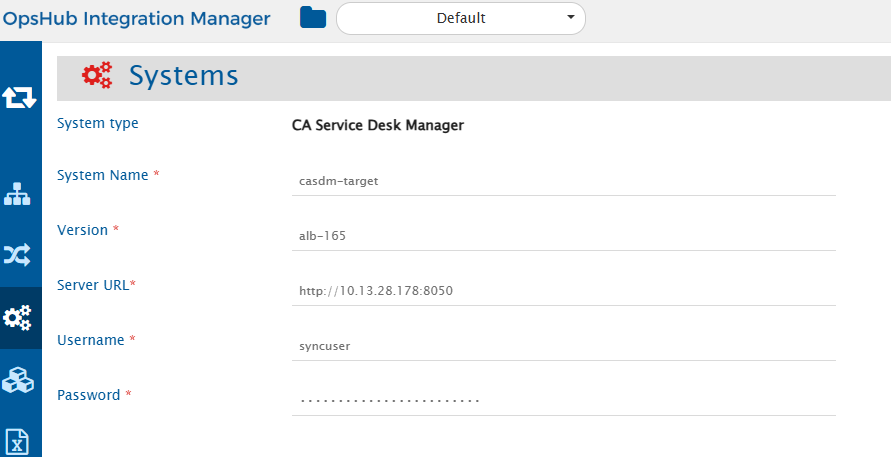

If the system is deployed on HTTPS and a self-signed certificate is used, then you will have to import the SSL Certificate to be able to access the system from <code class="expression">space.vars.SITENAME</code>. Click [Import SSL Certificates](../getting-started/ssl-certificate-configuration.md) to learn how to import SSL certificate.

## CA Service Desk Manager System Form Details

| Field Name           | Field Visibility | Description                                                                                                                                                                                                                                                                                                                                                                                                                                                                                                                                                                                                    |
|----------------------|------------------|----------------------------------------------------------------------------------------------------------------------------------------------------------------------------------------------------------------------------------------------------------------------------------------------------------------------------------------------------------------------------------------------------------------------------------------------------------------------------------------------------------------------------------------------------------------------------------------------------------------|
| **System Name**      | Always           | Provide a unique name for the CA Service Desk Manager.                                                                                                                                                                                                                                                                                                                                                                                                                                                                                                                                                  |
| **Version**      | Always           | Provide a version name for the CA Service Desk Manager. Refer to [Get CA Service Desk Manager Version](#get-ca-service-desk-manager-version) section for details on finding the CA Service Desk Manager version.                                                                                                                                                                                                                                                                                                                                                                                                                                                                                                                                                |
| **Server URL**       | Always           | Provide REST API Server URL of the CA Service Desk Manager instance. This URL will be used for communicating with end system. The format of the URL would be:  http://[your_domain_name]:8050/.                                                                                                                                                                                                                                                                                                                                                                                        |
| **Username**       | Always           | Provide the username of the CA Service Desk Manager user dedicated to OpsHub Integration Manager. This user should not be used for any other operations from the system's user interface and must have the Analyst privilege to use the REST APIs to access data in CA Service Desk Manager.                                                                                                                                                                                                                                                                                                       |
| **Password**        | Always           | Provide the Password for the user specified in the "Username" field.                                                                                                                                                                                                                                                                                                                       |                                                                                                                                                                                                                                                                                                                  |

# Mapping Configuration

In this step, map the fields between CA Service Desk Manager and the other system to be integrated to ensure that the data between both the systems synchronizes correctly.
Click [Mapping Configuration](../integrate/mapping-configuration.md) to learn the step-by-step process to configure mapping between the systems.

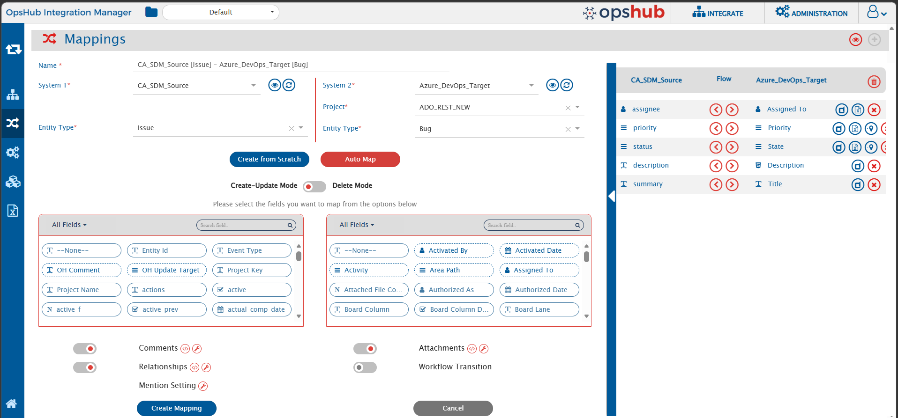

# Integration Configuration

In this step, set a time to synchronize data between CA Service Desk Manager and the other system to be integrated. Also, define parameters and conditions, if any, for integration.
Click [Integration Configuration](../integrate/integration-configuration.md) to learn the step-by-step process to configure integration between two systems.

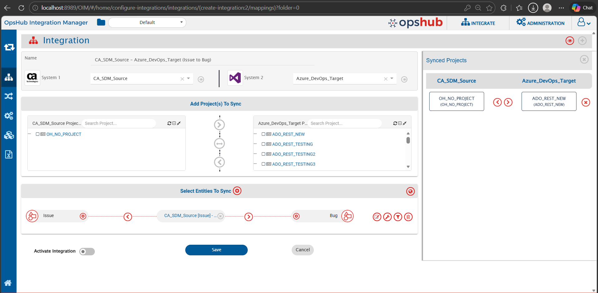

# Criteria Configuration

If you want to specify conditions for synchronizing an entity between CA Service Desk Manager and the other system to be integrated, you can use the **Criteria Configuration** feature.
To configure criteria in CA Service Desk Manager, integration needs to be created with CA Service Desk Manager as the source system.

**Query Format:**
`Fieldname = 'value'`

**Sample Queries:**

* Polling all projects with status set to Acknowledged
    * User can view the status list of Request/ Incident/ Problem by Administration -> Service Desk -> Requests/Incidents/Problems -> Status.

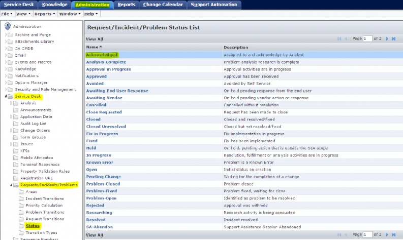

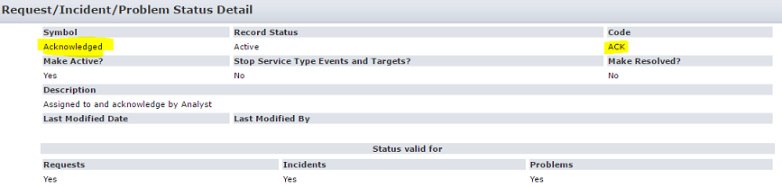

* Polling all projects with Areas set to Applications
  * For example, (Areas='Active') where Active = Record Status for symbol "Applications" User can view the Areas list of Request/Incident/Problem by Administration -> Service Desk -> Requests/Incidents/Problems -> Areas

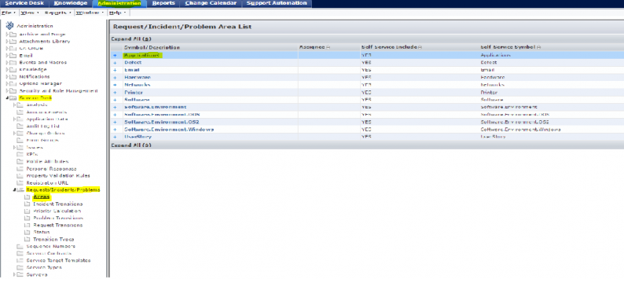

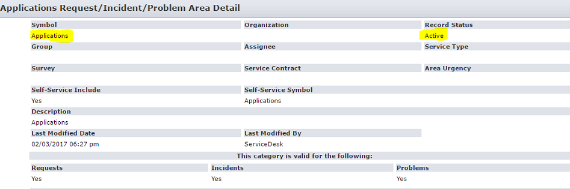

Go to the Criteria Configuration section on the [Integration Configuration](../integrate/integration-configuration.md) page to learn more.

## CA Service Desk Manager Criteria Examples

| Field name | Field internal name | Criteria description                               | Criteria snippet        |
|------------|---------------------|----------------------------------------------------|-------------------------|
| summary    | summary             | Sync items where summary equals “sampleSummary”    | summary='sampleSummary' |
| status     | status              | Sync items where status is open                    | status='OP'             |
| id         | id                  | Sync items where internal id is greater than or equal to 54321 and less than 54400 | id>='54321 & id<'54400'             |
| ref_num    | ref_num             | Sync items where ref_num is equal to 1001          | ref_num='1001'          |

* For status, we need to provide the code of the status that we want to set in criteria call. Refer to [Get Status Codes for Criteria](#get-status-codes-for-criteria) section for details.
* For id, it refers to the internal id of the entities in the end-system. 
* The ref_num refers to the display id of the entities that is visible from the UI, for entity types: Incident, Problems, Requests, Issue. For Change Order entity type, use 'chg_ref_num' instead.

# Known Limitations

* For synchronizing comments from CA Service Desk Manager to other systems, an additional entity update from the UI is required when comments are added via API.
  * Reason: Adding or updating a comment through the API does not update the “last modified time” of the entity in the end system.
  * If comments are added directly from the UI, no additional update is required.
* Special characters are not supported in CA Service Desk Manager for attachment file name. 
  * If the attachment file name contains this file name characters !,@,#,$,^,&,(,),%,😅 or non-ascii characters like (样,品,テ,ス,ト,フ,ァ,イ,ル,★,✓,♛,Ω), then the file will not be added in CA Service Desk Manager. Consequently, the user will encounter a Processing Failure. To avoid this Processing Failure, it is recommended to use the valid file naming conventions.
  * Additionally, if the user still wants to synchronize attachments having this file name characters, then the user needs to add advance mapping for attachments to replace special characters with any of the supported characters. Refer [Attachment naming convention related errors](../help-center/troubleshooting/errors/common/attachment-naming-convention-related-errors.md)
* Link type attachments are not supported in CA Service Desk Manager. These types of attachments need to be skipped by using appropriate advance mapping.
* If other complex objects are created in CA Service Desk Manager schema, these complex objects are also displayed as text field at field mapping.

# Appendix

## Get Access Roles in CA Service Desk Manager
Below are the steps to find the available access roles for users in CA Service Desk Manager:

1. Log in to your CA Service Desk account and navigate to the Administration Section.

2. Select the 'Security and Role Management' option from the sidebar.

3. Select the 'Access Types' option under the above section. This will provide you with a list of all available access types available to be assigned to the user.

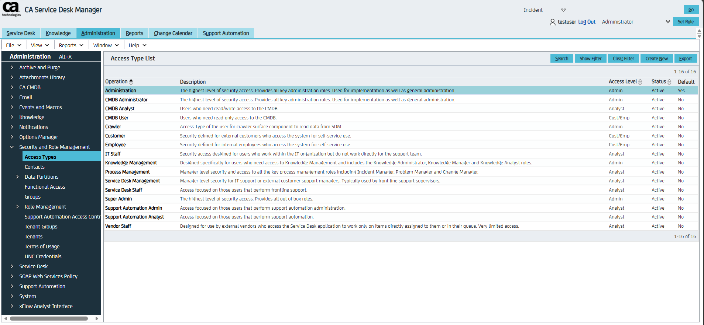

## Get CA Service Desk Manager Version
Below are the steps to find the version of your CA Service Desk Manager instance:

1. Log in to your CA Service Desk account and navigate to the Administration Section.

2. Select the 'Help' option from the navigation bar to show its options. 

3. Select the 'About...' option. This will open a new pane same as below, which will have all your details regarding the deployed instance, including the version of the instance.

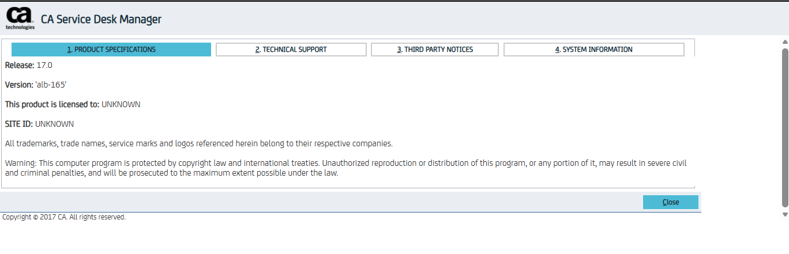

## Get Status Codes for Criteria
Below are the steps to find the status code of a status that you want to provide in criteria call:
1. Log in to your CA Service Desk account and navigate to the Administration Section.

2. Select the 'Service Desk' option from the sidebar.

3. Select the desired entity type for which you want the status code. The Requests, Problems and Incidents are configured as one section under 'Requests/Incidents/Problems' and Issues and Change Orders have their individual options.

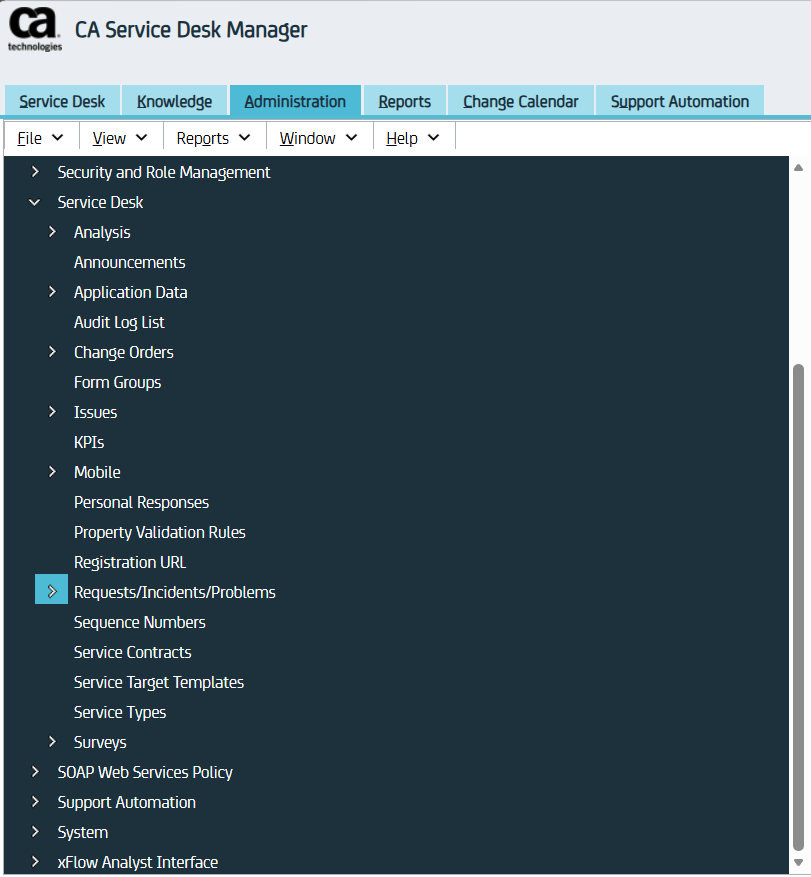

4. Once the entity type is selected, click on the 'Status' section. This will show all the status available to be set.

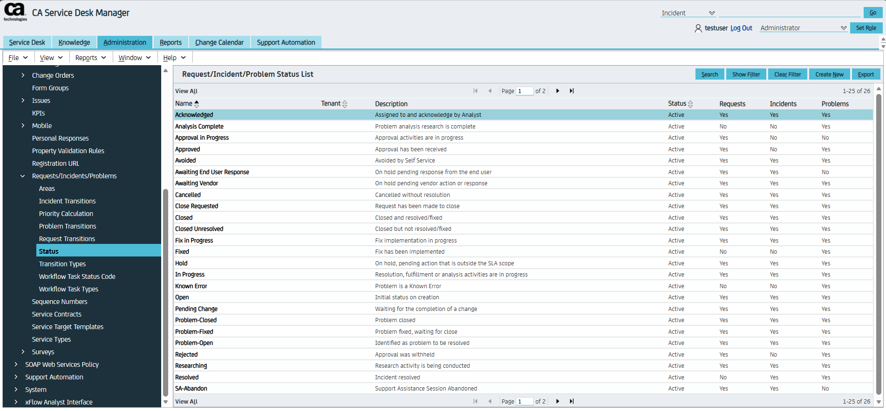

5. Select the status for which you want the status code, which will open the info pane from which you can get the status code under the 'Code' option.

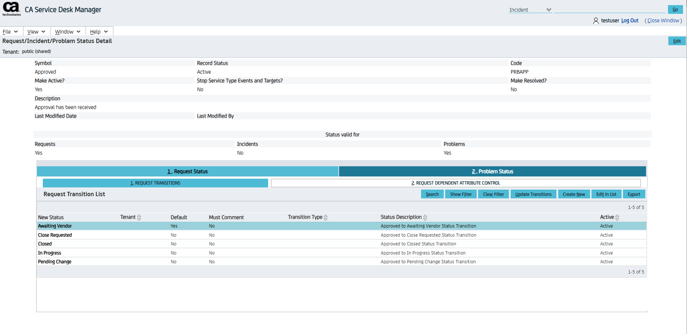

