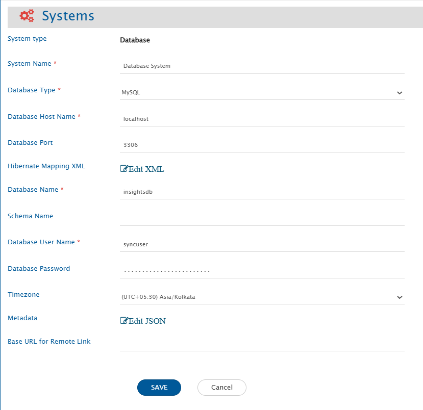
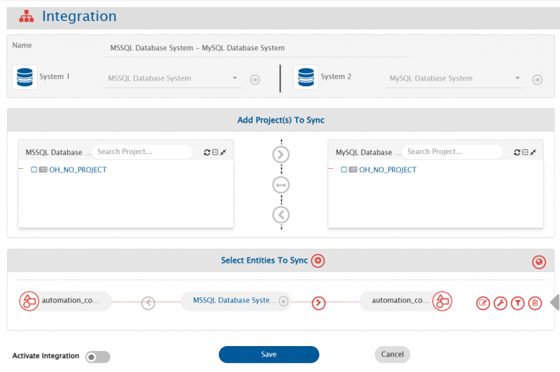

# Prerequisites

## Integration user
- A dedicated user should be created for the database integration. This user must have read and write access on the database table and read access on the view that needs to be integrated.  
- This user should not be used to perform any other operations on the database.

## When database integration is required to communicate to a new database server
If a database system is needed to be integrated with a database type other than the type of database on which <code class="expression">space.vars.SITENAME</code> is deployed, follow the steps given below:
- Download the required database driver on which new database connection is to be created. Refer [this](Installation_Prerequisites#Download-Database-Connector-jar) to get the link of database connector jar.
- Stop the <code class="expression">space.vars.SITENAME</code>.
- Copy the downloaded driver into `Opshub installation directory]\OpsHubServer\lib` folder.
- Start <code class="expression">space.vars.SITENAME</code>.

## Fields requirement
- **Primary-key**: There must be a primary key field or a field which doesn't allow duplicate or null values.
- **Updated Time**: There should be a datetime or timestamp column storing last updated time of the record. It is mandatory to have this column when using database system at source side of integration. However, this column is optional when using database system at target side of integration.
- **Created Time**: It is required when bi-directional sync needs to be performed using the database system. There should be a datetime or timestamp column storing the time of creation of the record. However, this column is optional in all the scenarios other than the bi-directional sync scenario.
- **Created/Updated By (Optional)**: A column to store the username of the person who created or last updated the record.
- **OH_Last_Update (Optional)**: A text column to store required information for the recovery.

> **Note**: The columns storing "created/updated by" and "OH_Last_Update" are required by <code class="expression">space.vars.SITENAME</code> to ensure smooth data synchronization, especially if something goes wrong during the sync process.  
> Without these columns, during the synchronization, all record field values are compared with the existing values, which is inefficient.

# System Configuration
- Before you start the integration configuration, you must first configure database system.  
- Click [System Configuration](../integrate/system-configuration.md) to learn the step-by-step process to configure a system.

Here is the screenshot: 
 
<p align="center">
  
</p>


## Database System form details

| **Field Name**            | **Description**                                                                                                                                                                                                                                                                                       |
|---------------------------|-------------------------------------------------------------------------------------------------------------------------------------------------------------------------------------------------------------------------------------------------------------------------------------------------------|
| **System Name**           | Provide the system's name                                                                                                                                                                                                                                                                             |
| **Database Type**         | Select the database type for which you want to create a new database system. Currently supported databases are: 1. MySQL 2. MS SQL Server/Azure SQL 3. Oracle 4. PostgreSQL 5. MariaDB                                                                                                                |
| **Database Host Name**    | The name of the host machine where the database server is deployed                                                                                                                                                                                                                                    |
| **Database Port**         | Port number on which database server is deployed. Generally, default ports for MySQL/MariaDB is 3306, MS SQL Server/Azure SQL is 1433, Oracle is 1521, and PostgreSQL is 5432                                                                                                                         |
| **Instance Name**         | Instance name of the MS SQL Server/Azure SQL, if it is a named instance. Applicable to MS SQL Server only                                                                                                                                                                                             |
| **Database Name**         | Name of the database to connect with                                                                                                                                                                                                                                                                  |
| **Schema Name**           | Default schema of the database to connect with. Mandatory for MS SQL Server/Azure SQL and PostgreSQL                                                                                                                                                                                                  |
| **Database User Name**    | Provide the user name of a dedicated user that will be used for communicating with database. User should have the read and write permission on database                                                                                                                                               |
| **Database Password**     | Provide the password for the user provided in Database User Name                                                                                                                                                                                                                                      |
| **Timezone**              | Select the timezone for date and time values. If not selected, UTC timezone will be considered by default                                                                                                                                                                                             |
| **Hibernate Mapping XML** | XML mapping required to map the columns of database table with some properties. For more details, refer to [Understanding Hibernate XML Input](#understanding-hibernate-xml-input) section.                                                                                                           |
| **Metadata**              | Provide Json to configure links, comments, attachments, extra fields, or overwrite metadata for fields mentioned in [HBM](#understanding-hibernate-xml-input). Refer to the [Understanding Metadata JSON Input](#understanding-metadata-json-input) section for details on format and JSON structure. |

## Understanding Hibernate XML Input

- This is hibernate XML mapping for tables in which data needs to be integrated. If multiple tables need to be integrated then add one class element for each table in this input widget.
- The tables that are mapped in hibernate mapping XML will be visible in mapping and integration screens.
- Properties that are mapped with column names of table will be visible as fields.
- The column name of primary column can be anything but the property name must be `id`.
- If no value needs to be mapped with the ID column and an auto-generated value is to be added to it, the generator class can be set to either `'identity'` or `'native'`. These options are preferred over `'increment'` when multiple integrations are writing to the same table. The data type of the ID column must be an integer or another suitable type for auto-generation.

  **Generator Options and Database Compatibility**:

  | Generator   | Compatible Databases                     | Description                                                                                   |
  |-------------|------------------------------------------|-----------------------------------------------------------------------------------------------|
  | `identity`  | MySQL, MS SQL Server, PostgreSQL         | Uses the database's auto-increment or identity column feature.                                |
  | `native`    | MySQL, MS SQL Server, PostgreSQL, Oracle | Automatically selects the best strategy for the database being used.                          |
  | `increment` | All                                      | Hibernate-managed increment. Not recommended for multiple integrations writing to same table. |

  **Example**:
```xml
<id name="id" type="integer">
    <column name="sr_no"/>
    <generator class="identity"/>
</id>
```
* The column in the table which stores time of the last update on the record needs to be mapped with the 'updated_time' property. It is optional when there is no need to read data using database system.
* The column in the table which stores time of the creation of the record needs to be mapped with 'created_time' property. It is required only when bi-directional sync needs to be set-up for the database system.
* For the efficient recovery, the following columns need to be mapped correctly:
  * There should be a column in the table to store username of user who created or last updated that record. This column needs to be mapped with created_updated_by property. The data type for created_updated_by field should be varchar(100).
  * There should be a column in the table that needs to be mapped with OH_Last_Update property. The data type for OH_Last_Update field should be varchar(100).
* Here is the sample Hibernate XML:
```xml
<?xml version="1.0"?>
<!DOCTYPE hibernate-mapping PUBLIC "-//Hibernate/Hibernate Mapping DTD 3.0//EN" "http://www.hibernate.org/dtd/hibernate-mapping-3.0.dtd">
<hibernate-mapping>
  <class entity-name="automation_commit_details" table="automation_commit_details">
    <id name="x_oh_uuid" type="string">
      <column name="x_oh_uuid"/>
    </id>
    <property name="event_uuid" column="event_uuid" type="string" />
    <property name="oh_system_id" column="oh_system_id" type="integer" />
    <property name="commit_id" column="commit_id" type="string" />
    <property name="commit_time" column="commit_time" type="timestamp" />
    <property name="author_email" column="author_email" type="string" />
    <property name="committer_email" column="committer_email" type="string" />
    <property name="reviewer" column="reviewer" type="string" />
    <property name="oh_commit_type" column="oh_commit_type" type="string" />
    <property name="commit_message" column="commit_message" type="string" />
    <property name="entity_id" column="entity_id" type="string" />
    <property name="created_time" column="created_time" type="timestamp" />
    <property name="updated_time" column="updated_time" type="timestamp" />
    <property name="created_updated_by" column="created_updated_by" type="string" />
    <property name="OH_Last_Update" column="OH_Last_Update" type="string" />
  </class>
</hibernate-mapping>
```
* <code class="expression">space.vars.SITENAME</code> supports history via OH_History field using history-tracking table (OH_History). Refer to [OH_History Table](#oh_history-table) for configuration steps.
  * This table can store **field-wise revision history** for the entity.
  * For each field change in each revision, a new record would be stored capturing:
    - which field changed
    - the old and new values
    - the revision number
    - who changed it
    - when it was changed
* <code class="expression">space.vars.SITENAME</code> supports virtual field storage in additional table (OH_Additional_Fields). Refer to [OH_Additional_Fields Table](#oh_additional_fields-table) for configuration steps.
  * This table stores **user-defined or dynamically added fields** that are not part of the main table.
  * Each additional field is stored as a separate row with:
    - workitem_id
    - workitem_type
    - field_id (field name)
    - field_data_type
    - field_value
  * This allows systems to add extra fields without modifying the core table structure.

## Understanding Metadata JSON Input

* You can provide metadata for complex data types, such as links, comments, and attachments associated with a record, in JSON format here.

An example input for the metadata JSON:



* User can configure extra field or overwrite metadata for fields mentioned in HBM using additionalMeta input. Refer to [Field JSON Configuration](#json-configuration) for more details.

# Mapping Configuration

* Map the fields between the database and the other system to be integrated to ensure that the data between both the systems synchronize correctly.  
* Refer to [Mapping Configuration](../integrate/mapping-integration.md) page to learn the step-by-step process to configure mapping between the systems.
* <code class="expression">space.vars.SITENAME</code> supports storing audits using OH_History field using history-tracking tabl. Refer to [OH_History Table Mapping Configuration](#mapping-configuration-1).
* <code class="expression">space.vars.SITENAME</code> supports storing extra fields without modifying the table structure. Refer to [Additional field configuration](#json-configuration) for configuration steps.
  * These configured fields will be available for mapping once configured.
## Inline File Support
* Prerequisite: Configure the attachment table and ensure attachment configuration is enabled.
* Inline files are supported for both read and write operations. It is supported for fields with data type `text`, `html` or `wiki`. Refer to [Field JSON Configuration](#json-configuration) to understand how to configure field's data type.
* <code class="expression">space.vars.SITENAME</code> stores image references in following URI template `file:/{attachmentIdColumn value}` where `{attachmentIdColumn value}` is the id of the record in the attachment table.
Examples:
```html

```
```wiki
!Example image.png!
```

* Here is the screenshot:  

<p align="center">
  
</p>


> **Note** Field having foreign key constraint will be shown as Reference type of field. It should contain valid ID value of the table it refers to.  
>
> **Note** Workflow Transition is not applicable for database connector.

# Integration Configuration

* In this step, set a time to synchronize data between the database and the other system to be integrated. Also, define parameters and conditions, if any, for integration.  
* Refer to [Integration Configuration](../integrate/integration-configuration.md) page to learn the step-by-step process to configure integration between two systems.

Here is the screenshot:  

<p align="center">
  
</p>


## Criteria Configuration

* If the user wants to specify conditions for synchronizing an entity from database as source system to the other system, the criteria must be configured. Navigate to [Integration Configuration → Criteria Configuration](../integrate/integration-configuration.md#criteria-configuration) section on [Integration Configuration](../integrate/integration-configuration.md) page to learn in detail about Criteria Configuration.  

* Set the query as per database supported query format. Criteria is applicable to any column in table. Only the where clause part of the SQL query is supported.

**Criteria query samples**

| Field Name   | Criteria query usecase                                      | Snippet                             |
|--------------|-------------------------------------------------------------|-------------------------------------|
| order_value  | Need to fetch only those records having order_value > 5000  | `order_value > 5000`                |
| order_status | Need to fetch only those records having status = 'Active'   | `order_status = 'Active'`           |
| order_date   | Fetch only records where order_date is after a date         | `order_date >= '2024-08-15 12:00:00'` <br> Here datetime format needs to be same as the format of the field |

> Here datetime format needs to be same as the format of the field.

* User can also add composite query consisting of more than one columns. For example:  
  `order_value > 5000 AND order_status = 'Active'`

> **Note** The name of the field mentioned in criteria query should be same as the actual name of the field in table.

## Target LookUp Configuration

* Provide query in Target Search Query field such that it is possible to search the entity in the database as the target system. In the target search query field, the user can provide a placeholder for the source system's field value between the '@'.

* Go to [Search in Target Before Sync](../integrate/integration-configuration.md#search-in-target-before-sync) section on [Integration Configuration](../integrate/integration-configuration.md) page to learn in detail about how to configure Target LookUp.

* Overall, Target LookUp Query is similar to [Criteria Configuration](#criteria-configuration), except that the value part contains a field name between '@' instead of static value.

**Target LookUp query samples**

| Field Name | Target lookup usecase                                                | Snippet                             |
|------------|----------------------------------------------------------------------|-------------------------------------|
| order_id   | Target lookup on entity with matching source entity id in order_id   | `order_id = '@source_entity_id@'`   |

> **Note** The name of the field mentioned in target lookup query should be same as actual name of the field in table.

# Known Behavior and Limitations

* The `id` field can be mapped to any other field in another system. However, when using a database system as the target system and mapping the `id` field of a database table to a field may generate duplicate values. As a result, an error will occur, since databases do not allow duplicate values in the primary key column.
* When using database system as source system, it will fetch the records from table based on `id` and the field is mapped to `updated_time`. A record will be fetched from the table only if its `updated_time` value meets one of the these conditions:
  * It is greater than or equal to the time of the last processed record.
  * It is greater than or equal to the time specified in the "Start Polling Time" field on the advance integration configuration.
* If a table's username column mapped to `created_updated_by` is the same as the username in the database system form, records will be skipped during polling time.
* For Attachment sync, attachment file names must not contain characters that are unsupported by the operating system on which the <code class="expression">space.vars.SITENAME</code> is installed.  
  For example, on Windows, characters such as `\ / : * ? " < > |` are not allowed in file names.
* `OH_History` field and extra fields (stored in `OH_Additional_Fields`) cannot be used in criteria or target lookup.

# Appendix

## OH_History Table

* The **OH_History** table stores field-level revision history for any work item.  

### Table configuration

#### Required Columns
| Column               | Data Type               | Description                                                                                           |
|----------------------|-------------------------|-------------------------------------------------------------------------------------------------------|
| `workitem_change_id` | `VARCHAR`               | Deterministic unique ID generated using (`workitem_id`, `workitem_type`, `revision_id`, `field_name`) |
| `workitem_id`        | `VARCHAR`               | <code class="expression">space.vars.SITENAME</code> overwrites this based on entity being processed   |
| `workitem_type`      | `VARCHAR`               | <code class="expression">space.vars.SITENAME</code> overwrites this with entity type                  |
| `revision_id`        | `VARCHAR`               | Logical revision number                                                                               |
| `field_name`         | `VARCHAR`               | Name of field changed                                                                                 |
| `old_value`          | `TEXT`                  | Previous value                                                                                        |
| `new_value`          | `TEXT`                  | Updated value                                                                                         |
| `change_description` | `TEXT`                  | Description of revision change                                                                        |
| `changed_by`         | `VARCHAR`               | Display name of user who made the change                                                              |
| `changed_at`         | `DATETIME` or `TIMESTAMP` | Timestamp of change                                                                                 |

**Note:**  
* Users may add more columns; use that column as tags in `<op_list>` to store it in a database.  
* Users may choose any table or column names in their database, but they must not modify the `class:entity-name` and `property:name` in the provided HBM XML.
  * The `table` and `column` attributes may be adjusted to match the actual database schema created by user.

### HBM XML

```xml
<class entity-name="OH_History" table="OH_History">
    <id name="workitem_change_id" type="string">
        <column name="workitem_change_id"/>
        <generator class="assigned"/>
    </id>
    <property name="workitem_id" column="workitem_id" type="string"/>
    <property name="workitem_type" column="workitem_type" type="string"/>
    <property name="revision_id" column="revision_id" type="string"/>
    <property name="field_name" column="field_name" type="string"/>
    <property name="old_value" column="old_value" type="text"/>
    <property name="new_value" column="new_value" type="text"/>
    <property name="change_description" column="change_description" type="text"/>
    <property name="changed_by" column="changed_by" type="string"/>
    <property name="changed_at" column="changed_at" type="timestamp"/>
</class>
```
### Query for table creation

#### MySQL
```sql
CREATE TABLE OH_History (
    workitem_change_id VARCHAR(255) PRIMARY KEY,
    workitem_id VARCHAR(255),
    workitem_type VARCHAR(255),
    revision_id VARCHAR(255) NOT NULL,
    field_name VARCHAR(255),
    old_value TEXT,
    new_value TEXT,
    change_description TEXT,
    changed_by VARCHAR(255),
    changed_at DATETIME
);
````

#### MSSQL

```sql
CREATE TABLE OH_History (
    workitem_change_id VARCHAR(255) PRIMARY KEY,
    workitem_id VARCHAR(255),
    workitem_type VARCHAR(255),
    revision_id VARCHAR(255) NOT NULL,
    field_name VARCHAR(255),
    old_value VARCHAR(MAX),
    new_value VARCHAR(MAX),
    change_description VARCHAR(MAX),
    changed_by VARCHAR(255),
    changed_at DATETIME2
);
```

#### Oracle

```sql
CREATE TABLE OH_History (
    workitem_change_id VARCHAR2(255) PRIMARY KEY,
    workitem_id VARCHAR2(255),
    workitem_type VARCHAR2(255),
    revision_id VARCHAR2(255) NOT NULL,
    field_name VARCHAR2(255),
    old_value CLOB,
    new_value CLOB,
    change_description CLOB,
    changed_by VARCHAR2(255),
    changed_at VARCHAR2(255)
);
```

#### Postgres

```sql
CREATE TABLE OH_History (
    workitem_change_id VARCHAR(255) PRIMARY KEY,
    workitem_id VARCHAR(255),
    workitem_type VARCHAR(255),
    revision_id VARCHAR(255) NOT NULL,
    field_name VARCHAR(255),
    old_value TEXT,
    new_value TEXT,
    change_description TEXT,
    changed_by VARCHAR(255),
    changed_at VARCHAR(255)
);
```

### Mapping configuration

#### Expected data format

* After the transformation, <code class="expression">space.vars.SITENAME</code> expects data in the following format:

```xml
<OH_History>
    <op_list>
        <revision_id>1</revision_id>
        <field_name>Title</field_name>
        <old_value>Old title</old_value>
        <new_value>New title</new_value>
        <change_description>Title updated</change_description>
        <changed_by>user1</changed_by>
        <changed_at source_format="yyyy-MM-dd'T'HH:mm:ss'Z'" target_format="yyyy-MM-dd'T'HH:mm:ss.SSSXXX" op_type="Calendar">1704103200000</changed_at>
    </op_list>
    <op_list>
        <revision_id>1</revision_id>
        <field_name>Status</field_name>
        <old_value>New</old_value>
        <new_value>Active</new_value>
        <change_description>Status Activated</change_description>
        <changed_by>user1</changed_by>
        <changed_at source_format="yyyy-MM-dd'T'HH:mm:ss'Z'" target_format="yyyy-MM-dd'T'HH:mm:ss.SSSXXX" op_type="Calendar">1704103200000</changed_at>
    </op_list>
    <op_list>
        <revision_id>2</revision_id>
        <field_name>Title</field_name>
        <old_value>New title</old_value>
        <new_value>Update 2</new_value>
        <change_description>Title updated</change_description>
        <changed_by>user1</changed_by>
        <changed_at source_format="yyyy-MM-dd'T'HH:mm:ss'Z'" target_format="yyyy-MM-dd'T'HH:mm:ss.SSSXXX" op_type="Calendar">1704106800000</changed_at>
    </op_list>
</OH_History>
```
- Only `revision_id` is mandatory in the mapping.
- <code class="expression">space.vars.SITENAME</code> automatically sets `workitem_id` and `workitem_type`.
- The `changed_at` field must use `op_type="Calendar"` and contain time in milliseconds or in the format that follows `source_format`. The `source_format` and `target_format` attributes define the date format conversion and they are required.

#### Sample mapping
* The following mapping can be used to, get data from source using utility method  ```utils:getEntityRevisions``` and use it for preparing history.
```xml
<OH_History xmlns:xsl="http://www.w3.org/1999/XSL/Transform"
            xmlns:revision="http://com.opshub.eai.core.carriers.EntityRevisionDetails"
            xmlns:revisionDesc="http://com.opshub.eai.core.carriers.RevisionDescription"
            xmlns:userMeta="http://com.opshub.eai.metadata.UserMeta">
    <xsl:variable name="revisions" select="utils:getEntityRevisions($workflowId, $sourceSystemId, /SourceXML/opshubProjectKey, $entityType, /SourceXML/opshubEntityId, $createUpdateTime)"/>

    <xsl:for-each select="$revisions">
        <xsl:variable name="rev" select="."/>
        <xsl:variable name="revisionId" select="revision:getRevisionId($rev)"/>
        <xsl:variable name="revisionTime" select="revision:getRevisionTime($rev)"/>
        <xsl:variable name="changedByUser" select="revision:getUser($rev)"/>
        <xsl:variable name="changedByDisplay" select="userMeta:getUserDisplayName($changedByUser)"/>
        <xsl:variable name="description" select="revision:getRevisionDescription($rev)"/>
        <xsl:variable name="changeDescription" select="revisionDesc:getDescriptionString($description)"/>

        <xsl:for-each select="revisionDesc:getFieldsChangedInRevision($description)">
            <op_list>
                <revision_id><xsl:value-of select="$revisionId"/></revision_id>
                <field_name><xsl:value-of select="./fieldName"/></field_name>
                <old_value><xsl:value-of select="./oldValue"/></old_value>
                <new_value><xsl:value-of select="./newValue"/></new_value>
                <change_description><xsl:value-of select="$changeDescription"/></change_description>
                <changed_by><xsl:value-of select="$changedByDisplay"/></changed_by>
                <changed_at source_format="yyyy-MM-dd'T'HH:mm:ss'Z'" target_format="yyyy-MM-dd'T'HH:mm:ss.SSSXXX" op_type="Calendar">
                  <xsl:value-of select="$revisionTime"/>
                </changed_at>
            </op_list>
        </xsl:for-each>
    </xsl:for-each>
</OH_History>
```


## OH_Additional_Fields Table

* The **OH_Additional_Fields** table is used to store dynamically configured fields for any entity.
* Each row corresponds to a single field of a specific work item.

### Table configuration

#### Required Columns

| Column            | Data Type | Description                                                                                       |
|-------------------|-----------|---------------------------------------------------------------------------------------------------|
| `field_value_id`  | `VARCHAR` | Deterministic/assigned unique ID generated by <code class="expression">space.vars.SITENAME</code> |
| `workitem_id`     | `VARCHAR` | Entity identifier                                                                                 |
| `workitem_type`   | `VARCHAR` | Entity type                                                                                       |
| `field_id`        | `VARCHAR` | Internal name of the field                                                                        |
| `field_data_type` | `VARCHAR` | Data type provided in JSON                                                                        |
| `field_value`     | `TEXT`    | Actual stored value                                                                               |

* Users may choose any table or column names in their database, but they must not modify the `class:entity-name` and `property:name` in the provided HBM XML.
  * The `table` and `column` attributes may be adjusted to match the actual database schema created by user.

#### HBM XML

```xml
<class entity-name="OH_Additional_Fields" table="OH_Additional_Fields">
    <id name="field_value_id" type="string">
        <column name="field_value_id"/>
    </id>
    <property name="workitem_id" column="workitem_id" type="string"/>
    <property name="workitem_type" column="workitem_type" type="string"/>
    <property name="field_id" column="field_id" type="string"/>
    <property name="field_data_type" column="field_data_type" type="string"/>
    <property name="field_value" column="field_value" type="text"/>
</class>
```

### Query for table creation

#### MySQL

```sql
CREATE TABLE OH_Additional_Fields (
    field_value_id VARCHAR(255) PRIMARY KEY,
    workitem_id VARCHAR(255),
    workitem_type VARCHAR(255),
    field_id VARCHAR(255),
    field_data_type VARCHAR(255),
    field_value TEXT
);
```

#### MSSQL

```sql
CREATE TABLE OH_Additional_Fields (
    field_value_id VARCHAR(255) PRIMARY KEY,
    workitem_id VARCHAR(255),
    workitem_type VARCHAR(255),
    field_id VARCHAR(255),
    field_data_type VARCHAR(255),
    field_value VARCHAR(MAX)
);
```
#### Oracle

```sql
CREATE TABLE OH_Additional_Fields (
    field_value_id VARCHAR2(255) PRIMARY KEY,
    workitem_id VARCHAR2(255),
    workitem_type VARCHAR2(255),
    field_id VARCHAR2(255),
    field_data_type VARCHAR2(255),
    field_value CLOB
);
```
#### Postgres

```sql
CREATE TABLE OH_Additional_Fields (
    field_value_id VARCHAR(255) PRIMARY KEY,
    workitem_id VARCHAR(255),
    workitem_type VARCHAR(255),
    field_id VARCHAR(255),
    field_data_type VARCHAR(255),
    field_value TEXT
);
```


### JSON configuration
* Users can configure extra fields, or overwrite metadata for fields mentioned in HBM with the following JSON configuration.
* `additionalMeta.internalName` must match the HBM XML `class:entity-name`.
* When `additionalMeta.fields.system.internalName` matches an existing HBM column:
  * <code class="expression">space.vars.SITENAME</code> overwrites the field metadata.
* When it does not match:
  * A new field is created, and values are stored in `OH_Additional_Fields`.
* Users may configure the following parameters for each field.

| JSON Path                                       | Required    | Default Value  | Description                                                                                                                                                       |
|-------------------------------------------------|-------------|----------------|-------------------------------------------------------------------------------------------------------------------------------------------------------------------|
| `additionalMeta.fields.system.internalName` | Yes         | —              | Unique identifier of the field; determines overwrite vs. new-field creation.                                                                                      |
| `additionalMeta.fields.system.displayName`  | No          | `internalName` | Display name shown to user.                                                                                                                                       |
| `additionalMeta.fields.system.multiselect`  | No          | false          | Whether multiple values are allowed.                                                                                                                              |
| `additionalMeta.fields.system.mandatory`    | No          | false          | Whether field must be configured.                                                                                                                                 |
| `additionalMeta.fields.system.readOnly`     | No          | false          | Whether the field is editable.                                                                                                                                    |
| `additionalMeta.fields.system.dateFormat`   | Conditional | null           | Required only when `dataType` is `date` or `date_string`.                                                                                                         |
| `additionalMeta.fields.system.dataType`     | No          | `text`         | Data type of the field. Supported values: `text`, `numeric`, `boolean`, `date`, `date_string`, `html`, `wiki`, `link`, `test-step`, `test-run-iteration`, `user`. |
#### Example
```json
{
  "additionalMeta": [
    {
      "fields": {
        "system": [
          {
            "internalName": "name",
            "displayName": "Work Item Title",
            "dataType": "text",
            "mandatory": true
          },
          {
            "internalName": "custom_priority",
            "displayName": "Priority (Custom)",
            "dataType": "numeric",
            "mandatory": false
          }
        ]
      },
      "internalName": "workitem"
    }
  ],
  "link": {...},
  "comment": {...},
  "attachment": {...}
}
```
* Above JSON Example understanding
  * Overwriting an existing mapped field
    * When `additionalMeta.fields.system.internalName: "name"` matches a column defined in HBM XML.
    * <code class="expression">space.vars.SITENAME</code> overwrites metadata:
      * `displayName` → "Work Item Title"
      * `dataType` → `text`
      * `mandatory` → true
      * All other parameters remain unchanged.
  * Adding a new field
    * When `additionalMeta.fields.system.internalName: "custom_priority"` does not match any column in HBM XML.
    * <code class="expression">space.vars.SITENAME</code> treats it as a new field, storing its values in the `OH_Additional_Fields` table.
