# Prerequisites

## User privileges

- Create one user in Monday.com that is dedicated to <code class="expression">space.vars.SITENAME</code>. This user should not perform any other action from Monday.com’s user interface. This user is referred to as an 'Integration User' in the documentation.
- For this integration user to perform operations in Monday.com, various permissions are required, as outlined in the [Required Permissions](#required-permissions) section.

## Required Permissions

- Add the integration user to the board to be synchronized. (Refer to [Add user to board](https://support.monday.com/hc/en-us/articles/115005312649-Board-members) for more details.)
- These permissions should be granted to the user: (Refer to [Set permissions](https://support.monday.com/hc/en-us/articles/115005315809-Board-permissions) for more details on setting permissions)

| **Permission category** | **Permissions**                                                                                                                                                                                                                                               |
|-------------------------|---------------------------------------------------------------------------------------------------------------------------------------------------------------------------------------------------------------------------------------------------------------|
| **Items**               | - Create items - Edit items - View items - Move items within a group - Move items across groups - Archive self-created items - Archive items created by other users - Delete self-created items - Delete items created by other users |
| **Sub items**           | - Create sub items - View sub items - Edit sub items - Archive self-created sub items - Archive sub items created by other users - Delete self-created sub items - Delete sub items created by other users                                  |
| **General permissions** | - Upload files in boards and docs                                                                                                                                                                                                                             |
| **Updates permissions** | - Create item updates - Create doc comments                                                                                                                                                                                                                |
| **Group permissions**   | - Create groups                                                                                                                                                                                                                                               |                                                                                                                                                                                                                     |

## Monday.com Edition Guidelines

- To ensure smooth integration without delays, the **Pro** or **Enterprise** edition is required.
  - **Reason**: Trial and Standard editions have limited API calls per day. See [Monday.com daily API call limit](https://developer.monday.com/api-reference/docs/rate-limits#daily-call-limit) for details.
- For the **Pro** edition, set the item sync schedule to **15 minutes or more**.
  - **Reason**: Shorter sync intervals may cause sync delays due to API rate limit, especially for boards with many items.
  - See [Integration Configuration - Associate Schedule](../integrate/integration-configuration.md#associate-schedule) for details

# Supported Entities

* All **board items'** and **sub items'** sync are supported for the following modules: Monday Dev, Service, Monday CRM, Work Management and Campaigns.
* Example of board items:
    * In the screenshot below, each row of the ticket on the given board represents a board item:
      

        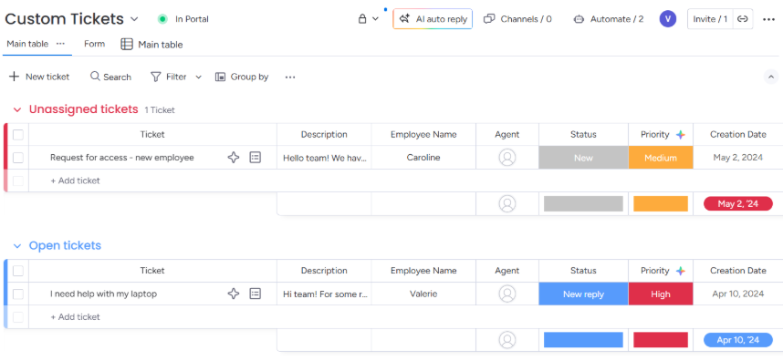
      

* Example of board sub items:
    * In the screenshot below, ticket with name “Need to replace monitor” is a sub item under the parent item with name “I need help with my laptop”:
        

            
          

# System Configuration

Before you continue with the integration, you must first configure the Monday.com system in <code class="expression">space.vars.SITENAME</code>.

Refer to [System Configuration](../integrate/system-configuration.md) for a steps on how to configure the system.
Refer to the screenshot below:

  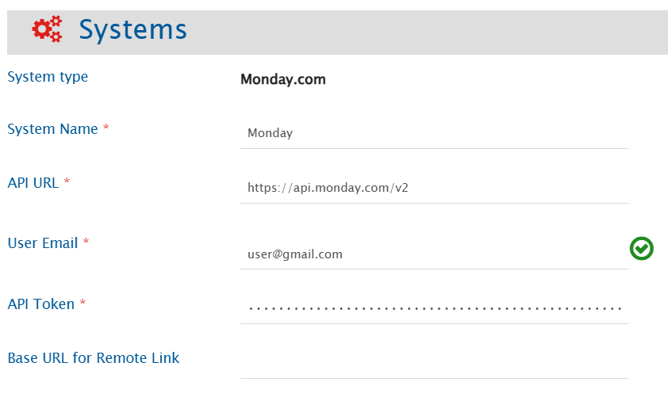

## Monday.com System Form Details

| Field Name                   | When is the field visible | Description                                                                                                                                                                                                                                                                                        |
|------------------------------|---------------------------|----------------------------------------------------------------------------------------------------------------------------------------------------------------------------------------------------------------------------------------------------------------------------------------------------|
| **System Name**              | Always                    | Provide a unique name for the Monday.com system.                                                                                                                                                                                                                                                   |
| **API URL**                  | Always                    | The GraphQL API endpoint used. Default value is: https://api.monday.com/v2                                                                                                                                                                                                                         |
| **User Email**               | Always                    | Provide a dedicated email address of the Monday.com user for <code class="expression">space.vars.SITENAME</code>. This user should not be used for any other operations from system's user interface, and must have the [required permissions](#required-permissions) to access data in Monday.com |
| **API Token**                | Always                    | Provide the API token generated for the user given in the User Email field. Refer to [Access API Token](#get-api-token) section for details.                                                                                                                                                       |
| **Base URL for Remote Link** | Always                    | Provide a different instance URL of the Monday.com instance. This URL will be used for generating the Remote Link.   Note: If "Base URL for Remote Link" is empty, it will use default instance URL to generate remote link if configured on integration.                                       |

# Mapping Configuration

Map the fields between Monday.com and the other system to be integrated to ensure that the data between both the systems synchronizes correctly. 

Refer to [Mapping Configuration](../integrate/mapping-configuration.md) for steps on configuring field mappings.

  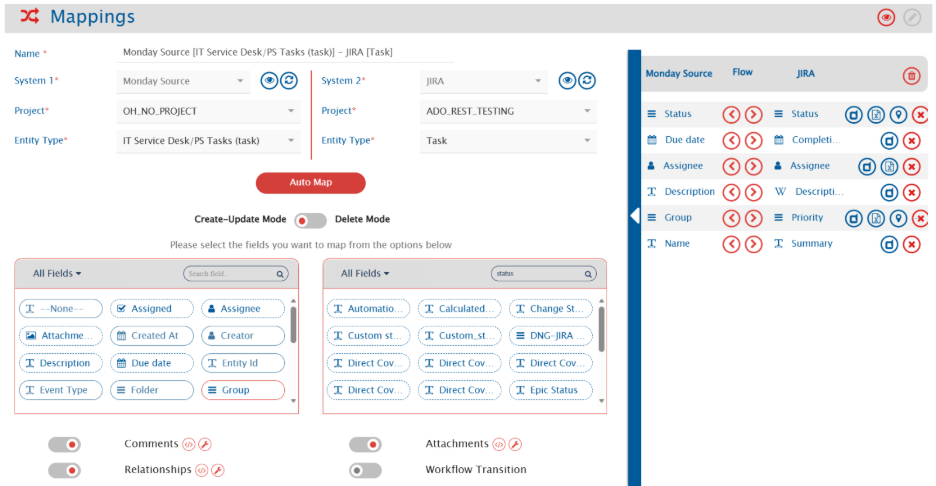

## Field Configuration

For Monday.com as a target system:

- **Country**: Accepts country codes as values only. Example: "IN"
  - Refer to this JSON for available country codes: [country.io/names.json](https://country.io/names.json)
- **Location**:  Accepts values in the format: {latitude} {longitude} {address} only
  - Example: 29.9772962 31.1324955 Giza Pyramid Complex
- **Rating**: Accepts values from 0 to 5 only.
  - Any other numbers will cause the sync to fail according to Monday.com field behavior.
- **World clock**: Accepts a time zone as a value only. Example: "Europe/London"
  - Other time zone values can be referred from: [List of Time Zones of the World](https://utctime.info/timezone/)
- **Group**: Group is a **mandatory** field for items.
  - If a group with the specified name does not exist on Monday.com, <code class="expression">space.vars.SITENAME</code> will create and use it.

## Relationship Configuration

The user will be able to sync the following relationship types:
* Connected Boards
* Dependency columns
* Parent–child relationships between items and subitems

### Mandatory Links

* For sub items, **'Parent'** is a mandatory relationship linkage as a subitem can only be created inside an item. 
* Example: To create a sub item, parent item must exist:
    

          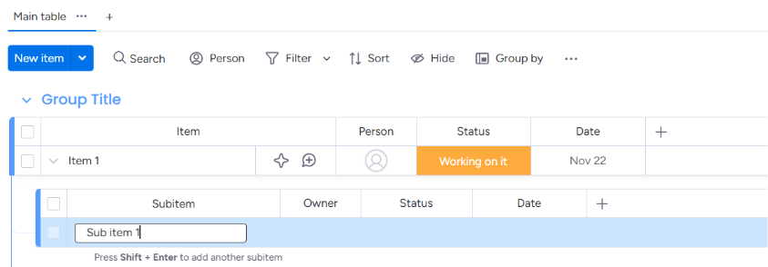
        

#### Sample configuration to sync items and sub items:

If the user wants to sync item and sub items with parent-child links:

1. Sync all the items from source to target first (without any links with sub item).
2. Configure below links in sub item mapping configuration:
    

          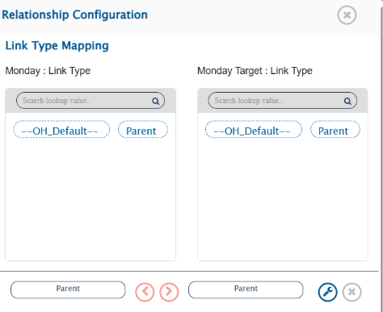
        

3. Synchronize the sub items. It will add the required parent links to the parent items.

## Attachment Configuration

* All file-type columns are supported for syncing attachment types. 
* The user can choose which file-type column each attachment should sync to. If the attachment types' mapping is not configured, all attachments will be synced to one single column.
* If there is no attachment mapping provided, all attachments will be synced to any one column only.
* Here's the screenshot of attachment types' mapping for reference:

    

          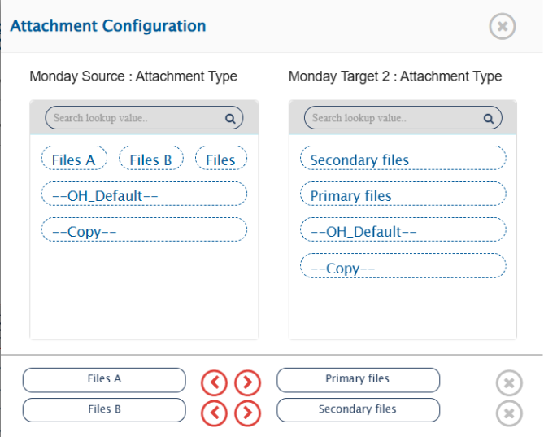
        

## Soft Delete Configuration

- When Monday.com is the target system, the **soft delete operation** is performed by **default** in the synchronization of the [Source Delete event](../integrate/source-delete-synchronization.md).
- After the soft delete operation is performed by <code class="expression">space.vars.SITENAME</code>, the entity will be deleted from Monday.com and it can be found in trash.
- Configuring Delete Mode:
  - To enable **archive** operation in target, "OH Archive" field shall be mapped with default value "Yes" in the [Delete Mode](../integrate/mapping-configuration.md#delete-mode) mapping.
  - To enable only the **logical delete** operation in the target, "OH Soft Delete" field shall be mapped with the default value "No" in the [Delete Mode](../integrate/mapping-configuration.md#delete-mode) mapping.

# Integration Configuration

Set a time to synchronize data between Monday.com and the other system. Define parameters and conditions, if any, for integration.

Refer to [Integration Configuration](../integrate/integration-configuration.md) for step-by-step instructions.

  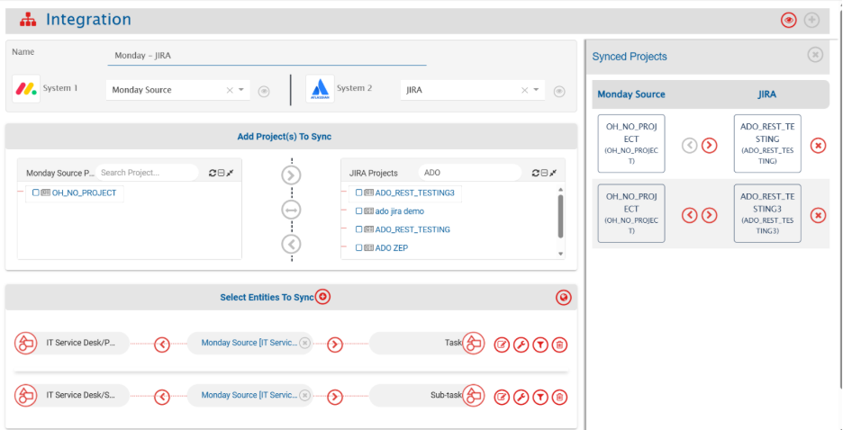

## Criteria Configuration

If the user wants to specify conditions for synchronizing an item from Monday.com as source system to the other system, the criteria must be configured.

Navigate to [Criteria Configuration](../integrate/integration-configuration.md/#criteria-configuration) for details.

- Set the Criteria Query as per Monday.com’s **Native JSON query format**.
- Refer to [Monday API Reference](https://developer.monday.com/api-reference/reference/items-page#filtering-items-by-name) for more details on query format.
- While adding the criteria, user needs to add the internal names of the fields on which the criteria is to be applied. To get the internal field name for the Monday.com columns, refer to the [Get field internal name](#get-internal-names-for-fields) section.
- Given below are the sample snippets of how the Monday.com queries can be used as criteria query in <code class="expression">space.vars.SITENAME</code>:

### Sample criteria:

| Field name  | Field internal name | Criteria description                                                     | Criteria snippet                                                                                        |
|-------------|---------------------|--------------------------------------------------------------------------|---------------------------------------------------------------------------------------------------------|
| Description | text_description    | Sync items where text description equals “sample”                        | {"rules":[{"column_id":"text_description","compare_value":["sample"]}]}                                 |
| Start Date  | start_date          | Sync items where Start Date value is between 1 June 2025 to 30 June 2025 | {"rules":[{"column_id":"start_date","compare_value":["2025-06-01","2025-06-30"],"operator":"between"}]} |

## Target LookUp Configuration

- Provide query in Target Search Query field such that it is possible to search the entity in the Monday.com as the target system. In the target search query field, the you can provide a placeholder for the source system's field value in the '@'.
- To learn in detail about how to configure Target LookUp, refer to **Search in Target Before Sync** section on [Integration Configuration](../integrate/integration-configuration.md) page.
- Overall, Target LookUp Query is similar to [Criteria configuration](#criteria-configuration), except that the value part contains a field name with '@' instead of static value.
- While adding the query, user needs to add the internal names of the fields on which the query is to be applied. To get the internal field name for the Monday.com columns, refer to the [Get field internal name](#get-internal-names-for-fields) section.

### Sample target lookup query:

| Field name  | Field internal name | Target Lookup use case                                                         | Query snippet                                                               |
|-------------|---------------------|--------------------------------------------------------------------------------|-----------------------------------------------------------------------------|
| Description | text_description    | Target Lookup on the item having the source entity's id in 'description' field | {"rules":[{"column_id":"description","compare_value":["@oh_internal_id@]}]} |

# Known Behaviors and Limitations

- **Folder**:
  - The folder of an item can be only read. The user cannot create folders or assign individual items to them.
    - Reason: Monday.com only allows entire boards to be added to folders, and not an item only.
- **Attachments**:
  - In order to sync attachments from monday.com, make sure they're added to any file type column.
    - Reason: Attachments added directly to the File Gallery of Monday.com (not inside a file-type column) cannot be synced because of Monday.com API unavailability.
- **Items and sub items relationship linkage**:
  - A Parent item link is mandatory when creating a subitem.
    - Hence, Monday.com as the target system, once subitem is created , its parent link cannot be changed or removed. 
    - Reason: Monday.com API unavailability
  - A parent link can be added on a sub item while creation, but a child link cannot be added from already existing items in Monday.com due to unavailability of API.
- **Comments**:
  - Replies to comments or edits in Monday.com will be synced as separate comments by <code class="expression">space.vars.SITENAME</code>.
- **Documents**:
  - Synchronization of documents as entity is not supported.

# Appendix

## Get API Token

To get the API token for a user:
1. Log in to your Monday.com account.
2. Go to the developers' section by clicking on your profile picture in the top right-hand corner of your screen. Refer to the screenshot below::
   

      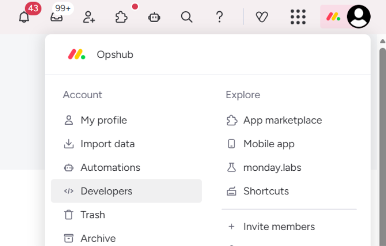
    

    
3. Navigate to the API token section in the left pane and copy the token value. Refer to the screenshot below:
     
    

      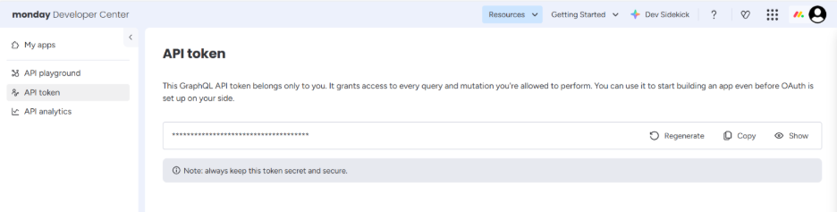
    

## Get Internal Names for Fields

1. Log in to your Monday.com account. 
2. Navigate to monday.labs by clicking on your profile picture in the top right-hand corner of your screen. Refer to the screenshot below:
   

    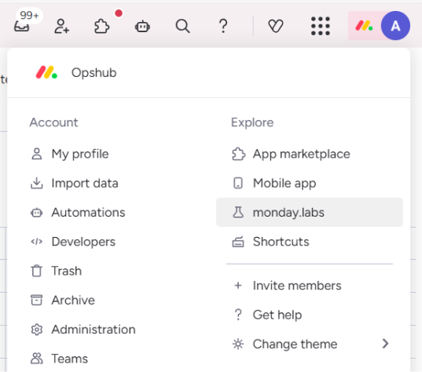
    

3. Scroll down to Developer mode and toggle it on. Refer to the screenshot below:
    

      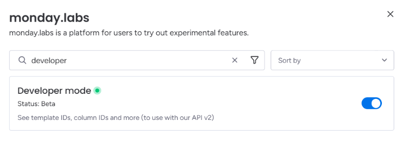
    

4. Once the user exits, the board will automatically refresh.
5. Click the dropdown menu to the right of the column title, and the Column ID will be displayed. Refer to the screenshot below:
    

      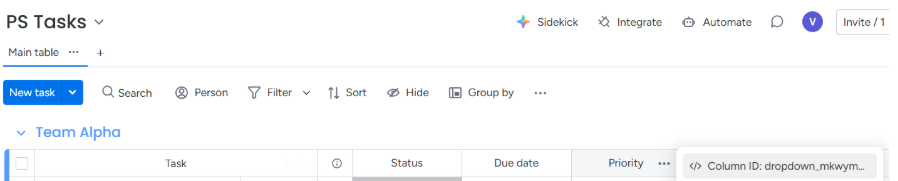
    

