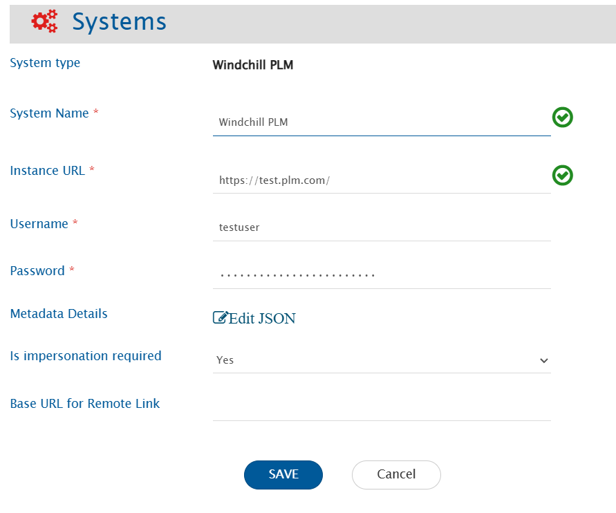
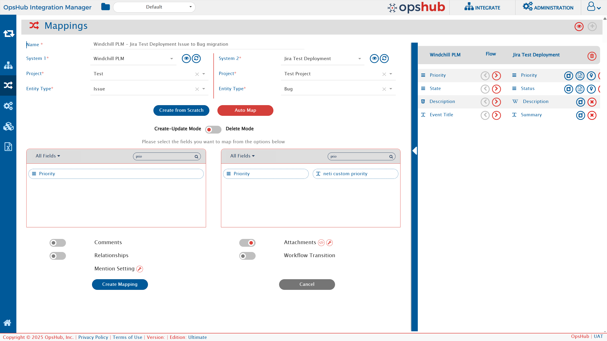
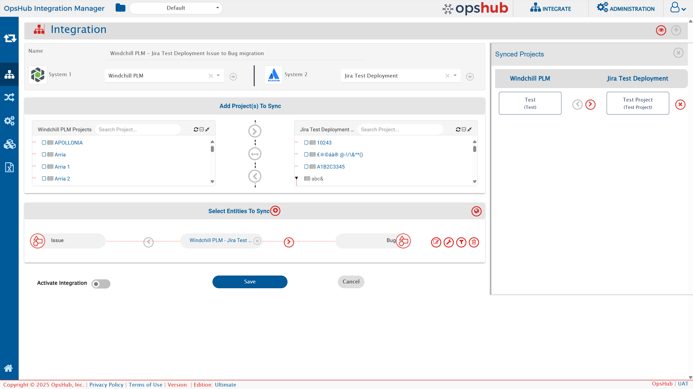

# Prerequisites

### User Privileges

Before you begin, create a dedicated user in Windchill PLM that will be used specifically for this integration. This dedicated user is called an "Integration User".
- This user will handle all data synchronization between Windchill PLM and other systems.
- This user shouldn't perform any other action from Windchill PLM's user interface.

### Required Scope/Permission

* When configuring an integration with Windchill PLM, it’s essential to assign only the necessary permissions based on the planned operations and business requirements. These permissions control what data the integration user can access or modify, ensuring both functionality and security within Windchill PLM.

* To **add or remove permissions** for the integration user in Windchill PLM, use the Policy Administration tools, which allow administrators to manage access at the domain, role, or object level as described in the [Security Management Permissions page](https://support.ptc.com/help/windchill/plus/r12.0.2.0/en/index.html#page/Windchill_Help_Center/SecurityMgmtPermissionsRef.html).

> **Note**: If required permissions are missing or insufficient, the integration may fail or restrict operations. Always ensure that the integration user has the appropriate permissions before beginning the setup.

#### Permissions Required for Integration User in Windchill PLM

The integration user must have the following Windchill PLM permissions:

- **Read**: Ability to view items.
- **Create**: Ability to create new items.
- **Modify, Modify Identity**: Ability to update and change item fields.
- **Modify Content**: Ability to attach files to items.
- **Download**: Ability to download attached files.
- **Set State**: Ability to change the lifecycle state of items (e.g., moving from "Open" to "In Progress").

These permissions should be granted for all products and entities that you plan to synchronize as part of the integration.

### User Impersonation

When synchronizing data from a source system to Windchill PLM, if you want to **preserve the original “Created By” and “Modified By” users from the source system in the PLM**, then you must **enable user impersonation in OpsHub Integration Manager.**
This requires **[specific configuration](#user-impersonation-1) and prerequisite setup** to be completed before synchronization.

1. User Impersonation Does Not Bypass Authorization

   *   User impersonation does not override Windchill’s authorization model. The user being impersonated must already have sufficient permissions in Windchill PLM.
   * Example: If the source system indicates that an object is created by *userX*, then:
       * *userX* must exist in Windchill PLM.
       * *userX* must have permission to create or modify that object in Windchill PLM.
   * If permissions are missing, the impersonation operation will fail even though it is correctly configured.

2. Configure <code class="expression">space.vars.SITENAME</code> Host as a Trusted Host in Windchill PLM
   * Windchill PLM allows user impersonation only from trusted host machines. Therefore, the machine where <code class="expression">space.vars.SITENAME</code> is hosted must be explicitly trusted by the Windchill PLM instance. High-level steps are given below:
     * Identify the IP address of the machine where <code class="expression">space.vars.SITENAME</code> is hosted. (Refer to [Verifying the IP Address of the OIM Host Machine](#verifying-the-ip-address-of-the-oim-host-machine))
     * Add this IP address to the Windchill trusted hosts configuration.
     * Apply the configuration changes and restart Windchill services.
   * Refer to [Configuring Trusted Hosts in Windchill PLM](#configuring-trusted-hosts-in-windchill-plm) for detailed steps.

---
# System Configuration
As you kickstart the integration, the user must first configure Windchill PLM system in <code class="expression">space.vars.SITENAME</code>.  Click [System Configuration](../integrate/system-configuration.md) to learn step-by-step process to configure a system. Refer to the following screenshot:

<p align="center"></p>

### Windchill PLM System Form Details

| **Field Name**               | **When is the field visible** | **What to Enter**                                                                                                                                                                                                                                                                                                                                                                                                                                                                        |
|------------------------------|-------------------------------|------------------------------------------------------------------------------------------------------------------------------------------------------------------------------------------------------------------------------------------------------------------------------------------------------------------------------------------------------------------------------------------------------------------------------------------------------------------------------------------|
| **System**                   | Always                        | Select **Windchill PLM** from the dropdown list                                                                                                                                                                                                                                                                                                                                                                                                                                          |
| **System Name**              | Always                        | Give this configuration a unique name (e.g., "Production Windchill" or "Windchill Main"). This helps you identify this connection later                                                                                                                                                                                                                                                                                                                                                  |
| **Instance URL**             | Always                        | Provide Server URL of the Windchill PLM instance. This URL will be used for communicating with PLM system API. The format of the URL would be: `http://hostname:port/` or `https://hostname:port/`. Example: `https://windchill.yourcompany.com/`                                                                                                                                                                                                                                        |
| **Username**                 | Always                        | Provide the username of the PLM user dedicated to <code class="expression">space.vars.SITENAME</code>. This user should not be used for any other operations from Windchill PLM's user interface and must have the required privileges to access data. For more details, refer to [User privileges](#permissions-Required-for-integration-user-in-windchill-plm) section.                                                                                                                |
| **Password**                 | Always                        | Provide the password of the user added in **Username** field.                                                                                                                                                                                                                                                                                                                                                                                                                            |
| **Metadata Details**         | Always                        | Provides the link types' metadata, and  define synchronization behaviour for fields where applicable. This data is pre-populated in JSON format according to the system metadata (Entity type, field attributes, relationships, etc.). See the [Advanced Configuration](#advanced-configuration-metadata-details) section for details.                                                                                                                                                   |
| **Enable Impersonation**     | Optional                      | Select 'Yes' to enable user impersonation for fields "creator" and "modifier". By default, user impersonation will not be performed. Refer to the [User Impersonation Prerequisites](#user-impersonation) section for detailed configuration requirements.                                                                                                                                                                                                                                                  |
| **Base URL for Remote Link** | Always                        | This URL is used to generate links that open the related item in Windchill PLM.<br>When to use this: If your Windchill PLM has different URLs for internal use (API) versus external access (user interface), enter the user-facing URL here.<br>Example: If your API URL is `https://api.windchill.com/` but users access Windchill PLM at `https://windchill.yourcompany.com/`, enter the second URL here.<br>If left empty, the system will use the Instance URL for generating links. |


### Advanced Configuration: Metadata Details

The **Metadata Details** field fine-tunes how Windchill PLM fields are handled during synchronization. This setting is optional but can be very helpful when user needs to sync link or to resolve specific data handling issues. 

#### When to use this configuration?

Use this advanced configuration if:
- Windchill PLM does not correctly indicate whether a field is read-only or editable.
- Windchill PLM does not correctly specify whether a field supports multiple values.
- The user needs to synchronize custom fields that are not automatically detected.
- The user wants to define a specific date format for date fields.
- The user needs to configure relationships between different types of items.

### Understanding the JSON Structure

The Metadata Details' field accepts configuration in JSON format. Here's a template configuration with all possible options:

```json
{
  "entities": [
    {
      "internalName": "PTC.ChangeMgmt.Issue",
      "fields": {
        "system": [
          {
            "internalName": "comIssueAssignmentDate",
            "displayName": "Assignment Date",
            "dataType": "date_string",
            "multiselect": false,
            "mandatory": false,
            "readOnly": false, 
            "dateFormat": "yyyy-MM-dd'T'HH:mm:ss.SSSZ"
          }
        ]
      },
      "relationship": {
        "linkTypes": [
          {
            "linkType": "ReferenceObjects",
            "reverseLinkType": "ReferenceObjects"
          }
        ]
      }
    }
  ]
}
```

### JSON Configuration Parameters
> **Note**: Refer to [Get Internal Field Names for Windchill PLM Entities](#get-internal-field-names-for-windchill-plm-entities) to learn how to retrieve the exact entity's and field's internal names for the Windchill PLM instance.
#### Entity Level

**`internalName`** (at entity level)
- This identifies the type of item in Windchill PLM configuration.
- Use the exact internal name that Windchill PLM uses.
- **Example**: `"PTC.ChangeMgmt.Issue"` for Issue items.

#### Field Level

**`internalName`** (at field level)
- The internal name that Windchill PLM uses for this field.
- To modify an existing field, use its exact internal name from Windchill PLM.
- To add a new custom field, use the unique name assigned to it in Windchill PLM.

**`displayName`**
- The user-friendly name shown in the integration interface.
- It'll be visible when mapping fields.

**`dataType`**
- Specifies what type of data the field contains.
- Common values: `text`, `lookup`, `date`, `boolean`, `number`.
- Use these to correct cases where Windchill PLM doesn't report the correct type.

**`multiselect`**
- Set to `true` if the field can hold multiple values.
- Set to `false` if it can only hold a single value.
- **Example**: A "Categories" field that allows multiple selections should be set to `true`.

**`mandatory`**
- Set to `true` if this field must have a value.
- Set to `false` if the field is optional.

**`readOnly`**
- Set to `false` to allow the integration to update this field.
- Set to `true` to prevent updates to this field.
- **Useful when**: Windchill PLM reports a field as read-only, but it can be updated through the API (like the Status field).

**`dateFormat`**
- Specifies the format for date fields.
- Only needed if Windchill PLM uses a non-standard date format.

#### Relationship Level

**`linkTypes`**
- Defines how different items can be linked together.
- **`linkType`**: The type of link from the current item to another.
- **`reverseLinkType`**: The type of link from the other item back to the current item.

> **Note**: Only include the fields in the JSON that require customization. Standard fields that function correctly do not need to be listed.

### JSON Configuration Examples:
1) Make the `status` field writable (set `readOnly` to `false`):

```json
{
  "entities": [
    {
      "internalName": "PTC.ChangeMgmt.Issue",
      "fields": {
        "system": [
          {
            "internalName": "status",
            "readOnly": false
          }
        ]
      }
    }
  ]
}
```

2) Make a field multi-select (set `multiselect` to `true`):
```json
{
  "entities": [
    {
      "internalName": "PTC.ChangeMgmt.Issue",
      "fields": {
        "system": [
          {
            "internalName": "categories",
            "multiselect": true
          }
        ]
      }
    }
  ]
}
```

3) Add a custom mandatory text field `reporter`:
```json
{
  "entities": [
    {
      "internalName": "PTC.ChangeMgmt.Issue",
      "fields": {
        "system": [
          {
            "internalName": "comIssueReporter",
            "displayName": "Reporter",
            "dataType": "text",
            "mandatory": true
          }
        ]
      }
    }
  ]
}
```
---

# Supported Entities

Currently, this integration supports:

- **Issue** (Soft types / Subtypes of Problem Reports)
>**Note**: Entity support will be enhanced in the future, with additional Windchill PLM objects incorporated based on evolving business needs and priorities.
---
# Mapping Configuration

Map the fields between Windchill PLM and the other system to be integrated to ensure that the data between both the systems synchronize correctly. Refer to [Mapping Configuration](../integrate/mapping-configuration.md) to learn the step-by-step process to configure mapping between the systems.

<p align="center"></p>

## User Impersonation
When Windchill PLM is the target system and user impersonation is required, update the field mappings as follows:

* Map the Created By field from the source system to the **Impersonated Creator** field in Windchill PLM.
* Map the Updated By field from the source system to the **Impersonated Modifier** field in Windchill PLM.
  * Select overwrite source system value option for this field mapping. Refer [this](../integrate/mapping-configuration.md#overwrite) to knwo about overwrite option.
---

# Integration Configuration

Set a time to synchronize data between Windchill PLM and the other system to be integrated. Also, define parameters and conditions (if any) for integration. Refer to [Integration Configuration](../integrate/integration-configuration.md) to learn the step-by-step process to configure the integration between two systems.

<p align="center"></p>


### Criteria Configuration

If the user wants to specify conditions for synchronizing an entity from Windchill PLM as source system to the other system, the criteria must be configured. Refer to Criteria Configuration section on [Integration Configuration](../integrate/integration-configuration.md) page for details.

>**Note**: <code class="expression">space.vars.SITENAME</code> uses Windchill PLM's native query format to filter items.

#### Understanding Query Syntax

Queries in Windchill PLM follow this pattern:
```
FieldName operator Value
```

**Example**: To find an issue with a specific ID:
```
ID eq OR:wt.change2.WTChangeIssue:0000001
```

Here:
- `ID` is the field name
- `eq` means "equals"
- `OR:wt.change2.WTChangeIssue:0000001` is the value to match

#### Sample Queries

| **What You Want to Find**                            | **Query to Use**                                                      | **What it Achieves**                                                   |
|------------------------------------------------------|-----------------------------------------------------------------------|------------------------------------------------------------------------|
| Issues with State open                               | `State/Value eq 'OPEN'`                                               | Returns Issues where the `State` field equals `OPEN`                   |
| Issues created after a date and has certain priority | `IssuePriority/Value eq 'HIGH' and CreatedOn gt 2024-01-01T00:00:00Z` | Returns Issues where priority is `High` and created after `2024-01-01` |

For more information about query options, Refer to [Windchill PLM's Query Parameters documentation](https://support.ptc.com/help/windchill_rest_services/r2.7/en/#page/windchill_rest_services/examples_WCCG_RESTAPIsSupportedQueryOptions.html#).
#### Note:

- **Navigable properties only**: User can only filter on fields that Windchill PLM considers "navigable".
  - Filters on non-navigable properties will either fail or be ignored.
- Check [Windchill PLM's documentation on navigational properties](https://support.ptc.com/help/windchill_rest_services/r2.7/en/#page/windchill_rest_services/WCCG_RESTAPIsConfiguringNavigationalProperties.html) for more details.


### Target Lookup Configuration

* Provide Query in Target Search Query field such that it is possible to search the entity in the Windchill PLM as the target system. In the target search query field, the user can provide a placeholder for the source system's field value in the '@'.

* To learn in detail about how to configure Target LookUp, refer to **Search in Target Before Sync** section on [Integration Configuration](../integrate/integration-configuration.md) page.

* Overall, Target LookUp Query is similar to [Criteria configuration](#criteria-configuration), except that the value part contains a field name with '@' instead of static value.

**How it Works:**

Provide a query that the integration will use to search the matching items in Windchill PLM. If a match is found, the existing item is updated instead of creating a new one.

**Using Placeholders:**

The user can use field values from the source system in the search query by wrapping field names in `@` symbols.

**Example:**
```
comUpstreamItem eq @ID@
```

Here:
- `comTestUpstreamItem` is the Windchill PLM field to search.
- `@ID@` will be replaced with the actual ID value from the source system.
- The integration will look for a Windchill PLM item where `comTestUpstreamItem` matches the source ID.

---

# Known Behaviors and Limitations

* History-based synchronization is currently not supported. Each synchronization run captures the latest version of an item available at that time.
* Only those attachments will be synchronized which are uploaded to the items using the `Attach new local file` option.
* Comments and discussions' synchronization is not supported.
* Relationship/Link information can be read and synchronized, but new relationships/links cannot be created or modified through the integration.
* Any new items created by the integration are placed in the base folder of the product container.
  * Once the item is created in base folder, they cannot be moved to a different folder through integration.
* Currently, fields that appear in an **Item's Details** tab will be synchronized.
* Windchill PLM does not always indicate whether a field supports multiple values. The user can define the correct behavior for such fields in the [Metadata Details JSON](#understanding-the-json-structure).
* Some fields may appear read-only in the mapping interface. However, if the Windchill PLM's API allows updates (for example, the Status field), you can override this behavior in the [Metadata Details JSON](#understanding-the-json-structure) configuration.
* The [Metadata Details JSON](#understanding-the-json-structure) cannot introduce new entity types to Windchill PLM. It can only modify or add fields to existing entity types, along with relationships.
  * Currently, the user can only configure Issue entity and its fields/relationships through [Metadata Details JSON](#understanding-the-json-structure).
* Product names containing a single quote (`'`) are not supported.
  * Reason: Windchill PLM's API does not handle single quotes in product names correctly, leading to the errors during synchronization.

---

# Appendix

### Get Internal Field Names for Windchill PLM Entities

To determine the exact internal names of Entity and Fields for your Windchill PLM instance:

1. Use the `GetWindchillMetaInfo()` API call to retrieve field values and metadata. For more details, refer to the [API documentation](https://support.ptc.com/help/windchill_rest_services/r2.7/en/#page/windchill_rest_services/WCCG_RESTAPIsAccessPTCCommonDomainsfunctions.html). You can also execute this API call using any standard API client tool. Example: Postman, Curl.
2. Look for the following values in the API response:
   * **EntityType** → use as `entities[].internalName`
   * **PropertyName** → use as `fields.system[].internalName`
* Example: Below is the response for making the API call for issue entity:
```json
{
  "EntityType": "PTC.ChangeMgmt.Issue",
  "BaseType": "PTC.ChangeMgmt.ProblemReport",
  "DisplayName": "Issue",
  "InternalName": "com.Test.Issue",
  .
  .
  .
  "PropertyInfo": [
    {
      "PropertyName": "State",
      "DisplayName": "State",
      "InternalName": "state.state",
      "DataType": "PTC.EnumType",
      "ReadOnly": true,
      .
      .
      .
    }
  ]
}
```
* The following mappings can be determined:
  * `entities[].internalName` will be `PTC.ChangeMgmt.Issue`
  * `fields.system[].internalName` will be `State`

### Configuring Trusted Hosts in Windchill PLM
Follow the steps below to add the host machine IP address to the trusted hosts configuration in Windchill PLM.
1. Locate the *site.xconf* file
   1. Navigate to the following path on the Windchill server: *{PLM installation folder}/Windchill/site.xconf* . Example: *E:\ptc\Windchill_13.0\Windchill\site.xconf*
2. Update the trusted hosts configuration
   1. Open the *site.xconf* file in a text editor.
   2. Add the property **wt.auth.trustedHosts** inside the \<Configuration> and \</Configuration> tags.
   3. Add the IP address of the machine where <code class="expression">space.vars.SITENAME</code> is hosted.
   4. Example, if IP of <code class="expression">space.vars.SITENAME</code> machine is "127.0.0.1":
        ```
      <Property name="wt.auth.trustedHosts"
          overridable="true"
          targetFile="codebase/wt.properties"
          value="127.0.0.1"/>
      ```
3. Apply the configuration changes
   1. Launch **Windchill Shell** with Administrator privileges.
   2. Execute the following command:
        ```xconfmanager -p```
4. Restart Windchill services
   1. Open Windows Services.
   2. Locate the WindChill service.
   3. Restart the service to apply the changes.

### Verifying the IP Address of the OIM Host Machine
In environments where a VPN or dynamic network configuration is used, the IP address of the machine hosting <code class="expression">space.vars.SITENAME</code> may change. To ensure the correct IP address is configured as a trusted host in Windchill PLM, follow the steps below.

1. Initiate a request from the <code class="expression">space.vars.SITENAME</code> host machine
   1. On the machine where <code class="expression">space.vars.SITENAME</code> is hosted, open a web browser.
   2. Access the Windchill PLM application by navigating to the Windchill URL.
2. Access Windchill server logs
   1. Log in to the machine where Windchill PLM is installed.
   2. Navigate to the Windchill HTTP server logs directory: *{PLM installation folder}/HTTPServer/logs/access.log* .
3. Identify the originating IP address
   1. Open the *access.log* file.
   2. Locate the most recent log entries generated immediately after accessing Windchill from the <code class="expression">space.vars.SITENAME</code> host machine.
   3. Identify the client IP address recorded in these entries.
   4. The IP address associated with the request represents the current IP of the host machine.

