# Prerequisites

## System Prerequisites
* **API Enablement**: 
  - Polarion's REST API must be enabled in the `polarion.properties` file by setting the following property: 
    - `com.siemens.polarion.rest.enabled=true`
  - You can find this file in Polarion installed directory at: 
      - `@POLARION_INSTALLATION_PATH@\polarion\configuration`
  - Refer [Polarion API Reference](https://docs.sw.siemens.com/en-US/doc/230235217/PL20241023686685479.polarion_help_sc.xid2134849/xid2137943) for more details.

## User Privileges
* Create a user in Polarion that is dedicated for <code class="expression">space.vars.SITENAME</code>. This user shouldn't perform any other action from Polarion's user interface.
* Following are the user privileges required:
1. The user must have access to the default SVN repository:
   - To grant user access to the default repository, refer [Grant Permission To Access Repository](#grant-permission-to-access-repository).
2. The user must have the role of '**project_admin**' in the project which they are going to configure in <code class="expression">space.vars.SITENAME</code>.
   - To assign this role, refer [Assign Role To User](#assign-role-to-user).
3. The user must have the following minimal permissions:

| Access Level       | READ Permissions    | WRITE Permissions                                                                                                     |
|--------------------|:--------------------|-----------------------------------------------------------------------------------------------------------------------|
| Projects           | Permission to VIEW  | Permission to VIEW                                                                                                    |
| REST API Endpoints | Permission to GET   | Permission to GET <br> Permission to PATCH  <br> Permission to POST  <br> Permission to DELETE (For attachments only) |   
   - To check if the user has above permissions, refer to section [Check API Permissions Required](#check-api-permissions-required)
 

# System Configuration

Before you continue with the integration, you must first configure the Polarion system in <code class="expression">space.vars.SITENAME</code>.

Refer to [System Configuration](../integrate/system-configuration.md) for steps on how to configure the system.
Refer to the screenshot below:

<p align="center">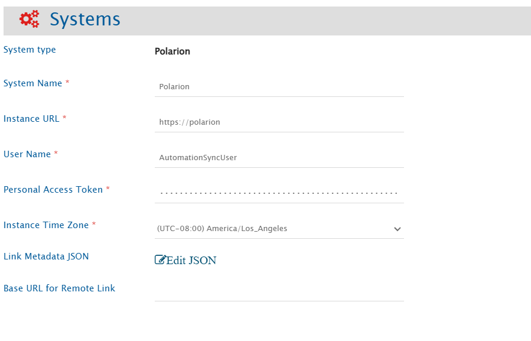</p>

## Polarion System Form Details

| Field Name                   | When is the field visible  | Description                                                                                                                                                                                                                                                    |
|:-----------------------------|----------------------------|:---------------------------------------------------------------------------------------------------------------------------------------------------------------------------------------------------------------------------------------------------------------|
| **System Name**              | Always                     | Provide a unique name for the Polarion system.                                                                                                                                                                                                                 |
| **Instance URL**             | Always                     | Provide the Server URL of the Polarion instance. <br> Format: `http://[host name]:[port no]` or `http://[your_domain_name]`. <br> Example: `http://10.13.27.200:8080`.                                                                                         |
| **User Name**                | Always                     | Provide the username of the dedicated user for Polarion API communication.                                                                                                                                                                                     |
| **Personal Access Token**    | Always                     | Provide the **Personal Access Token** for the user specified in the "User Name" field. <br> Refer to [Access API Token](#get-api-token) section for details.                                                                                                   |
| **Instance Time Zone**       | Always                     | Provide the time zone of the host machine where Polarion is installed.                                                                                                                                                                                         |
| **Link Metadata JSON**       | Always                     | Provide link metadata for Polarion entity types in JSON format. For more details refer to [Link Metadata Configuration](#link-metadata-configuration).                                                                                                         |
| **Base URL for Remote Link** | Always                     | Provide a different instance URL of the Polarion instance. This URL will be used for generating the Remote Link. <br> Note: If "Base URL for Remote Link" is empty, it will use default **Instance URL** to generate remote link if configured on integration. |

# Mapping Configuration

Map the fields between Polarion and the other system to be integrated to ensure that the data between both systems synchronizes correctly.

Refer to [Mapping Configuration](../integrate/mapping-configuration.md) for steps on configuring field mappings.

<p align="center">
  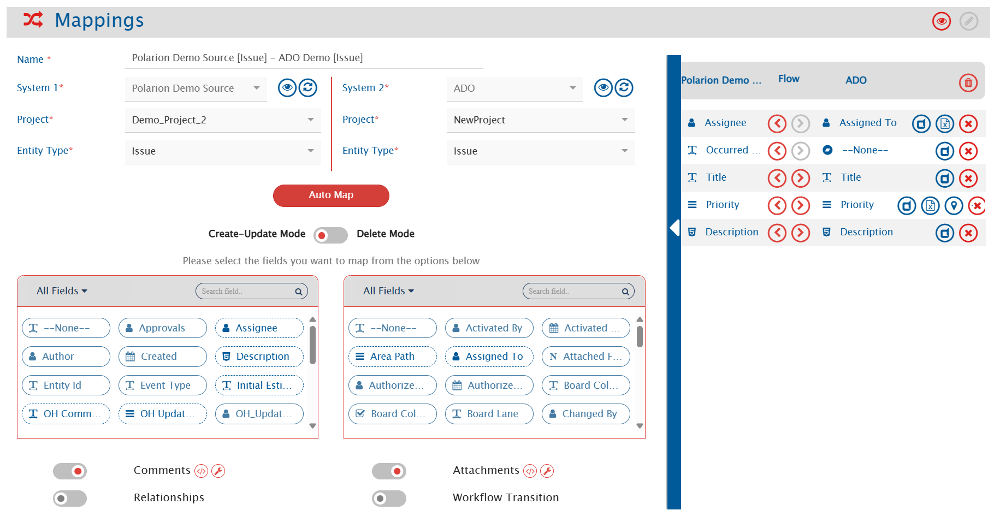
</p>

# Integration Configuration

Set a time to synchronize data between Polarion and the other system. Define parameters and conditions, if any, for integration.

Refer to [Integration Configuration](../integrate/integration-configuration.md) for step-by-step instructions.
<p align="center">
  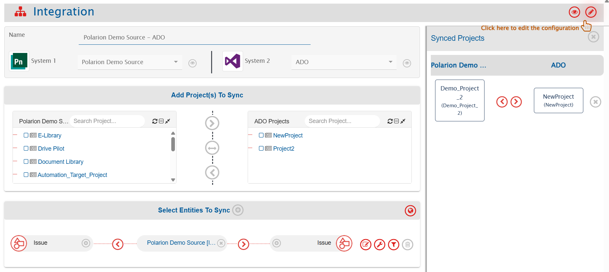
</p>


## Criteria Configuration

If you want to specify conditions for synchronizing an entity between Polarion and the other system to be integrated, you can use the Criteria Configuration feature.

Navigate to [Criteria Configuration](../integrate/integration-configuration.md/#criteria-configuration) to learn in detail about Criteria Configuration.

- To configure criteria in Polarion, integration needs to be created with Polarion as the source system. Set the **Query** as per Polarion's **Lucene query syntax**.
  - Refer to [Polarion API Reference](https://developer.siemens.com/polarion/basic-concepts.html#querying) for more details on query format.
- While adding the criteria, user needs to add the internal names of the fields on which the criteria has to be applied.
  - Refer to [Access Field Internal Name](#access-field-internal-name) section for details.
- Given below are the sample snippets of how the Polarion queries can be used as criteria query in <code class="expression">space.vars.SITENAME</code>:

### Sample criteria:

| Field name   | Field internal name | Criteria description                                   | Criteria snippet                         |
|--------------|---------------------|--------------------------------------------------------|------------------------------------------|
| Title        | title               | Sync items with title containing "API"                 | (title:\*API\*)                          |
| Status       | status              | Sync items where status equals "Open"                  | (status:open)                            |
| Created Date | created             | Sync items created between 1 June 2025 to 30 June 2025 | (created:[20250601 TO 20250630])         |
| Status       | status              | Sync items where status is not reviewed                | (NOT status:reviewed)                    |
| Severity     | severity            | Sync items where severity is either normal or blocker  | (severity:normal OR severity:blocker)    |


## Target LookUp Configuration

- Provide query in Target Search Query field such that it is possible to search the entity in the Polarion as the target system. In the target search query field, you can provide a placeholder for the source system's field value in the '@'.
- To learn in detail about how to configure Target LookUp, refer to **Search in Target Before Sync** section on [Integration Configuration](../integrate/integration-configuration.md) page.
- Overall, Target LookUp Query is similar to [Criteria configuration](#criteria-configuration), except that the value part contains a field name with '@' instead of static value.
- While adding the query, user needs to add the internal names of the fields on which the query is to be applied.

### Sample target lookup query:

| Field name      | Field internal name | Target Lookup use case                                                                       | Query snippet                     |
|-----------------|---------------------|----------------------------------------------------------------------------------------------|-----------------------------------|
| Target Item ID  | targetItem          | Target Lookup on the item having the source entity's id in custom field called 'targetItem'  | targetLookup:@oh_internal_id@     |


# Known Behaviors and Limitations

- History based synchronization is not supported due to API unavailability.
- **Comments**:
  - Replies to comments or edits in Polarion will be synced as separate comments by <code class="expression">space.vars.SITENAME</code>.
- **Project Groups**:
  - Project Groups are not visible in the Project mapping list due to API limitations; projects are listed individually.
- **Test cases and Unit test cases in Work item**:
    - Test Steps and relation with Test Records are not supported currently.
- **Links**
  - For link synchronization it is required to provide link metadata for Polarion entity types in JSON format in OpsHub Integration Manager.
    - Reason: API unavailability.
  - The Suspect and Revision properties of a link will not be explicitly synchronized due to API limitations as these properties are auto-populated by Polarion when links are added.

# Appendix

## Grant Permission To Access Repository

To make sure the user (Example, ID = automationtest) has access to the SVN repository:
- Update the 'access' file located at `@POLARION_INSTALLATION_PATH@\data\svn`, add the following entries:

   ```ini
   # Append automationtest to existing lists
    [groups]
    user = ..., automationtest
    
    [/]
    automationtest = rw
   
    [repo:/]
    automationtest = rw

    [repo:/.polarion/access]
    automationtest = rw
   ```

## Assign Role To User

To assign user the role of 'project_admin':
1. Log in to your Polarion account as admin.
2. Go to the 'Administration' section by clicking on the settings icon in the top left-hand corner of your screen. Refer to the screenshot below:
    <p align="center">
       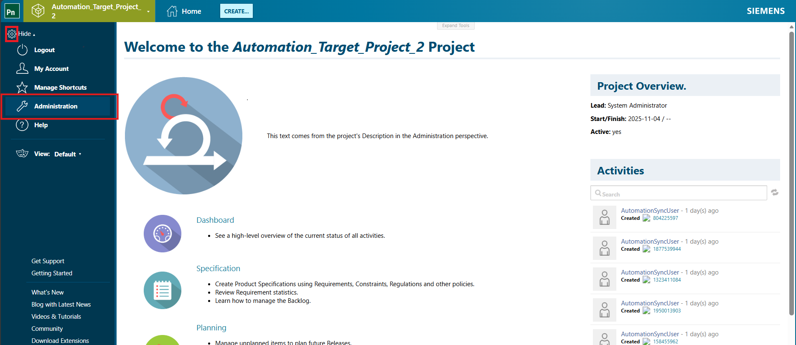
     </p>
    <br>
3. Click 'User Management' -> 'Users' in the left pane. Refer to the screenshot below:
   <br>
    <p align="center">
      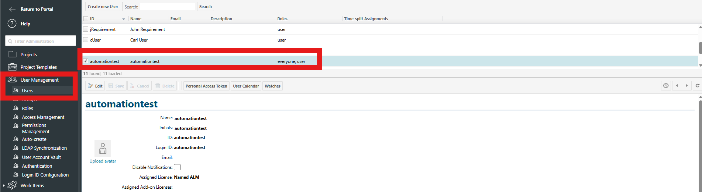
    </p>
   <br>
4. In 'Project Roles', give the user 'project_admin' role. For example, refer to the screenshot below for Role assigned to the user in Project 'Automation_Unit_Project':
   <br>
    <p align="center">
      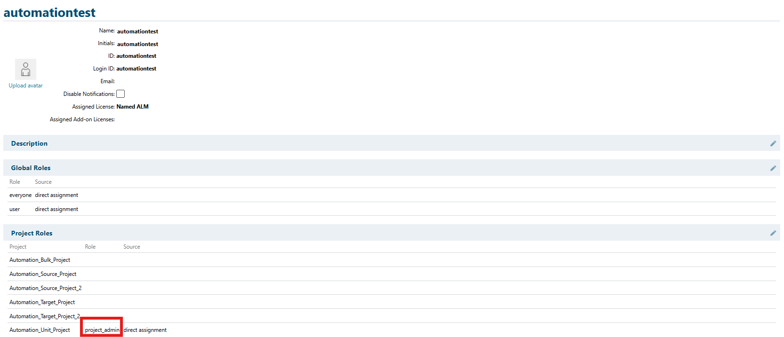
    </p>
   <br>


## Check API Permissions Required

To give user the relevant permissions that allows synchronization of entities:
1. Log in to your Polarion account as admin.
2. Go to the 'Administration' section by clicking on the settings icon in the top left-hand corner of your screen. Refer to the screenshot below:
    <p align="center">
       
     </p>
    <br>
3. Now, go to 'User Management' -> 'Permissions Management' -> 'By Role'. Here, make sure the following permissions are checked.
   <br>
    <p align="center">
      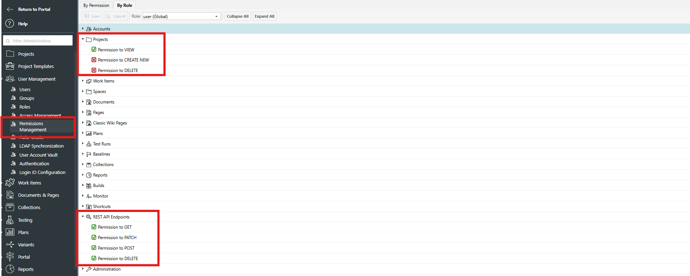
    </p>
   <br>


## Get API Token

To get the API token for a user:
1. Log in to your Polarion account.
2. Go to the 'My Account' section by clicking on the settings icon in the top left-hand corner of your screen. Refer to the screenshot below:
   <p align="center">
      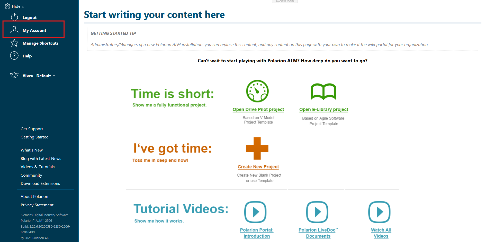
    </p>
   <br>
3. Click 'Personal Access Token' in the top pane and copy the token value. Refer to the screenshot below:
   <br>
    <p align="center">
      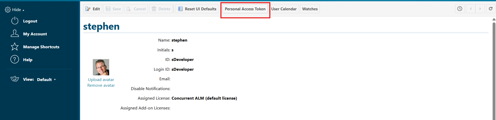
    </p>
4. Provide the toke details. Refer to the screenshot below:
   <br>
    <p align="center">
      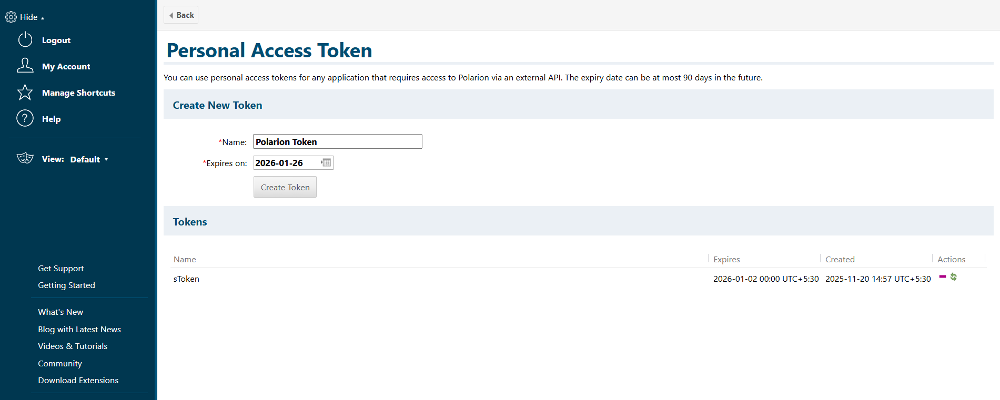
    </p>

Note:
- It is recommended to regenerate API token before it expires, to avoid unexpected processing failures in <code class="expression">space.vars.SITENAME</code>.

## Access Field Internal Name

To get the field internal names:
1. Log in to your Polarion account.
2. Go to the 'Administration' section by clicking on the settings icon in the top left-hand corner of your screen. Refer to the screenshot below:
   <p align="center">
      
    </p>
   <br>
3. Click 'Work Items' -> 'Custom Fields' in the left pane. Refer to the screenshot below:
   <br>
    <p align="center">
      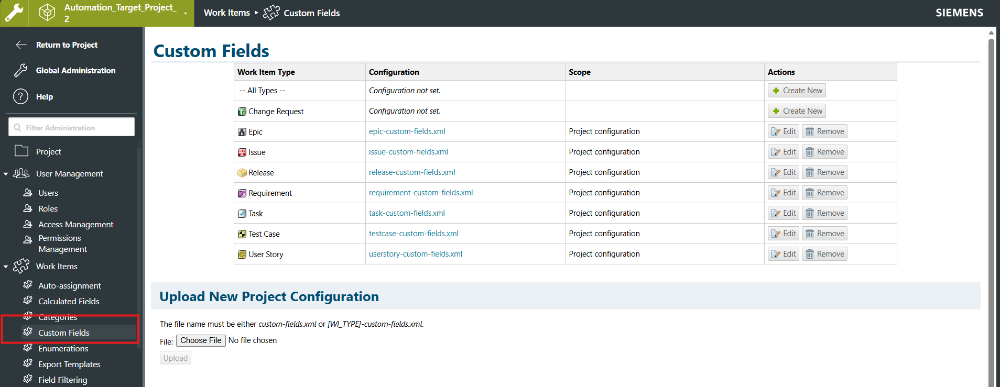
    </p>
4. The column named 'ID' contains internal names of the field. Refer to the screenshot below:
   <br>
    <p align="center">
      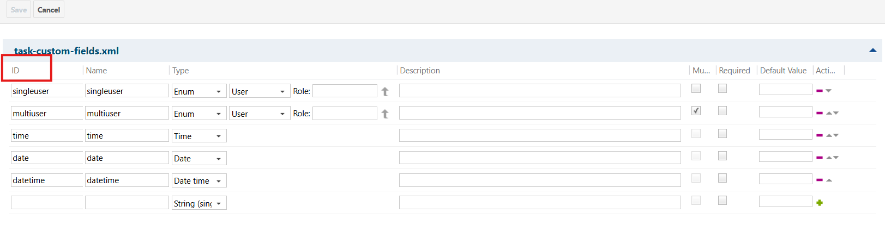
    </p>

## Link Metadata Configuration
This section includes a sample Link Metadata JSON template used for configuring links in Polarion. Modify the template according to your requirements
<br>
Link Metadata JSON Example:
```json
{
   "entities": [
      {
         "internalName": "task",
         "relationship": {
            "linkTypes": [
               {
                  "linkType": "has parent",
                  "linkTypeInternalName": "parent",
                  "linkTypeDirection": "FORWARD",
                  "reverseLinkType": "is parent of",
                  "supportedAsSource": true,
                  "supportedAsTarget": true,
                  "mandatory": false
               },
               {
                  "linkType": "is parent of",
                  "linkTypeInternalName": "parent",
                  "linkTypeDirection": "BACKWARD",
                  "reverseLinkType": "has parent",
                  "supportedAsSource": true,
                  "supportedAsTarget": true,
                  "mandatory": false
               }
            ]
         }
      },
      {
         "internalName": "epic",
         "relationship": {
            "linkTypes": [
               {
                  "linkType": "has parent",
                  "linkTypeInternalName": "parent",
                  "linkTypeDirection": "FORWARD",
                  "reverseLinkType": "is parent of",
                  "supportedAsSource": true,
                  "supportedAsTarget": true,
                  "mandatory": false
               },
               {
                  "linkType": "is parent of",
                  "linkTypeInternalName": "parent",
                  "linkTypeDirection": "BACKWARD",
                  "reverseLinkType": "has parent",
                  "supportedAsSource": true,
                  "supportedAsTarget": true,
                  "mandatory": false
               }
            ]
         }
      }
   ]
}
```
<br>
The following steps describe how to populate the Link JSON metadata values for 'linkType', 'linkTypeInternalName', 'linkTypeDirection' and other related link properties. 
Steps:
1. Log in to your Polarion account.
2. Navigate to the 'Administration' section by clicking on the settings icon in the top left-hand corner of the screen. Refer to the screenshot below:
   <p align="center">
      
    </p>
   <br>
3. Navigate to 'Work Items' → 'Enumerations', open 'workitem-link-role-enum.xml', and select 'Edit'. Refer to the screenshot below for guidance.
    <p align="center">
      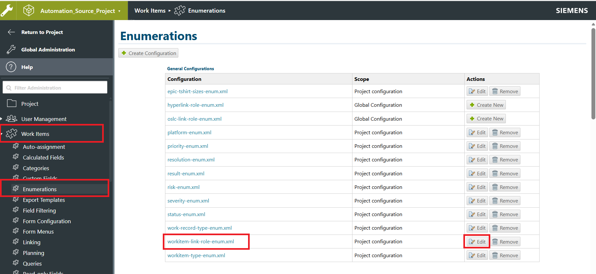
    </p>
   <br>
4. Within the enumeration file:
   - The values listed under 'ID' represent the internal names of the links and should be mapped to the 'linkTypeInternalName' property in the JSON metadata.
   - The values under 'Name' and 'Opposite Name' correspond to the display names of the links and should be mapped to the 'linkType' property in the JSON metadata.
   - For entries under 'Name', the 'linkTypeDirection' property should be set to 'FORWARD', while for entries under 'Opposite Name', it should be set to 'BACKWARD'.
   - The values of 'supportedAsSource' and 'supportedAsTarget' can be independently set to 'true' or 'false' based on whether the link is supported as a source or target.
   - The 'mandatory' property should be set to 'true' if the link is required, otherwise, it should be set to 'false'.
    <p align="center">
      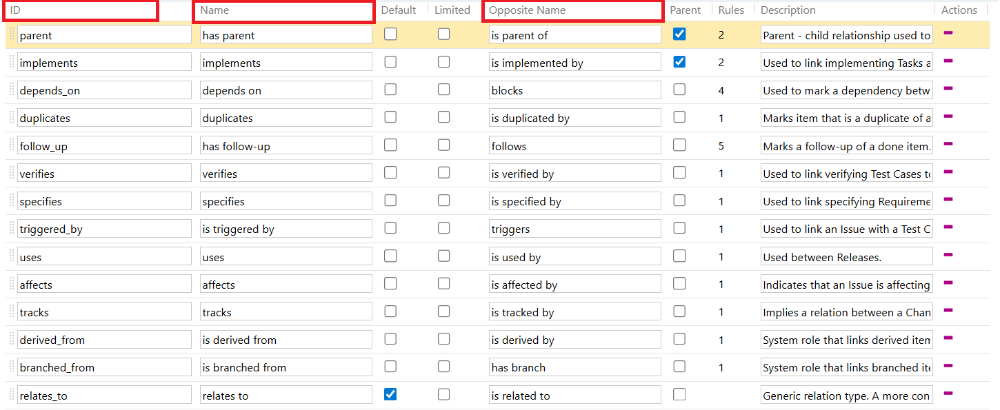
    </p>
   <br>
   