# Prerequisites

## User Privileges

- Create one user in SolarWinds Service Desk that is dedicated to <code class="expression">space.vars.SITENAME</code>. This user should not perform any other action from SolarWinds Service Desk's user interface. This user is referred to as an 'Integration User' in the documentation.
- For this integration user to perform operations in SolarWinds Service Desk, various permissions are required, as outlined in the [Required Permissions](#required-permissions) section.

## Required Permissions

The following permissions should be granted to the integration user:

| **Permission Category** | **Permission Name** | **Requirements** |
|-------------------------|---------------------|------------------|
| **Read** | Read access for entity types | Read permission must be granted for the specific entity types that need to be synchronized (Incidents and Changes). |
| **Read** | Read access for Users | Required to resolve user-related details such as reporter, assignee, or requester information during synchronization. |
| **Write** | Manage access for entity types | Allows the connector to create, update, and delete records for Incidents and Changes. |
| **Write** | Manage access for Users | Required to assign, update, or map user-related fields such as reporter, assignee, or requester during synchronization. |
| **Setup** | Setup (with All option) | Required for API token generation. |

## SolarWinds Service Desk Edition Guidelines

- To ensure smooth integration without delays, it is recommended to use the **Advanced** or **Premier** edition.
    - **Reason**: The API rate limit depends on your subscription plan:
        - **Advanced Plan**: 1,000 API calls per user per minute.
        - **Premier Plan**: 1,500 API calls per user per minute.
- For optimal performance, set the item sync schedule to **15 minutes or more**.
    - - **Reason**: Shorter sync intervals may cause sync delays due to API rate limiting, especially when synchronizing a large number of entities.

# Supported Entities

- The following entity types are supported for synchronization: **Incidents** and **Changes**.
- Example of an Incident:
    - In the screenshot below an Incident in SolarWinds Service Desk is shown:
      <p align="center">
        
      </p>
- Example of a Change:
    - In the screenshot below,a Change in SolarWinds Service Desk is shown:
      <p align="center">
        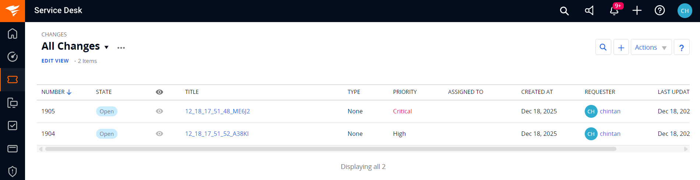
      </p>

# System Configuration

Before you continue with the integration, you must first configure the SolarWinds Service Desk system in OpsHub Integration Manager.

Refer to [System Configuration](../integrate/system-configuration.md) for steps on how to configure the system.
Refer to the screenshot below:

<p align="center">
  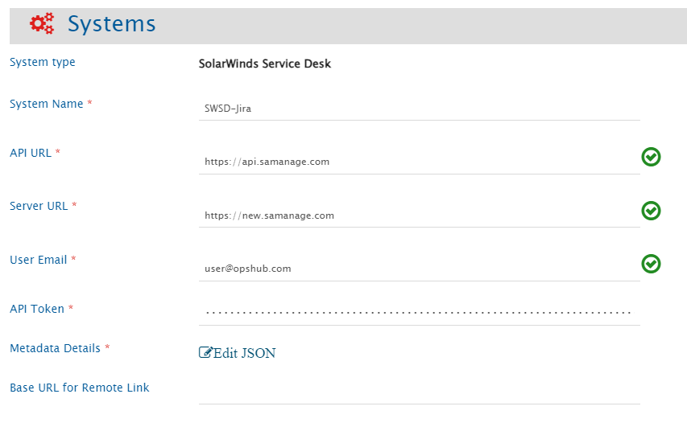
</p>

## SolarWinds Service Desk System Form Details

| Field Name           | When is the field visible | Description                                                                                                                                                                                                                                                                                                                                                                                                                                                                                                                                                                                                    |
|----------------------|---------------------------|----------------------------------------------------------------------------------------------------------------------------------------------------------------------------------------------------------------------------------------------------------------------------------------------------------------------------------------------------------------------------------------------------------------------------------------------------------------------------------------------------------------------------------------------------------------------------------------------------------------|
| **System Name**      | Always | Provide a unique name for the SolarWinds Service Desk system.                                                                                                                                                                                                                                                                                                                                                                                                                                                                                                                                                  |
| **API URL**          | Always | Provide the REST API Endpoint for accessing your SolarWinds Service Desk cloud instance. The API Base URL is region-specific and mandatory for connecting to the SolarWinds Service Desk environment. You must enter the URL that corresponds to your organization's region:<br>- US Region: https://api.samanage.com<br>- EU Region: https://apieu.samanage.com<br>- Asia-Pacific/Japan Region: https://apiau.samanage.com<br><br>Using an incorrect endpoint will result in authentication and connection errors. Refer to [SolarWinds ITSM API Documentation](https://apidoc.samanage.com) for more details. |
| **Server URL**       | Always | Provide Server URL of the SolarWinds Service Desk cloud instance. This URL will be used for communicating with end system. The format of the URL would be:  http://[your_domain_name]. Example: https://abc.samanage.com                                                                                                                                                                                                                                                                                                                                                                                       |
| **User Email**       | Always | Provide the email address of the SolarWinds Service Desk user dedicated to OpsHub Integration Manager. This user should not be used for any other operations from the system's user interface and must have the [Required Permissions](#required-permissions) to access data in SolarWinds Service Desk.                                                                                                                                                                                                                                                                                                       |
| **API Token**        | Always | Provide the API token generated for the user specified in the User Email field. This token must have sufficient permissions to enable communication with the SolarWinds Service Desk API. Refer to the [Get API Token](#get-api-token) section for details on how to generate the token.                                                                                                                                                                                                                                                                                                                       |
| **Metadata Details** | Always | Provide additional metadata specific to your SolarWinds Service Desk instance in JSON format. This is used to define lookup field values for your environment. For the correct JSON format and examples, refer to the [Metadata JSON Format](#metadata-json-format) section.                                                                                                                                                                                                                                                                                                                  |

# Mapping Configuration

Map the fields between SolarWinds Service Desk and the other system to be integrated to ensure that the data between both systems synchronizes correctly.
Refer to [Mapping Configuration](../integrate/mapping-configuration.md) for steps on configuring field mappings.

<p align="center">
  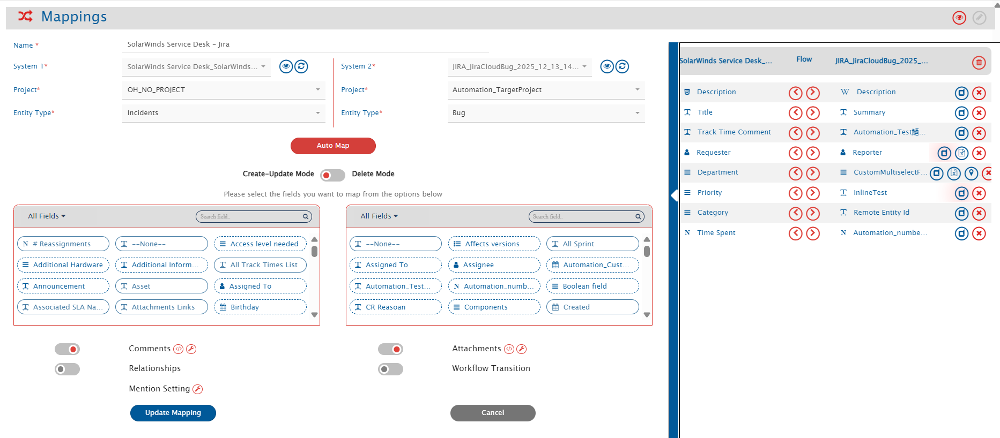
</p>

## Field Configuration

The following fields are available for Incidents and Changes:

### Common Fields (Both Incidents and Changes)

- **Title**: Text field (Mandatory)
- **Requester**: User field (Mandatory)
- **Description**: Rich Text field with HTML support
- **State**: Lookup field
- **Assigned To**: User field
- **Priority**: Lookup field
- **Site**: Lookup field
- **Department**: Lookup field
- **Tags**: Text field (supports multiple values)

####  Apart from this fields other system fields and custom fields are also available in the mapping configuration.

## Relationship Configuration

The user will be able to sync the following relationship types:
- Links between Incidents and Changes
- Links between Incidents and other Incidents
- Links between Changes and other Changes

The below screenshot shows how a Change entity is linked to another Change entity in SolarWinds Service Desk.
<p align="center">
  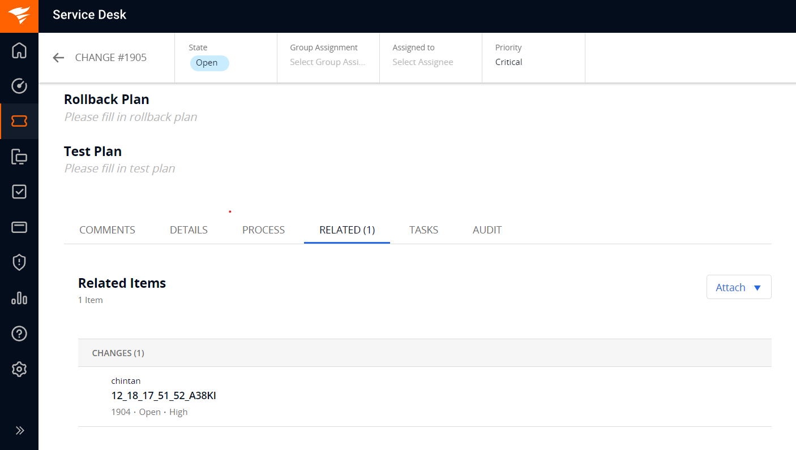
</p>

If the user wants to sync Incidents and their related Changes. Configure below links in link configuration:
<p align="center">
  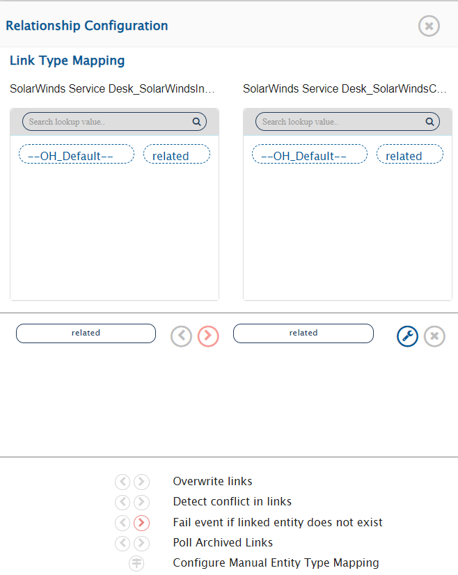
</p>

## Comments and Attachment Configuration

- Entity-level attachments are supported for synchronization. Refer the below screenshot, showing the attachment added on Entity level in SolarWinds Service Desk's **Incident** entity.
<p align="center">
  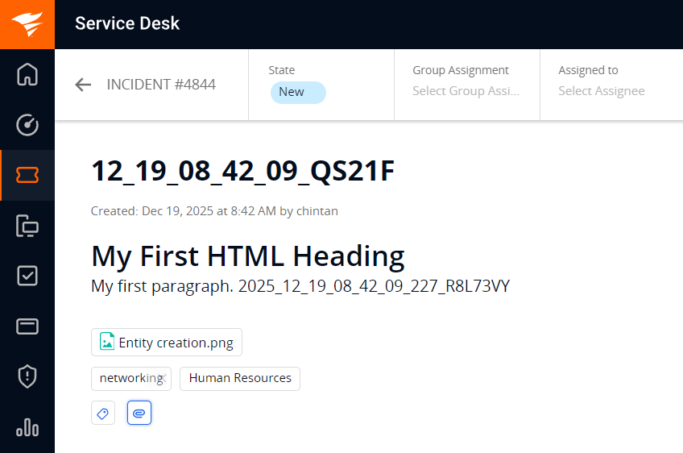
</p>

- The Incident entity type supports two comment types: **Public** and **Private**. Both types are supported for synchronization, and user can configure comment type mapping to maintain proper visibility settings. Refer to the screenshot below for the comment type mapping configuration.
<p align="center">
  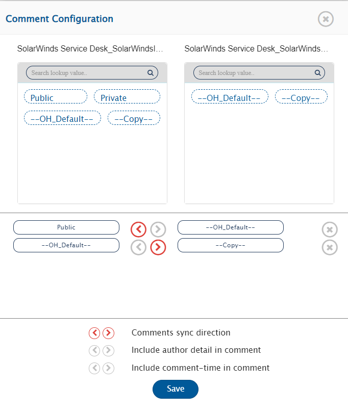
</p>

# Integration Configuration

Set a time to synchronize data between SolarWinds Service Desk and the other system. Define parameters and conditions, if any, for integration.
Refer to [Integration Configuration](../integrate/integration-configuration.md) for step-by-step instructions.

<p align="center">
  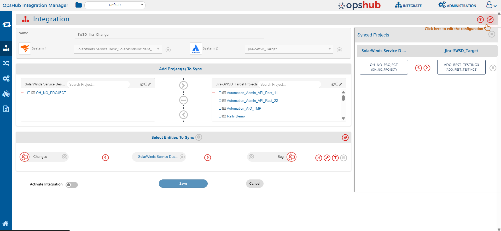
</p>

## Criteria Configuration

If the user wants to specify conditions for synchronizing an entity from SolarWinds Service Desk as source system to the other system, the criteria must be configured. Navigate to Criteria Configuration section on [Criteria Configuration](../integrate/integration-configuration.md/#criteria-configuration) page to learn in detail about Criteria Configuration.

Set the **Query** as per <code class="expression">space.vars.SITENAME</code>'s Native query format. While adding the criteria, user needs to add the internal names of the fields on which the criteria have to be applied. Given below are the sample snippets of how the SolarWinds Service Desk queries can be used as criteria query in <code class="expression">space.vars.SITENAME</code>:


### Sample criteria:

| Field name  | Field internal name | Criteria description                              | Criteria snippet                                                |
|-------------|---------------------|---------------------------------------------------|-----------------------------------------------------------------|
| Description | description         | Sync items where text description equals “sample” | [{"condition":"EQUALS","field":"description","value":"sample"}] |
| Priority    | priority            | Sync items where Priority is Critical             | [{"condition":"EQUALS","field":"priority","value":"1"}]         |


## Target Lookup Configuration

* Provide Query in Target Search Query field such that it is possible to search the entity in the SolarWinds Service Desk as the target system. In the target search query field, the user can provide a placeholder for the source system's field value in the '@'.

* To learn in detail about how to configure Target LookUp, refer to **Search in Target Before Sync** section on [Integration Configuration](../integrate/integration-configuration.md) page.

* Overall, Target LookUp Query is similar to [Criteria configuration](#criteria-configuration), except that the value part contains a field name with '@' instead of static value.

**Target LookUp query samples:**

| **Field Type** | **Target LookUp usecase**                                  | **Snippet**                                                       |
|----------------|-------------------------------------------------------------|--------------------------------------------------------------------|
| `Description`  | Target LookUp on the entity having the source entity's id in 'description' field | `[{"condition":"EQUALS","field":"description","value":"@oh_internal_id@"}]` |


# Known Behaviors and Limitations

- **Field Search Limitations**:
    - Certain fields such as State, Date type of fields and Custom fields cannot be searched using the available APIs. This limitation may affect criteria and target lookup configurations where these fields are used.
    - When configuring criteria or target lookup for lookup-type fields, user must use the internal field values rather than display values. Display values will not work in these configurations.
    - In Criteria and Target Lookup configurations, only Equals and Not Equals operators are supported. Range filters such as Less Than, Less Than or Equal To, Greater Than, and Greater Than or Equal To are not available due to API limitations.
- **Metadata Configuration**:
    - At present, there is no API available to fetch all field metadata details for lookup type of fields. The specific metadata according to the lookup fields present in user's instance must be defined through a JSON-based configuration during system creation. Refer to the [Metadata JSON Format](#metadata-json-format) section for details.
- **Attachments**:
    - Attachments added directly to attachment type of fields cannot be read/write in SolarWinds Service Desk due to API limitations.
- **API Rate Limiting**:
    - To avoid API rate limiting issues, it is recommended to set the sync schedule to 15 minutes or more, especially when frequent entity updates are performed.
- **API Token Validation**:
  - The API Token must be updated in the system configuration if any of the following occurs:
    - Permissions are removed from the integration user in SolarWinds Service Desk
    - The API token is manually reset or regenerated in SolarWinds Service Desk
    - The API token is deleted from the SolarWinds Service Desk interface
  - Failure to update the token in the system configuration will cause synchronization to fail.
# Appendix

## Get API Token 
To get the API token for a user follow the below steps.
1. Log in to your SolarWinds Service Desk account.
2. Navigate to the **Setup** > **Users & Groups** > **Users** section.

<p align="center">
  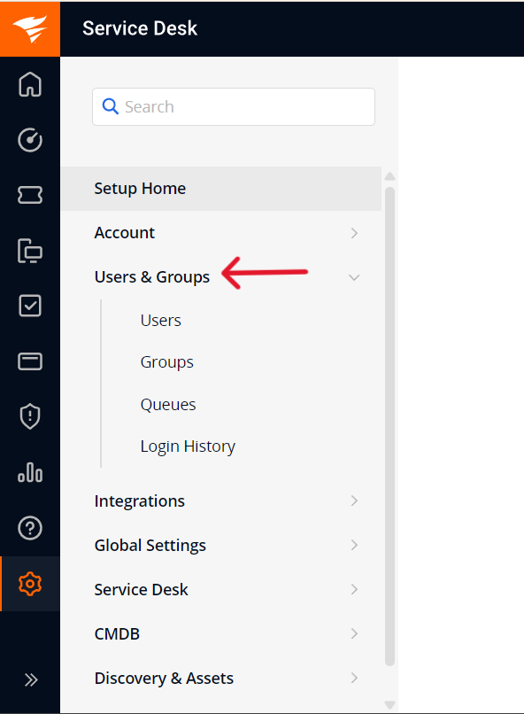
</p>

3. Navigate to your user and click on the username.
<p align="center">
  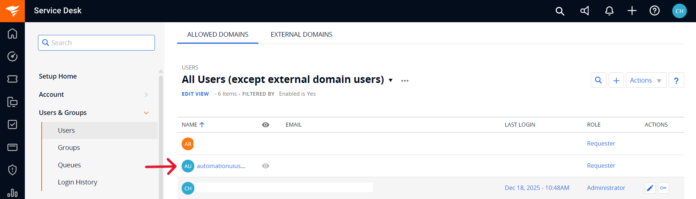
</p>

4. Click **Generate New Token** or if the token is already generated then click on **Reset JSON Web Token** to reset the token.

<p align="center">
  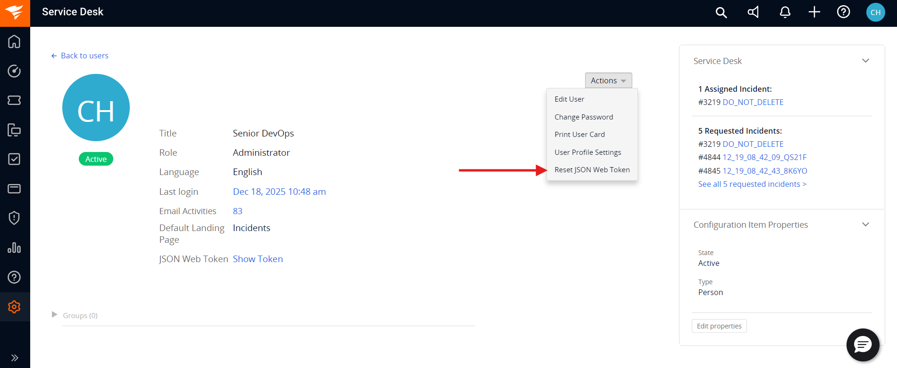
</p>

5. Once this is done copy the token value from Show Token option. Store this token securely, as it will be needed during system configuration.

## Metadata JSON Format

When configuring your SolarWinds Service Desk system, you may need to provide metadata in JSON format for lookup fields specific to your instance. The JSON should follow this structure:

```json
{
  "entities": [
    {
      "internalName": "incidents",
      "displayName": "Incidents",
      "fields": {
        "system": [
          {
            "internalName": "state",
            "displayName": "State",
            "dataType": "lookup",
            "mandatory": false,
            "lookUpValues": {
              "New": "New",
              "Resolved": "Resolved",
              "Closed": "Closed",
              "On_Hold": "On_Hold"
            },
            "historyEnabled": true
          },
          {
            "internalName": "priority",
            "displayName": "Priority",
            "dataType": "lookup",
            "mandatory": true,
            "lookUpValues": {
              "Critical": "Critical",
              "High": "High",
              "Medium": "Medium",
              "Low": "Low"
            },
            "historyEnabled": true
          }
        ]
      }
    },
    {
      "internalName": "changes",
      "displayName": "Changes",
      "fields": {
        "system": [
          {
            "internalName": "state",
            "displayName": "State",
            "dataType": "lookup",
            "mandatory": false,
            "lookUpValues": {
              "Open": "Open",
              "On_Hold": "On_Hold",
              "Approved": "Approved",
              "Declined": "Declined",
              "Waiting_for_Approval": "Waiting_for_Approval",
              "In_Progress": "In_Progress"
            },
            "historyEnabled": true
          },
          {
            "internalName": "priority",
            "displayName": "Priority",
            "dataType": "lookup",
            "mandatory": true,
            "lookUpValues": {
              "Critical": "Critical",
              "High": "High",
              "Medium": "Medium",
              "Low": "Low"
            },
            "historyEnabled": true
          },
          {
            "internalName": "change_type",
            "displayName": "Type",
            "dataType": "lookup",
            "mandatory": true,
            "lookUpValues": {
              "227996": "None",
              "227997": "Standard",
              "227998": "Normal",
              "227999": "Emergency"
            },
            "historyEnabled": true
          }
        ]
      }
    }
  ]
}
```

This JSON structure defines the available values for lookup fields in your SolarWinds Service Desk instance. Ensure you use the correct internal names and IDs for your fields.

---
