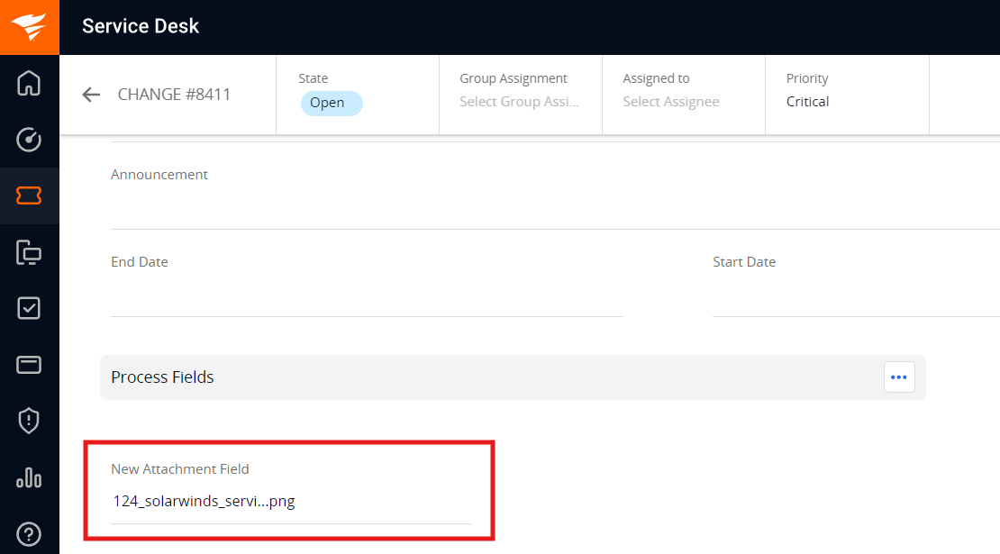
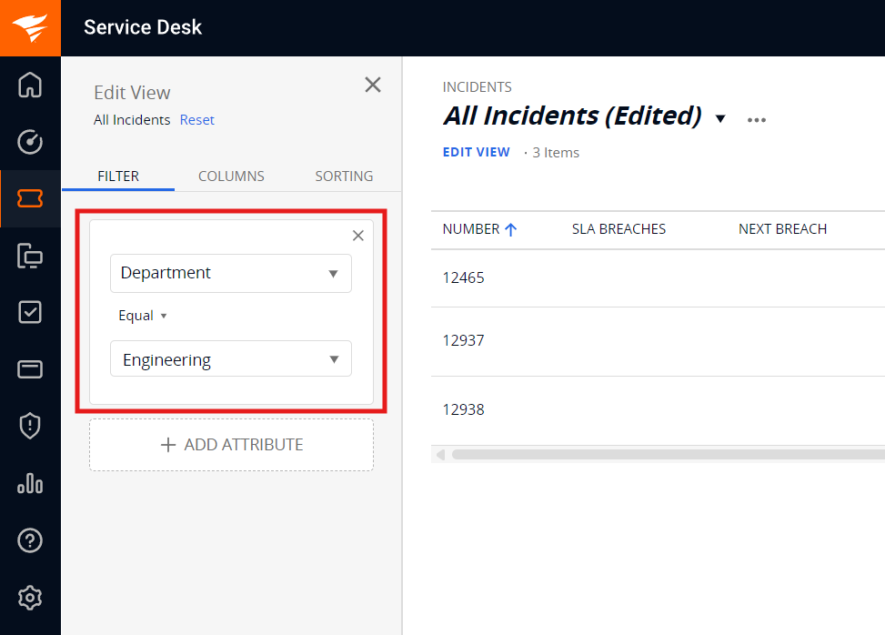
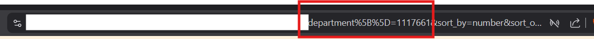

# Prerequisites
## User Privileges
- Create one user in SolarWinds Service Desk that is dedicated to <code class="expression">space.vars.SITENAME</code>. This user should not perform any other action from SolarWinds Service Desk's user interface. This user is referred to as an 'Integration User' in the documentation.
- For this integration user to perform operations in SolarWinds Service Desk, various permissions are required, as outlined in the [Required Permissions](#required-permissions) section.
## Required Permissions

The following permissions should be granted to the integration user:

| **Permission Name** | **Permission Category**       | **Requirements**                                                                                                                              |
|---------------------|-------------------------------|-----------------------------------------------------------------------------------------------------------------------------------------------|
| **Read**            | Read access for entity types  | Read permission must be granted for the specific entity types that need to be synchronized (Incidents and Changes).                           |
| **Read**            | Read access for Users         | Required to read user-related details such as user name, user email for the user fields like reporter, assignee etc. during synchronization.  |
| **Manage**           | Write access for entity types | Allows the connector to create, update, and delete records for supported entity types by <code class="expression">space.vars.SITENAME</code>. |
| **Manage**           | Write access for Users        | Required to read user-related details such as user name, user email for the user fields like reporter, assignee etc. during synchronization.  |
| **Setup**           | Setup (with All option)       | Required to the user who is generating  API token of Integration User for <code class="expression">space.vars.SITENAME</code>.                |

## SolarWinds Service Desk Edition Guidelines

- To ensure smooth integration without delays, it is recommended to use the **Advanced** or **Premier** edition of SolarWinds Service Desk.
    - **Reason**: The API rate limit depends on your subscription plan:
        - **Advanced Plan**: 1,000 API calls user/minute.
        - **Premier Plan**: 1,500 API calls user/minute.
- For optimal performance, set the item sync schedule to **15 minutes or more** at <code class="expression">space.vars.SITENAME</code>.
    - **Reason**: Shorter sync intervals may cause sync delays due to API rate limiting, especially when synchronizing a large number of entities.

# System Configuration

Before you continue with the integration, you must first configure the SolarWinds Service Desk system in <code class="expression">space.vars.SITENAME</code>.

Refer to [System Configuration](../integrate/system-configuration.md) for steps on how to configure the system.
Refer to the screenshot below:

<p align="center">
  
</p>

## SolarWinds Service Desk System Form Details

| Field Name           | Field Visibility | Description                                                                                                                                                                                                                                                                                                                                                                                                                                                                                                                                                                                                    |
|----------------------|------------------|----------------------------------------------------------------------------------------------------------------------------------------------------------------------------------------------------------------------------------------------------------------------------------------------------------------------------------------------------------------------------------------------------------------------------------------------------------------------------------------------------------------------------------------------------------------------------------------------------------------|
| **System Name**      | Always           | Provide a unique name for the SolarWinds Service Desk system.                                                                                                                                                                                                                                                                                                                                                                                                                                                                                                                                                  |
| **API URL**          | Always           | Provide the REST API Endpoint for accessing your SolarWinds Service Desk cloud instance. The API Base URL is region-specific and mandatory for connecting to the SolarWinds Service Desk environment. You must enter the URL that corresponds to your organization's region:<br>- US Region: https://api.samanage.com<br>- EU Region: https://apieu.samanage.com<br>- Asia-Pacific/Japan Region: https://apiau.samanage.com<br><br>Using an incorrect endpoint will result in authentication and connection errors. Refer to [SolarWinds ITSM API Documentation](https://apidoc.samanage.com) for more details. |
| **Server URL**       | Always           | Provide Server URL of the SolarWinds Service Desk cloud instance. This URL will be used for communicating with end system. The format of the URL would be:  http://[your_domain_name]. Example: https://abc.samanage.com                                                                                                                                                                                                                                                                                                                                                                                       |
| **User Email**       | Always           | Provide the email address of the SolarWinds Service Desk user dedicated to OpsHub Integration Manager. This user should not be used for any other operations from the system's user interface and must have the [Required Permissions](#required-permissions) to access data in SolarWinds Service Desk.                                                                                                                                                                                                                                                                                                       |
| **API Token**        | Always           | Provide the API token generated for the user specified in the User Email field. This token must have sufficient permissions to enable communication with the SolarWinds Service Desk API. Refer to the [Get API Token](#get-api-token) section for details on how to generate the token.                                                                                                                                                                                                                                                                                                                       |
| **Metadata Details** | Always           | Provide additional metadata specific to your SolarWinds Service Desk instance in JSON format. This is used to define lookup field values for your environment. For the correct JSON format and examples, refer to the [Metadata JSON Format](#metadata-json-format) section.                                                                                                                                                                                                                                                                                                                  |

# Mapping Configuration

Map the fields between SolarWinds Service Desk and the other system to be integrated and ensure that the data between both systems synchronize correctly.
Refer to [Mapping Configuration](../integrate/mapping-configuration.md) for steps on configuring field mappings.

<p align="center">
  
</p>

## Attachment Configuration

- Attachment which are added directly to the SolarWinds Service Desk entities will be synced. Refer the below screenshot, showing the attachment added on Entity level in SolarWinds Service Desk's **Incident** entity.
<p align="center">
  
</p>

## Comments Configuration
- The Incident entity type supports two comment types: **Public** and **Private**. Both types are supported for synchronization, and user can configure comment type mapping to maintain proper visibility settings. Refer to the screenshot below for the comment type mapping configuration.
<p align="center">
  
</p>

# Integration Configuration

Set a time to synchronize data between SolarWinds Service Desk and the other system. Define parameters and conditions, if any, for integration.
Refer to [Integration Configuration](../integrate/integration-configuration.md) for step-by-step instructions.

<p align="center">
  
</p>

## Criteria Configuration

- If the user wants to specify conditions for synchronizing an entity from SolarWinds Service Desk as source system to the other system, the criteria must be configured. Navigate to Criteria Configuration section on [Criteria Configuration](../integrate/integration-configuration.md/#criteria-configuration) page to learn in detail about Criteria Configuration.


- Set the **Query** as per <code class="expression">space.vars.SITENAME</code>'s Native query format.Refer to [OpsHub Query Format](../integrate/opshub-query-format.md) for step-by-step instructions. While adding the criteria, user needs to add the internal names of the fields on which the criteria have to be applied.


### Sample criteria:

| Field name  | Field internal name | Criteria description                              | Criteria snippet                                                |
|-------------|---------------------|---------------------------------------------------|-----------------------------------------------------------------|
| Description | description         | Sync items where text description equals “sample” | [{"condition":"EQUALS","field":"description","value":"sample"}] |
| Priority    | priority            | Sync items where Priority is Critical             | [{"condition":"EQUALS","field":"priority","value":"1"}]         |

- For lookup-type fields, always use the internal field values.
    - Display values will not work in Criteria. Refer to [Get Internal Name and ID For Fields](#get-internal-name-and-id-for-fields) section for details.

## Target Lookup Configuration

* Provide Query in Target Search Query field such that it is possible to search the entity in the SolarWinds Service Desk as the target system. In the target search query field, the user can provide a placeholder for the source system's field value in the '@'.

* To learn in detail about how to configure Target LookUp, refer to **Search in Target Before Sync** section on [Integration Configuration](../integrate/integration-configuration.md) page.

* Overall, Target LookUp Query is similar to [Criteria configuration](#criteria-configuration), except that the value part contains a field name with '@' instead of static value.

* For lookup-type fields, always use the internal field values.
  * Display values will not work in Target Lookup. Refer to [Get Internal Name and ID For Fields](#get-internal-name-and-id-for-fields) section for details

**Target LookUp query samples:**

| **Field Type** | **Target LookUp usecase**                                  | **Snippet**                                                       |
|----------------|-------------------------------------------------------------|--------------------------------------------------------------------|
| `Description`  | Target LookUp on the entity having the source entity's id in 'description' field | `[{"condition":"EQUALS","field":"description","value":"@oh_internal_id@"}]` |


# Known Behaviors and Limitations

- User will not be able to put Criteria and Target Lookup on fields such as State, date-type fields, and custom fields due to API limitations.
- In Criteria and Target Lookup configurations, only the following operators are supported: Equals & Not Equals. 
  - Range filters such as Less Than, Less Than or Equal To, Greater Than, and Greater Than or Equal To are not available due to API limitations.
- For some lookup and multi-lookup fields, the SolarWinds API does not return lookup values. In such cases, the required field metadata must be defined using a JSON configuration during system creation. Refer to the [Metadata JSON Format](#metadata-json-format) section for details.
- Attachments added to attachment-type fields will not be synchronized due to API limitations.
<p align="center">
  
</p>

- The API token must be updated in the SolarWinds Service Desk system configuration in OpsHub in the below cases to avoid the sync failures:
  - If permissions are removed from the integration user in SolarWinds Service Desk.
  - If the API token is manually reset or regenerated.
  - If the API token is deleted from the SolarWinds Service Desk interface.

# Appendix

## Get API Token 
To get the API token for the Integration User follow the steps:
1. Login to SolarWinds Service Desk account.
2. Navigate to the **Setup** > **Users & Groups** > **Users** section.

<p align="center">
  
</p>

3. Click on the username for which, need to generate the API token.
<p align="center">
  
</p>

4. Click on **Generate New Token** or if the token is already generated then click on **Reset JSON Web Token**.

<p align="center">
  
</p>

5. Once this is done copy the token value from **Show Token** option. Store this token securely, as it will be needed during system configuration.


## Get Internal Name and ID for Fields
Below are the steps to find the internal Name or ID for a specific field value:
1. Log in to your SolarWinds Service Desk account and navigate to the module (e.g., Incidents) containing the lookup field.

2. Click on Edit View and navigate to the Filter tab.

3. Select the desired Field (e.g., Department) and choose the specific Value (e.g., Engineering) you wish to map.

<p align="center">  </p>

4. Once the filter is applied, inspect the Browser URL.

5. Locate the parameter corresponding to your field. The numeric value following the field name in the URL is the Internal ID for that specific display value.

<p align="center">  </p>

6. Here in the above screenshot, **department** is the internal field name for the selected field **Department** and **1117661** is the internal field value for the lookup field value  **Engineering**.
## Metadata JSON Format

When configuring SolarWinds Service Desk in <code class="expression">space.vars.SITENAME</code>, user must provide a JSON structure for system fields. For Lookup-type fields, as their values cannot be retrieved via API therefore this fields must be manually defined here, to ensure proper integration.To get the internal field names and the internal ids for the lookup fields refer [Get Internal Names and Ids For Fields](#get-internal-name-and-id-for-fields) section. The Sample JSON structure provided as below:

```json
{
  "entities": [
    {
      "internalName": "incidents",
      "displayName": "Incidents",
      "fields": {
        "system": [
          {
            "internalName": "state",
            "displayName": "State",
            "dataType": "lookup",
            "mandatory": false,
            "lookUpValues": {
              "New": "New",
              "Resolved": "Resolved",
              "Closed": "Closed",
              "On_Hold": "On_Hold"
            },
            "historyEnabled": true
          },
          {
            "internalName": "priority",
            "displayName": "Priority",
            "dataType": "lookup",
            "mandatory": true,
            "lookUpValues": {
              "Critical": "Critical",
              "High": "High",
              "Medium": "Medium",
              "Low": "Low"
            },
            "historyEnabled": true
          }
        ]
      }
    },
    {
      "internalName": "changes",
      "displayName": "Changes",
      "fields": {
        "system": [
          {
            "internalName": "state",
            "displayName": "State",
            "dataType": "lookup",
            "mandatory": false,
            "lookUpValues": {
              "Open": "Open",
              "On_Hold": "On_Hold",
              "Approved": "Approved",
              "Declined": "Declined",
              "Waiting_for_Approval": "Waiting_for_Approval",
              "In_Progress": "In_Progress"
            },
            "historyEnabled": true
          },
          {
            "internalName": "priority",
            "displayName": "Priority",
            "dataType": "lookup",
            "mandatory": true,
            "lookUpValues": {
              "Critical": "Critical",
              "High": "High",
              "Medium": "Medium",
              "Low": "Low"
            },
            "historyEnabled": true
          },
          {
            "internalName": "change_type",
            "displayName": "Type",
            "dataType": "lookup",
            "mandatory": true,
            "lookUpValues": {
              "227996": "None",
              "227997": "Standard",
              "227998": "Normal",
              "227999": "Emergency"
            },
            "historyEnabled": true
          }
        ]
      }
    }
  ]
}
```

This JSON structure defines the available values for system fields of SolarWinds Service Desk instance. Ensure the correct internal names and IDs are used for the fields.

---
