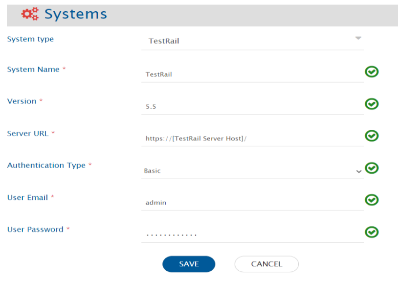
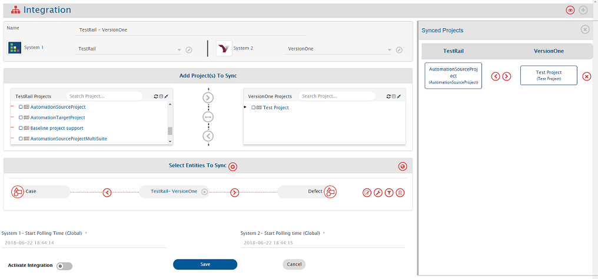
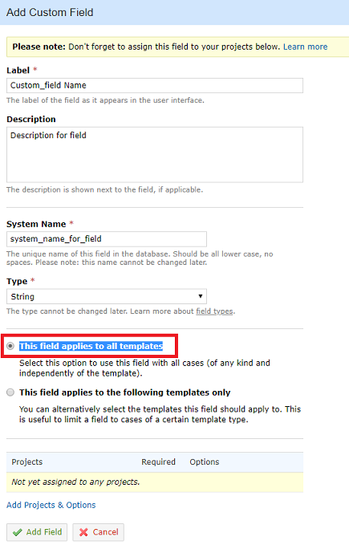
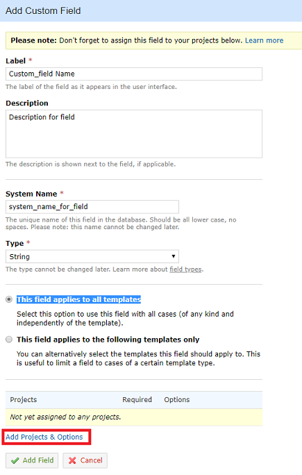
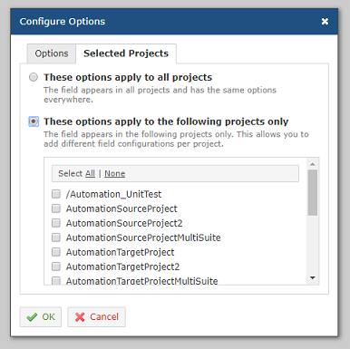
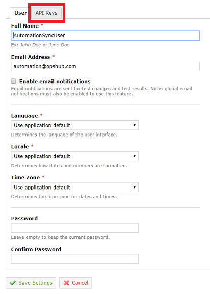
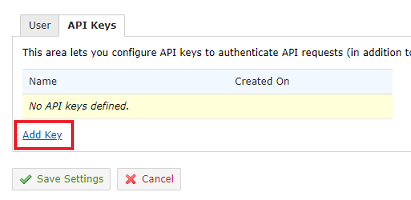
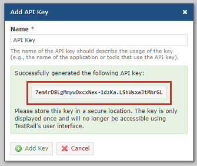

# Prerequisites

## User privileges

* Create a user in TestRail that is dedicated for <code class="expression">space.vars.SITENAME</code>. Please click [here](#testrailadduser) to see how you can add a user in TestRail.
* User must have all privileges to access web services. Please click [here](#testrailgrantpermission) to see how you can provide administrator rights to the TestRail user.
* Set User Time Zone to GMT +0.0. Please click [here](#testrailtimezone) to see how you can set timezone for TestRail user.

## Custom field setting

* For synchronization of Case, Project and Result entites, it is mandatory to create a custom field with system name `oh_last_update` as this field is required for recovery of workitems. If this field is not set, it will result in event failure. Please refer [here](#add-custom-field) for steps to add a custom field.

# System Configuration

Before you continue with the integration, you must first configure TestRail.

Click [System Configuration](../integrate/system-configuration.md) to learn the step-by-step process to configure a system.

Refer to the screenshot given below.

**TestRail System form details**

| **Field Name**      | **When field is visible on the System form**      | **Description**                                                                                   |
|---------------------|---------------------------------------------------|---------------------------------------------------------------------------------------------------|
| **System Name**     | Always                                            | Provide a unique **System Name**.                                                                |
| **Version**         | Always                                            | Provide **Version** of the system.                                                               |
| **Server URL**      | Always                                            | Provide **Server URL** to connect TestRail application base URL. E.g., https://example.testrail.io/ |
| **Authentication Type** | Always                                       | Select TestRail API authentication mode which allows OpsHub to authenticate with TestRail: 1. Basic 2. API Key |
| **User Email**      | Always                                            | Provide **User Email** of the dedicated user.                                                    |
| **User Password**   | Only when Authentication Type is Basic           | Provide TestRail User's password.                                                                |
| **User API Token**  | Only when Authentication Type is API Key         | Provide TestRail User's API Key.                                                                 |

If the system is deployed on HTTPS and a self-signed certificate is used, then you will have to import the SSL Certificate to be able to access the system from <code class="expression">space.vars.SITENAME</code>. Click [Import SSL Certificates](../getting-started/ssl-certificate-configuration.md) to learn how to import SSL certificate.

To generate new API key for the user, refer [Generate API key for the user](#testrailuserapikey) in appendix.

Refer [Add custom field](#testrailcustomfield) in appendix to learn how to add custom fields for entity.

# Mapping Configuration

Map the fields between TestRail and the other system to be integrated to ensure that the data between both the systems synchronizes correctly.

Click [Mapping Configuration](../integrate/mapping-configuration.md) to learn the step-by-step process to configure mapping between the systems.

Refer to the screenshot given below.

> Note: **Mandatory links configuration**

* For **Run** entity, **Suite** Link need to be configured  
* For **Result** entity, **Test**(entity) Link need to be configured  
* For **Test** entity, **Test Run**(entity) Link and **Case**(entity) Link need to be configured  
* For **Case** entity, **Section** field must be mapped  

> Note **Mapping limitations**

* Test entity:
  * Read operation and linkages with Case and Run entity are supported.
  * Create and update operations are not supported.
    * Reason: API unavailability.
* Test Result entity:
  * Create and read operations are supported.
  * Update operation is not supported.
    * Reason: API unavailability.

## Mapping configuration for synchronization of Step field of Test Case

* To sync Steps field to the TestRail as the target system, in the Test Case mapping, the default value needs to be set as **Test Case (Steps)** for 'Template' field.  
  > Note: User can also set the default value **Test Case (Steps)** for Template field from the TestRail UI itself. In that case, the above configuration will not be needed.

# Integration Configuration

Set a time to synchronize data between TestRail and the other system to be integrated. Also, define parameters and conditions, if any, for integration.

Click [Integration Configuration](../integrate/integration-configuration.md) to learn the step-by-step process to configure integration between two systems.

# Criteria Configuration

If you want to specify conditions for synchronizing an entity between TestRail and the other system to be integrated, you can use the Criteria Configuration feature.

To configure criteria in TestRail, integration needs to be created with TestRail as the source system. Set Query as per the given examples.

* An example of criteria with one *Lookup field* (System Lookup field)  
  **Sample Query:** Get cases having priority 1  
  **Example Query:** `priority_id=1`

* An example of criteria with one *User field*  
  **Sample Query:** Get cases created by TestUser  
  **Example Query:** `created_by=21` (Where 21 is a TestUser internal id)

* An example of criteria with one field support list of values  
  **Sample Query:** Get cases created by either of these users. [TestUser, DemoUser, AutomationUser, AdminUser]  
  **Example Query:** `created_by=21,23,42,12` (Where 21,23,42,12 are a respective internal ID of users)

> Note Only one field is allowed for criteria at one time.

Query field is similar to the filters available for that entity. Please click [filters](http://docs.gurock.com/testrail-api2/start) to check all the available supported filters.

# Known Behaviour

* From the Test Rail version **8.0.3 (Default)** release, there are changes in its Attachment API. Because of the misbehavior in the Attachment API, attachment might not synchronize properly through <code class="expression">space.vars.SITENAME</code>.

# Known Limitations

* Synchronization of the below mentioned features are not supported due to non-availability of TestRail APIs:
  * When TestRail is the source system:
    * Entity history
  * When TestRail is the source/target system:
    * Attachment associated with Test Suite that is added to a Test Plan
    * Attachment associated to Test Run
    * Comments
    * Inline Image of Step field of the Test Case entity.
* Synchronization of Shared Step of Test Case Entity is not supported.
* For TestRail as a source system, currently, criteria based synchronization is not supported for the below mentioned entities:
  * Section
  * Test Run
  * Milestone
  * Test Suite
  * Test Plan
  * Test
* For TestRail as a source/target system:
  * Currently, the below mentioned formatting is supported for **Markdown fields**, and the rest formatting will not synchronize via <code class="expression">space.vars.SITENAME</code>:
    * Bold
    * Italics
    * Ordered list
* Synchronization of Test Case parameters and BDD templates is not supported.

# Appendix

## 
Grant administer projects permissions to TestRail user

* Log in into TestRail as a user with administrator's role.  
* From the top-right corner, select **Administration** button.

* Select the **Users & Roles** menu from the right navigation list.

* Choose the user from the user list. Select **Lead** role from the drop-down list.

## 
Add user

To add a TestRail user:

* Log in into TestRail as a user with the administrator's role.  
* From the top-right corner, select **Administration** button.

* Select the **Users & Roles** menu from the right navigation list.

* Click add **User** button given below the user list.

## 
Add Custom Field

* Log in into TestRail as a user with the administrator's role.  
* From the top-right corner, select **Customizations** Button.

* Select **Add Field** button for the entity for which you want to add custom fields.
* Enter details for the custom field.
* Select **This field applies to all templates**.

* Click the **Add Projects & Options** link.

* Go to the **Selected Projects** tab.

* Select the project list for which you want to add custom fields.
* Select the **Add Field** button.

## 
Set User Time zone

* Log in into TestRail as a user with administrator's role.  
* From the top-right corner, select the **Administration** button.

* Select the **Users & Roles** menu from the right navigation list.

* Select the user from the user list.  
* Select time zone from the **Time Zone** drop-down list.

* Click the **Save User** button.

## 
Generate API key for the user

Following are the steps to generate API key for a user.

* Log in into TestRail as a user with the administrator's role which is used for TestRail System.  
* From the top-right corner, click your user name and go to **My Settings**.

* Select the **API Keys** tab.

* Click the **Add Key** link.

* Provide the name for API key and then click the **Generate Key** button. Select the API key from open dialogue box.

* Click the **Add Key** button. Then, click the **Save Settings** button.
