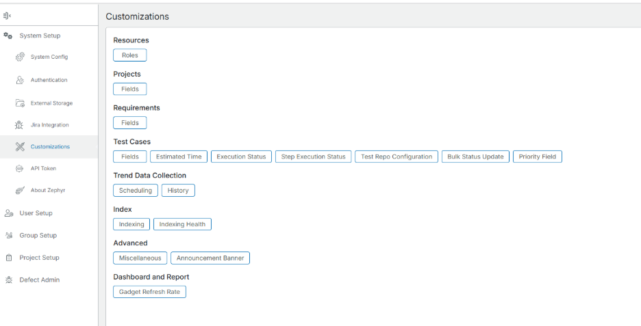
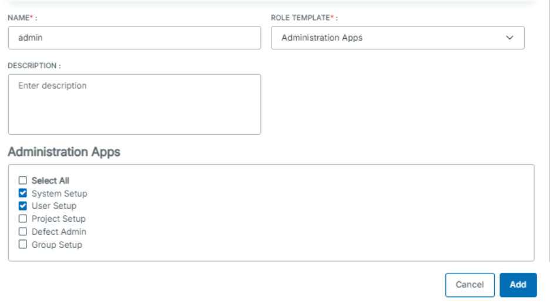
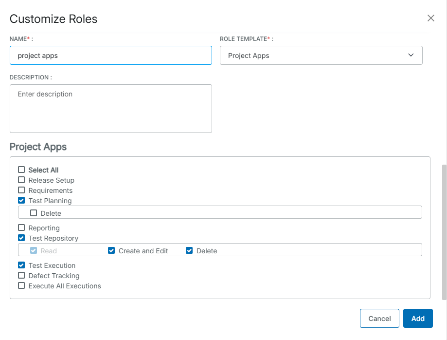
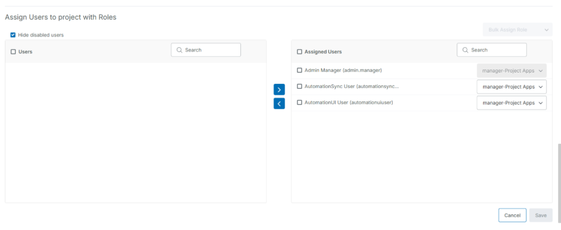
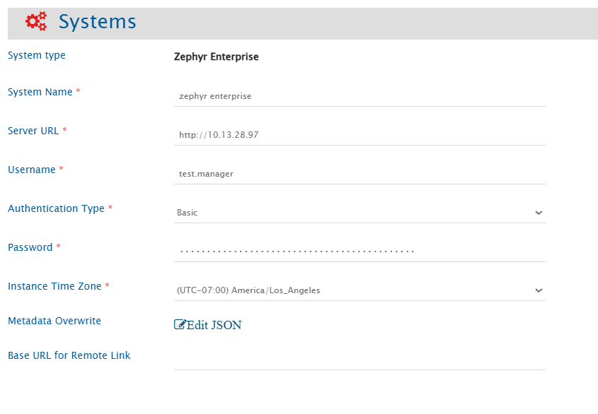
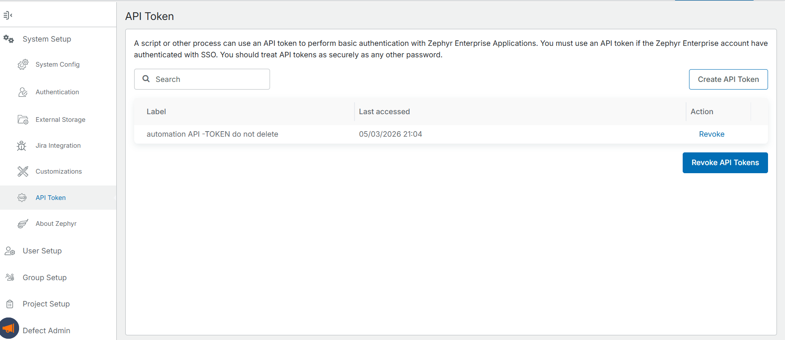

# Prerequisites

## User privileges

- Create one user in Zephyr Enterprise that is dedicated to <code class="expression">space.vars.SITENAME</code>. This user should not perform any other action from Zephyr Enterprise’s user interface. This user is referred to as an 'Integration User' in the documentation.
- For this integration user to perform operations in Zephyr Enterprise, various permissions are required, as outlined in the [Required Permissions](#required-permissions) section.

## Required Permissions

In Zephyr Enterprise, users are assigned roles, and those roles define their permissions. The integration user requires two roles to be configured and assigned:

1. **An Administration Apps role** — grants access to system-level settings.
2. **A Project Apps role** — grants read and write access to Test Planning, Test Repository, and Test Execution.

The user must also be assigned to the configured project with the configured **Project Apps** role.

#### Step 1 — Configure the Administration Apps Role

1. Navigate to the **Administration** section in Zephyr Enterprise.
2. Open **Customizations → Roles**.

<p align="center">
  
</p>


3. Create or verify a role using the **Administration Apps** role template.
4. Under **Administration Apps**, enable at minimum: **System Setup** and **User Setup**.



5. Save the role and assign it to the integration user.


#### Step 2 — Configure the Project Apps Role

1. In **Customizations → Roles**, create a role using the **Project Apps** role template.
2. Enable the following permissions:

| Project App         | Permissions Required |
   |---------------------|---------------------|
| **Test Repository** | Read, Create and Edit |
| **Test Planning**   | Read, Create and Edit |
|**Test Execution** | Read, Create and Edit |




5. Save the role.

#### Step 3 — Assign the User to the Project

1. Navigate to **Project Setup** and open the target project.
2. Open the **Assign Users to project with Roles** panel.
3. Assign the integration user with the **Project Apps** role, you have configured in step 2.
   
4. Save the assignment.


# Supported Entities

The following entities are supported for synchronization between Zephyr Enterprise and other systems:

* Folder
* Phase 
* Test Case
* Test Execution


# System Configuration

Before you continue with the integration, you must first configure the Zephyr Enterprise system in <code class="expression">space.vars.SITENAME</code>.

Refer to [System Configuration](../integrate/system-configuration.md) for a steps on how to configure the system.
Refer to the screenshot below:

<p align="center">
  
</p>

## Zephyr Enterprise System Form Details

| Field Name                  | When is the field visible                  | Description                                                                                                                                                                                                                                                                       |
|-----------------------------|--------------------------------------------|-----------------------------------------------------------------------------------------------------------------------------------------------------------------------------------------------------------------------------------------------------------------------------------|
| **System Name**             | Always                                     | Provide a unique name for the Zephyr Enterprise system.                                                                                                                                                                                                                           |
| **Server URL**              | Always                                     | Provide Server URL of the Zephyr Enterprise instance. This URL will be used for communicating with Zephyr Enterprise system API. The format of the URL would be - http://[Server host], e.g. - http://127.0.0.1                                                                   |
| **Username**                | Always                                     | Provide the username of the Zephyr Enterprise user dedicated to OpsHub Integration Manager (OIM). This user must not be used for any operations from Zephyr Enterprise’s user interface and must have the required permission to access the data as per OIM product documentation |
| **Password**                | Only when Authentication Type is Basic     | Provide the password for the user given in the "Username" field.                                                                                                                                                                                                                  |
| **API Token**               | Only when Authentication Type is API Token | Provide the API token generated in Zephyr Enterprise for the user given in the Username field. Refer to [Generate API Token](#generate-api-token) in the Appendix for details.                                                                                                    |
| **Instance Time Zone**                                                                                                                       | Always                                     | Provide the time zone of the host machine where Zephyr Enterprise application is installed.                                                                                                                                                                                       |
| **Metadata Overwrite**                                                                                                                       | Always                                     | Enable or disable the usage of private API. Refer to the [Understanding Metadata JSON Input](#understanding-metadata-json-input) section for details on format and JSON structure.                                                                                                |
| **Base URL for Remote Link** | Always                                     | Provide a different instance URL of the Zephyr Enterprise instance. This URL will be used for generating the Remote Link.<br/> Note: If "Base URL for Remote Link" is empty, it will use default instance URL to generate remote link if configured on integration.               |


## Understanding Metadata JSON Input

### Controlling Attachment Download via Private API

By default, OIM downloads attachments from Zephyr Enterprise using the private API. This behavior is enabled even if the **Metadata Overwrite** field is left empty or an empty JSON object (`{}`) is provided.

To disable private API usage for attachment downloads, explicitly set the `disableReadAttachments` flag to `true` in the JSON:

```json
{
  "entities": [
     {
         "internalName": "testcase",
         "systemSpecific": {
            "disableReadAttachments": true
         }
     }
  ]
}
```

# Mapping Configuration

Map the fields between Zephyr Enterprise and the other system to be integrated to ensure that data between both systems synchronizes correctly.

Refer to [Mapping Configuration](../integrate/mapping-configuration.md) for steps on configuring field mappings.

## Test Step Field Configuration

For mapping additional fields for test steps like 'Comments', advance XSLT will be modified. Add the following sample xslt in default xslt to map additional fields:

Example,  
Here, field name should be the internal name of comments field in Zephyr Enterprise and the content of this field needs to be included in given field name tag

```xml
<additionalFields>
    <fieldName>
        <xsl:value-of select="'zcf_1001'"/>
    </fieldName>
    <zcf_1001>
        <xsl:value-of select="additionalFields/comment"/>
    </zcf_1001>
</additionalFields> 
```

# Integration Configuration

Set a time to synchronize data between Zephyr Enterprise and the other system. Define parameters and conditions, if any, for integration.
Click [Integration Configuration](../integrate/integration-configuration.md) to learn the step-by-step process to configure integration between two systems.


## Criteria Configuration & Target Lookup

* <code class="expression">space.vars.SITENAME</code> supports criteria and target lookups for the entity types Test Case and test Execution.
* Zephyr Enterprise Query format will be same as the **ZQL (Zephyr Query Language)**.
* Please refer [this](https://support.smartbear.com/zephyr-enterprise/docs/en/zephyr-enterprise/zephyr-user-guide/search.html) link To learn how to form a query in ZQL format.

**Criteria samples**

| **Field Type** | **Criteria Description**                                                          | **Criteria snippet**               |
|----------------|-----------------------------------------------------------------------------------|------------------------------------|
| **Lookup** | Synchronize all entities having priority set to 'P1'                              | priority = "P1"                    |
| **Date** | Synchronize all entities created after certain date                               | createdOn > "01-31-2025 00:00" |
| **Text** | Synchronize all entities with Name Demo entity                                    | Name ~ "Demo"                      |
| **Text** and **Lookup** | Synchronize all entities with Name Demo entity **and** priority set to 'P3'       | name ~ "Demo" and priority = "P3"  |
| **Text** or **Lookup** | Synchronize all entities with Name Demo entity **or** status set to 'IN-PROGRESS' | name ~ "Demo" or priority = "P3"   |


# Known Behavior/ Limitations

- History-based synchronization is not supported due to API unavailability.
- Comments are not supported. Zephyr Enterprise does not support comments on entities.
- Requirements and Defects links on Test Case and Test Execution are not supported.
- Cookie-based authentication is not supported by OIM. Zephyr Enterprise supports Basic Auth, API Token, and Cookie authentication; OIM supports only **Basic Auth** and **API Token**.
- **An additional update to the entity is required after adding or removing an attachment.** When an attachment is added in Zephyr Enterprise, the entity's modified timestamp is not updated. Because OIM detects changes based on the modified time, the attachment will not be picked up during sync unless a manual update is made to the entity afterwards.
- **Attachment file names with non-ASCII characters are not supported.** This is a limitation of Zephyr Enterprise itself.
- **An additional update to the entity is required after adding or removing an external link.** When an external link (Hyperlink) is added to an entity in Zephyr Enterprise, the entity's modified timestamp is not updated. OIM will not detect the change during sync unless a manual update is made to the entity afterwards.
- **Bulk updates and test case cloning may not trigger synchronization.** In Zephyr Enterprise, test cases are queried based on their indexed last modified timestamp. During bulk update operations or when cloning test cases, the indexed last modified time may not be updated in the system. As a result, OIM may not detect these changes, and some updates may be missed during synchronization.
- **Tags in Zephyr Enterprise cannot contain spaces.** A space character is treated as a tag delimiter — two words separated by a space are stored as two separate tags. If the source system contains tag values with spaces and the target is the Zephyr Enterprise Tags field, the space characters must be handled using advanced XSLT transformation in the mapping configuration.


# Appendix


## Generate API Token

To generate an API token in Zephyr Enterprise for the integration user:

1. Navigate to the **Administration** section in Zephyr Enterprise.
2. Under **System Setup**, click on **API Token**.



3. Click **Create API Token**, then copy and save the generated token.


