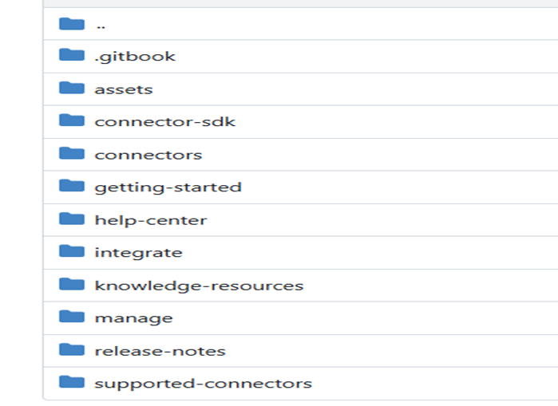
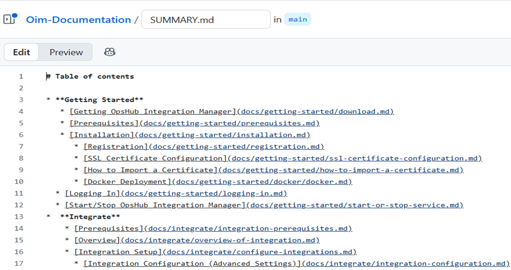

# OpsHub-GitBook Help Guide

# Complete Workflow Guide: Creating, Committing, and Publishing Markdown Files to GitBook via GitHub

This guide explains, step by step, how to edit, commit, and publish Markdown files (`.md`) in GitHub so that they appear correctly in GitBook.

## Understanding the Basics

### What is GitHub?
- Think of GitHub as an online folder where your documentation files live.
- Multiple people can edit these files.

### What is GitBook?
- GitBook reads your Markdown files from GitHub and displays them as a website.

### What is Markdown (.md)?
- A simple text format used for writing documentation.
- GitBook fully supports Markdown.

## Creating and Editing Pages in GitBook

### How to Edit an Existing Page
1. Locate the page in the folder hierarchy.  
   Each page in GitBook maps directly to a file in the GitHub repository.
   <p align="center">
   
   </p>
2. Make required changes (content, formatting, links, images, etc.).
3. Commit the changes.

### When You Add a New Page

  
    
#### Use the correct file name
- Use lowercase letters. 
- Do not use spaces. 
  - Use dashes (`-`) between words.  

    Example:
  `database-configuration.md`
  
  
#### Add the page to `SUMMARY.md`
- GitBook only shows pages listed in `SUMMARY.md`.
   Example:
   ```markdown
      - [Database Configuration](docs/integrate/database-configuration.md)
   ```
  
  
#### Commit both files together
- Make sure that:
  - Your new .md file and the update summary.md file are committed in the same commit.
    <p align="center">
      
   </p>
  
  

## How to Add a New Connector Entry

To list a new connector in the documentation, follow the steps below. These steps ensure the connector appears correctly in the Connectors list, Supported Connectors table, and the GitBook sidebar.

    
  
### Add Connector Documentation Page
- Create a new markdown file inside the `connectors` folder.
   > **Example:** connectors/│── snow-quick-connect.md

  
  
### Add Logo in Assets Folder
Place the connector logo in: `assets/connector/` directory.
#### Logo requirements
- Background color: `#EDF4FD`
- Background box: **536px × 161px**
- Logo size: **72px × 72px**
   > **Example file:** `assets/connector/servicenow.png`
  
  
  
### Add Entry in `connectors.md`
- Use the table/card layout format.
   > **Example:**
   > ```html
   >  <tr>
   >  <td align="center"><mark style="color:#555555"><strong>ServiceNow Quick Connect</strong></mark></td>
   >  <td><a href="../assets/connector/70_servicenow.png">ServiceNow Quick Connect</a></td>
   >  <td><a href="servicenow-quick-connect.md">servicenow-quick-connect.md</a></td>
   > </tr>

  
  
### Add Entry in `supported-connectors.md`
- Include supported versions and entities in the table format.

  
  
### Add Entry in `SUMMARY.md`
- Include the connector under the Connectors section for sidebar navigation.
> **Example:**
> ```markdown
> * [Connectors](connectors/connectors.md)
>   * [ServiceNow Quick Connect](docs/connectors/servicenow-quick-connect.md)
> ```

