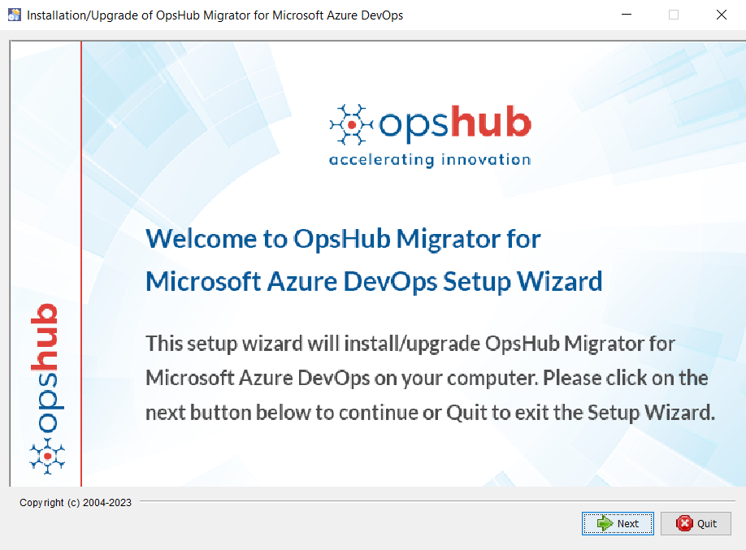
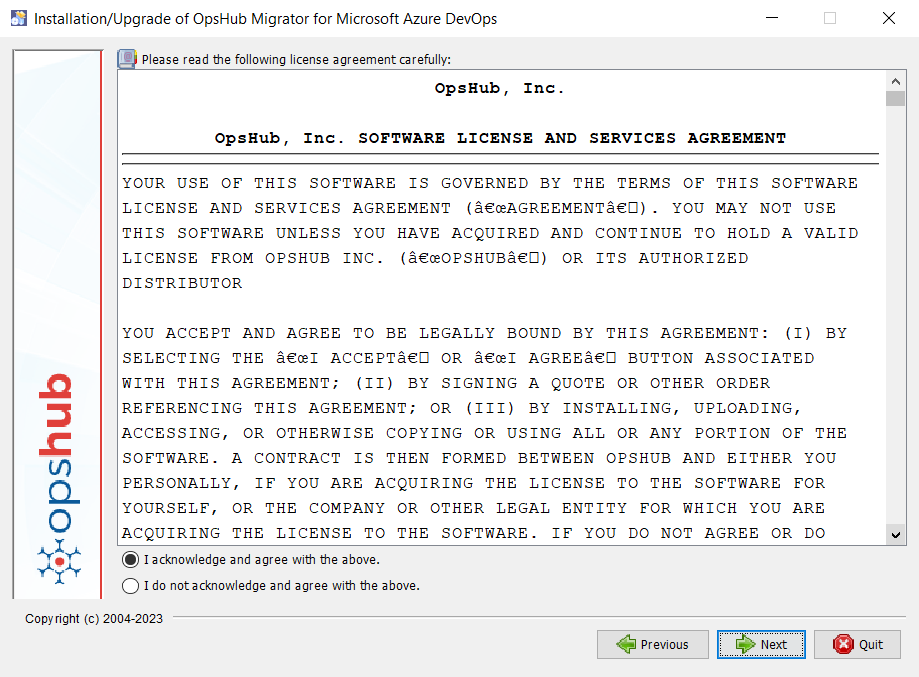
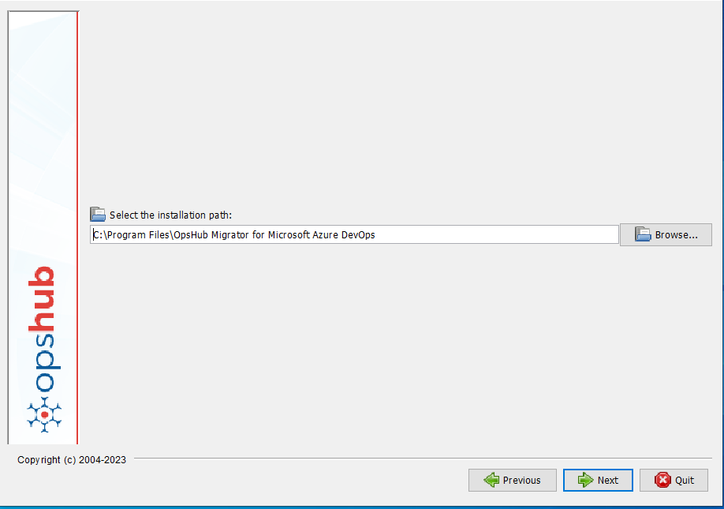
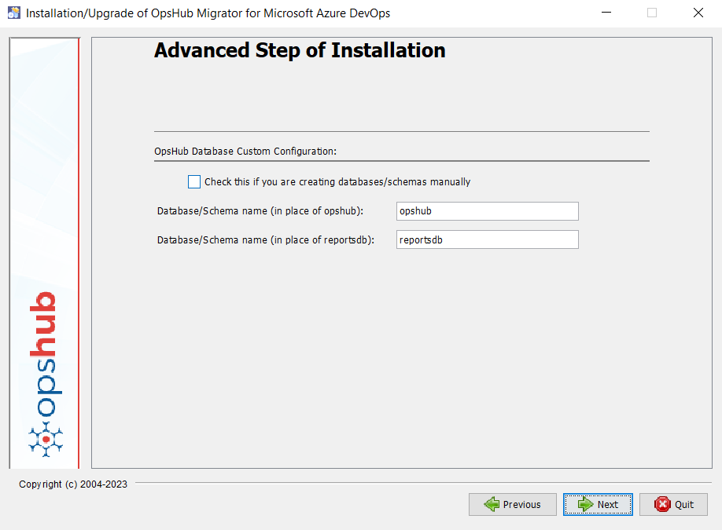
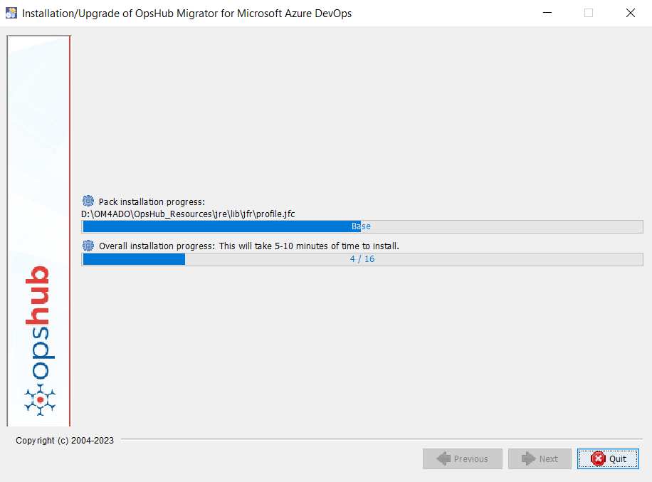
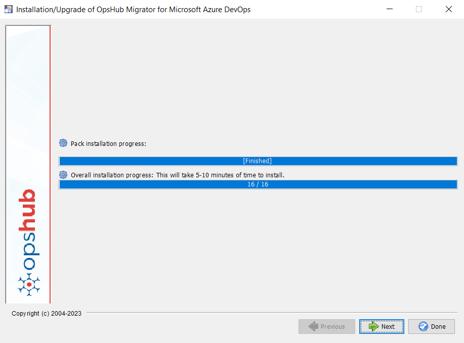
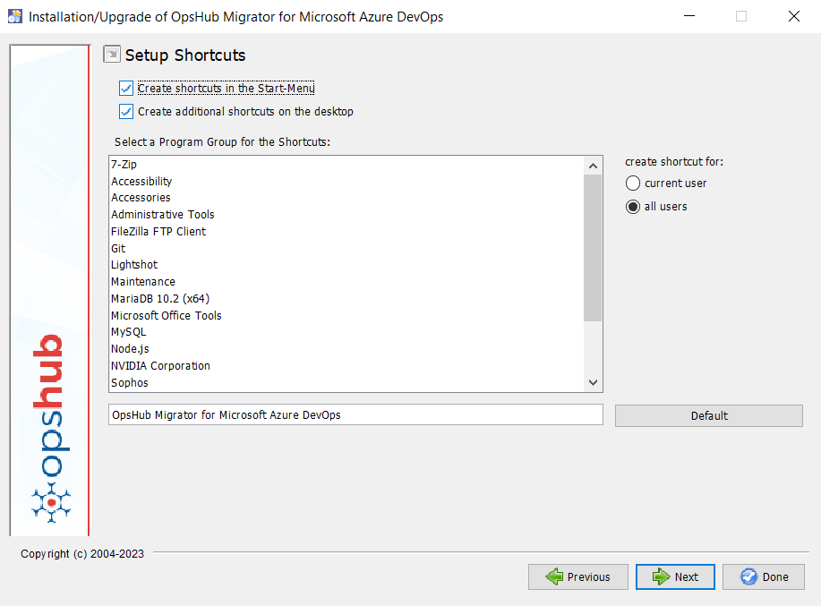
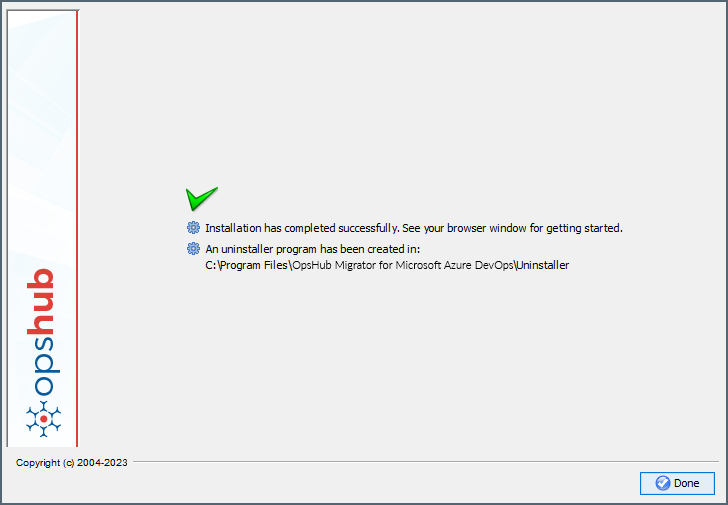

---
layout:
  width: wide
  title:
    visible: true
  description:
    visible: false
  tableOfContents:
    visible: true
  outline:
    visible: false
  pagination:
    visible: false
  metadata:
    visible: false
---

# Launching Installer

Double-click the `OM4ADO<version>.exe` file. User requires Administrator privileges to start the installer.

> **Note:** If any version of <code class="expression">space.vars.OM4ADO</code> is already installed, you will receive a notification. Click **Yes** to continue with the installation. This will overwrite the previous installation with the current version.

  

## Read License Agreement

This is the End User License Agreement window. Read the license agreement and, if you agree with the terms, select **I acknowledge and agree with the above** to continue with the installation.

  

# Installation

## Select Installation Path

Select the installation directory. Before selecting a directory, make sure it is empty. All log files, configuration files, and servers are placed in this directory. If the directory does not exist, you can create one as per your requirements.

  

## Registration

Each installation must be registered with <code class="expression">space.vars.OM4ADO</code>. Registration can be completed either in Online or Offline mode.

Please refer to the [Registration](Registration.md) page for more details.

## Database Selection



## Advanced Installation

* If you want to create databases manually, select the checkbox **Check this if you will be creating databases manually**. The instructions to create databases are provided in the [Manual Creation of Databases](#manual-creation-of-databases) section.
* If the checkbox is not selected, enter the names of the databases that you want to configure. Based on the selected database type (MySQL, MS SQL/Azure SQL, PostgreSQL, or Oracle), the databases/schemas will be created automatically.
* Database names can contain `$`, `_`, `#`, alphabets, and numbers without spaces.
* Make sure to use unique database names for each installation of <code class="expression">space.vars.OM4ADO</code>.

  

## Installation Progress

Once this window appears, the installation process has started. The installation may take approximately 45 minutes to complete.

  

## Installation Success

The screenshot below indicates that the installation has completed successfully. There is an additional step to set up the shortcut. Click **Next** to continue.

  

## Setup Shortcut

This step adds the application to the Windows program list and creates the <code class="expression">space.vars.OM4ADO</code> Launcher.

  

## Successful Installation

Clicking **Next** displays the following screen, indicating that the installation is complete.

  

Once the installation is complete, refer to [Launching OpsHub Migrator for Microsoft Azure DevOps](Launching_OpsHub_Migrator_for_Microsoft_Azure_DevOps.md) for more details.

# Appendix

## Manual Creation of Databases

## Queries for MySQL database


## Queries for MS SQL/Azure SQL Database


## Queries for Oracle Database


## Queries for PostgreSQL Database


## Collation Change of MS SQL/Azure SQL Databases

