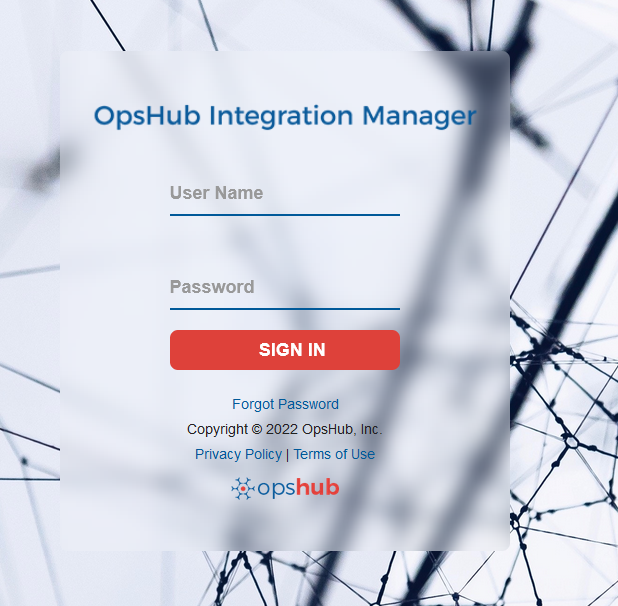
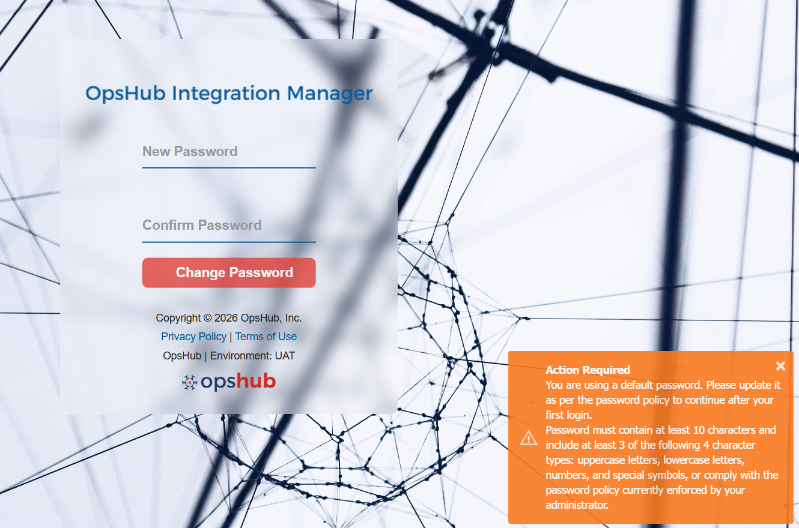
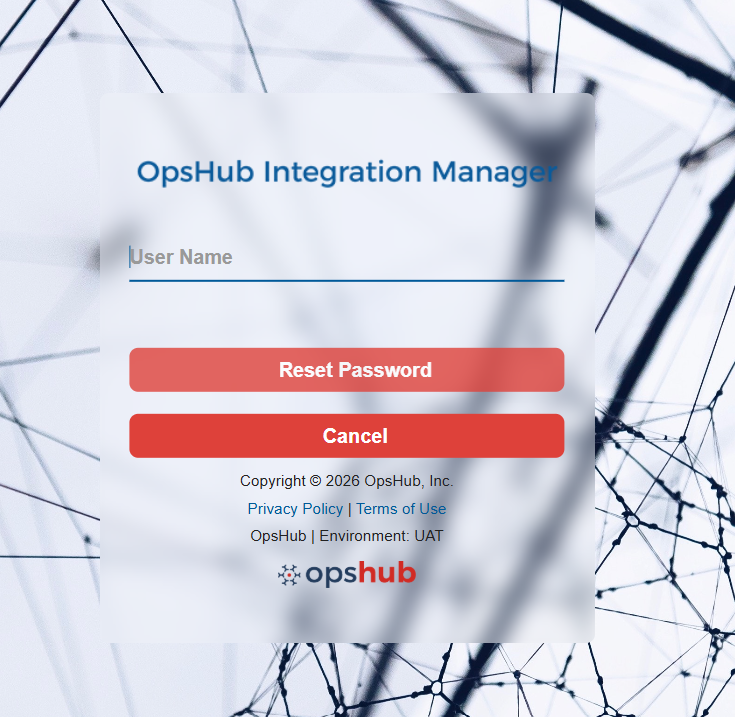
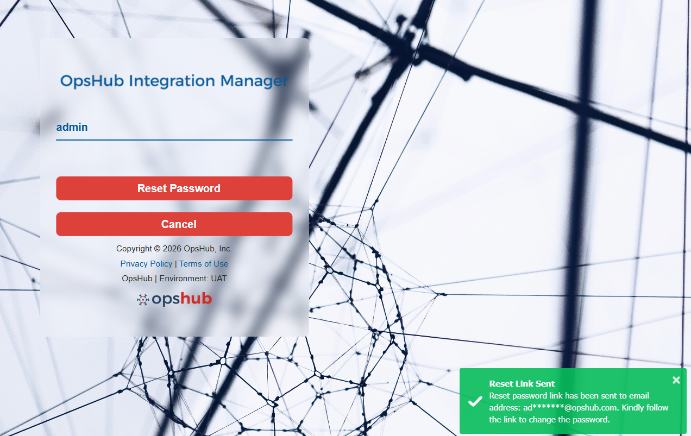
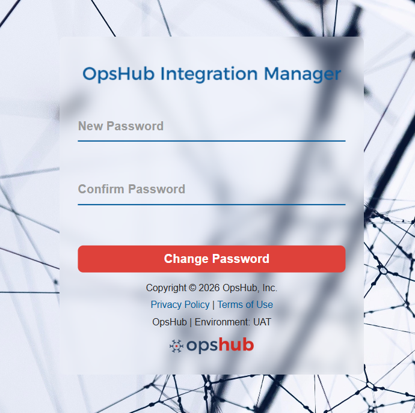
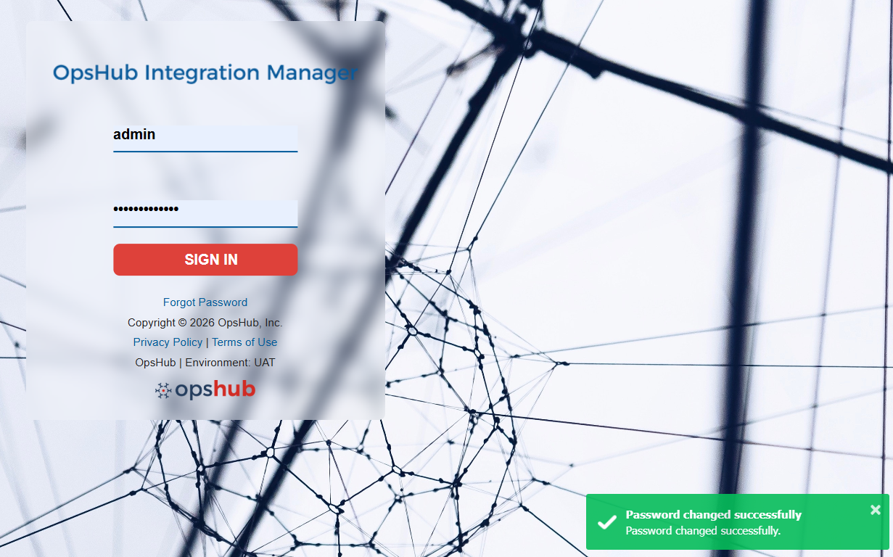

Let's see how you can get started with <code class="expression">space.vars.SITENAME</code>.

# Windows
* On Logging in page: Once the installation is complete, <code class="expression">space.vars.SITENAME</code> will be started automatically if you are doing installation on windows machine and you will be re-directed to the Getting started page in the default web browser. If the <code class="expression">space.vars.SITENAME</code> is not started, you can start it manually as described [here](start-or-stop-service.md).
* For launching the application, click on the link **Launch <code class="expression">space.vars.SITENAME</code>**. It will redirect to the login page.
* Log in with the following credentials:
  - username: admin
  - password: password

  

# Linux
* For Linux, once the installation is done, enter the URL as http://localhost:8989/OIM/ in browser.
* Log in as username **admin** and password **password**.
* If you have configured <code class="expression">space.vars.SITENAME</code> for HTTPS, then enter the URL as https://localhost:8443/OIM/ in browser.

# Set a New Password on First Login
* When a new user is created in OIM, or when the default **admin** user logs in for the first time after installation, you will be prompted to update your password.
* After logging in with the initial credentials, you will be automatically redirected to the password update screen.
* Please update your password in accordance with the defined password policy. For more details about password policy, refer to [Default Password Policy](../manage/administrator/login-server-management.md#password-policy-configuration).

  

* Once the password is successfully updated, you will be redirected back to the Login page, where you can log in using your updated credentials. 

# Forgot Password
If you have forgotten your password, <code class="expression">space.vars.SITENAME</code> provides a secure way to reset it.

- On the Login page, click the **Forgot Password** link in the login form, as shown below.

  

- You will be redirected to the Forgot Password page. Enter your **username** associated with your account and click on **Reset Password** to proceed.

  

Upon clicking **Reset Password**, a reset link will be sent to the registered email address associated with the provided username.

- If OpsHub system is configured with SMTP system, the email is sent using the **Sender Email-id** configured in the SMTP system. For more details about SMTP system, refer to [SMTP Configuration](../help-center/troubleshooting/configure-post-failure-notification.md#smtp-configuration).
- If OpsHub system is not configured with SMTP system or the configuration is invalid, the email is sent using the default <code class="expression">space.vars.SITENAME</code> user.

  

  

- Open your registered email inbox, locate the password reset email, and click on the **Reset Password** link provided. This will redirect you to the Reset Password page.

  

- Enter a new password, confirm it and click on **Change Password** to save your new password. Ensure that it adheres to the default password policy configured in the system. To know more, refer to [Default Password Policy](../manage/administrator/login-server-management.md#password-policy-configuration).

- Once the password is successfully reset, you will be redirected back to the Login page, where you can log in using your updated credentials.

  

Once you have logged in the application, you are ready to start integration configuration. Click [Overview of Integration](../integrate/overview-of-integration.md) to understand how to start using <code class="expression">space.vars.SITENAME</code> for integration.

