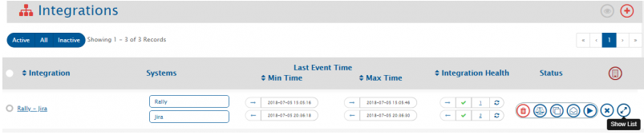
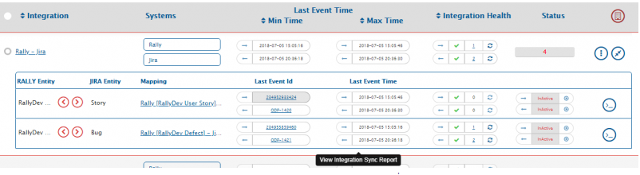
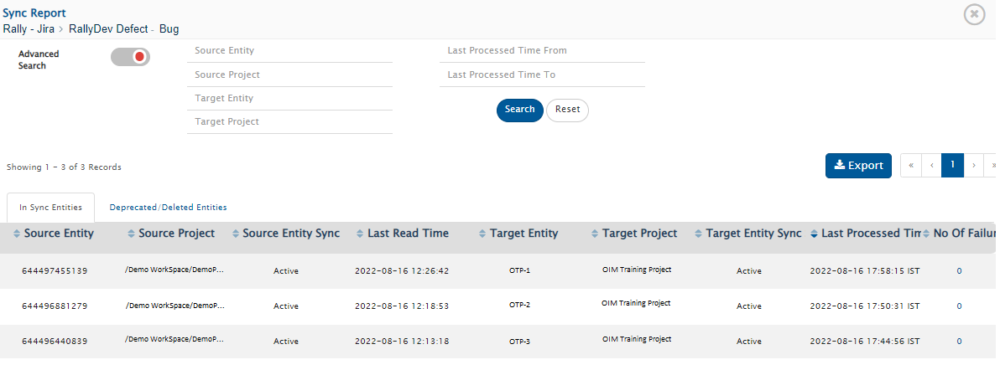
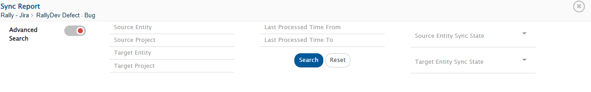
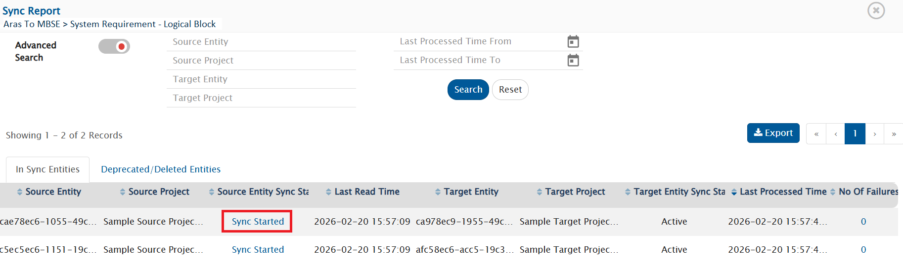
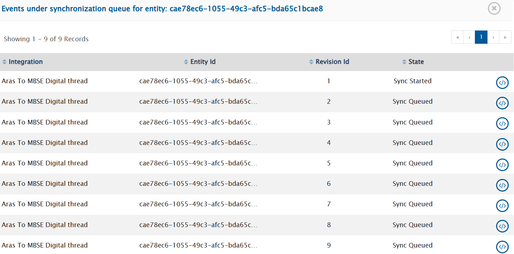
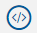
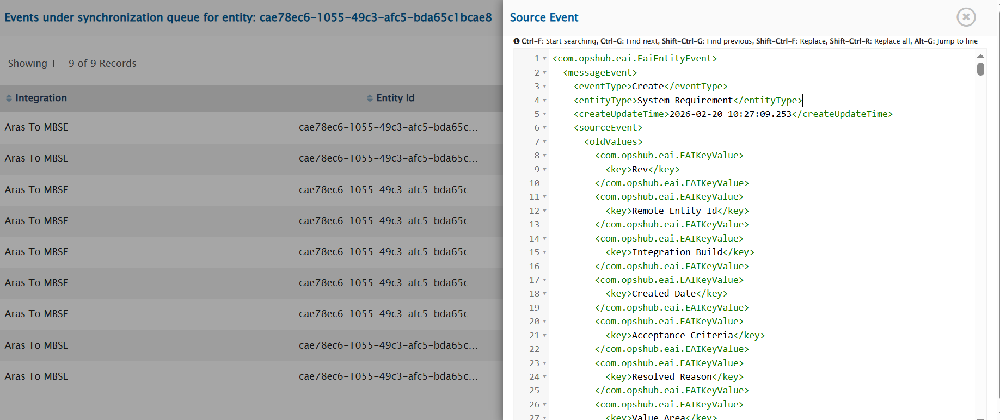

# Overview

Integration Sync Report provides the information for each entity synchronized by <code class="expression">space.vars.SITENAME</code>. The report gives insight into which entity from which project in the source system has synchronized to which project in the target system. The report also shows source entities ids and target entities ids. You can also navigate to the failed event of a particular entity from this report. Each integration has a separate Integration Sync Report.

# How to navigate to the Integration Sync Reports

To view the report for any integration, go to an integration, click the **Show List** button. From the list, click **Last Event ID** or **Last Event Time** button.  

  

  

# Reading an Integration Sync Report

The integration sync report is divided into two panes:
1. **In Sync Entities** : Report of the entities which are synchronized under the create/update events  
2. **Deprecated/Deleted Entities** : Report of the entities which are synchronized under the Delete events.

The Integration Sync Report includes:  
- **Source Entity Id:** This column shows the entity id of the source system  
- **Source Project Name:** This column shows the name of the project from which entity gets polled by <code class="expression">space.vars.SITENAME</code>  
- **Source Entity Sync State:** This column shows the [state](#state) of the entity in the source system  
- **Last Updated in Source:** This column shows the last updated time for the given entity in the source system  
- **Target Entity Id:** This column shows the entity id of the target system in which entity gets created by <code class="expression">space.vars.SITENAME</code>  
- **Target Project Name:** This column shows the project name of the target system in which entity gets created by <code class="expression">space.vars.SITENAME</code>  
- **Target Entity Sync State:** This column shows the [state](#state) of the entity in the target system  
- **Last Processed Time:** This column show the time when entity was last processed by <code class="expression">space.vars.SITENAME</code>  
- **No. of Failures:** This column shows the number of failed events for a given entity. By clicking on the number, you will be navigated to failed events for that entity.  

  

# Filtering an Integration Sync Report

You can filter data from an Integration Sync Report by using the following parameters:

- **Source Entity Id:** Search the entity by providing Source Entity Id  
- **Source Project Name:** Search the records with the source project name specified in the field  
- **Target Project Name:** Search the records with the target project as specified in the field  
- **Last Processed Time:** Search the entities with the Last Processed time between the range specified in the **Last Processed Time From** and **Last Processes Time To** fields  
- **Target Entity Id:** Search the entity by providing the Target Entity Id  
- **Source Entity Sync State:** Search the records with the source entity sync [state](#state) specified in the field  
- **Target Entity Sync State:** Search the records with the target entity sync [state](#state) specified in the field  

  

Enter the details in the field that you want to use for filtering the data. Then, click the **Search** button.

# Some Key Points to Note

- Project column remains empty for the system that doesn't have the concept of projects. If the system has the concept of projects and the project column is empty, it means the entity has not yet synchronized to the target system.  
- In case of migration or up-gradation the value of the column **Last Processed Time** for already synced entity is the time at which migration runs and **Project** remains empty.  
- In case of integration, if any entity has failure(s) on **Create event**, then **Last Updated in `<Source>` System, `<Target>` Entity Id and `<Target>` Project** columns remain empty for that record.  

# Glossary

## State

- Represents the current synchronization status of the entity for the configured integration in <code class="expression">space.vars.SITENAME</code>.

- The possible values are as follows:

### 1. General State

1. **Active:** The entity is available and accessible to <code class="expression">space.vars.SITENAME</code>.

### 2. When *Source Delete Synchronization* Is Enabled

The following states are applicable when deletion or archival changes in the source system are synchronized to the target system for an integration where [Source Delete Synchronization](../../integrate/source-delete-synchronization.md) is configured.

1. **Not Accessible:** The entity is no longer accessible to <code class="expression">space.vars.SITENAME</code>.

2. **Not Applicable:** The entity is not eligible for synchronization due to its type and/or project change, as no integration configuration matches the updated type and/or project.

3. **Archived:** The entity has been archived in the source system.

4. **Deleted by Sync:** The entity has been logically/soft deleted in the target system by <code class="expression">space.vars.SITENAME</code> as part of source delete synchronization.

5. **Archived by Sync:** The entity has been archived in the target system by <code class="expression">space.vars.SITENAME</code> as part of source delete synchronization.

### 3. When *Entity Type and/or Project Change Synchronization* Occurs

The following states are applicable when entity type and/or project changes in the source system are synchronized to the target system. For more details, refer to ["Entity Type" and/or "Project" Change Synchronization](../../integrate/entity-move-synchronization.md).

#### Conversion States

1. **Type Converted:** The entity's type has been changed in either the source or the target system.

2. **Project Converted:** The entity has been moved to a different project in either the source or the target system.

3. **Type and Project Converted:** Both the entity type and the project have been changed.

#### Deprecation States

4. **Deprecated due to Type Conversion:** The entity has been marked as deprecated in the target system because the type of the corresponding source entity was changed in the source system.

5. **Deprecated due to Project Conversion:** The entity has been marked as deprecated in the target system because the project of the corresponding source entity was changed in the source system.

6. **Deprecated due to Type and Project Conversion:** The entity has been marked as deprecated in the target system because both the type and project of the corresponding source entity were changed in the source system.

### 4. Applicable When Batch Writing Is Supported in the Target System

These states are applicable only for integrations with systems for which <code class="expression">space.vars.SITENAME</code> supports batch writing.

1. **Sync Queued:** The source changes are scheduled in a synchronization queue for batch writing. <code class="expression">space.vars.SITENAME</code> first collects all changes read by the integrations configured within the same group before applying them to the target system. At this stage, the changes are waiting in the queue and have not yet been written.
2. **Sync Started:** The processing of the queued changes has started. <code class="expression">space.vars.SITENAME</code> evaluates the queued updates one by one to determine the changes to be applied to the target system. Once all processing is completed, the consolidated updates are written to the target system.

> *Note:* To view queued changes for batch processing, refer to [Viewing Queued Entities for Synchronization](integration-sync-report.md#viewing-queued-entities-for-synchronization).
## Viewing Queued Entities for Synchronization

<code class="expression">space.vars.SITENAME</code> temporarily stores changes queued for batch writing in its database to ensure consistency and reliable processing.

Entities whose data is in the synchronization queue will have the **Sync Queued** or **Sync Started** state. Otherwise, they will have the **Active** state, which indicates that synchronization has either been completed for that entity or that no pending changes remain in the synchronization queue.

Follow the steps below to view them:
1. Open the **Sync Report** for the integration where the changes are under synchronization.
2. Click on the **"Sync Queued"** or **"Sync Started"** status.

  

    
   

3. The pop-up lists all changes currently queued for synchronization for the selected entity as follows:
  
  

    
   

4. Click on  to view the details of the changes.

  

    
   

