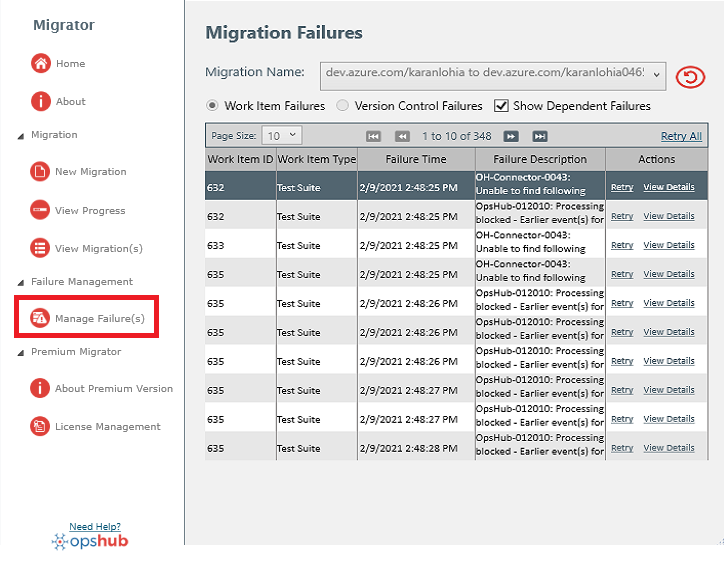

* To view migration failure(s), navigate to **Failure Management > Manage Failure(s)**.
* Select the Migration Name, and it will show the list of failures (if any) for the selected migration.

  

* From this section, users can also retry a failure and view the details of the failure.
> **Note:** The failure details contain the cause of the failure.

* If needed, users can also filter the migration failures based on **Work Item Failures** and **Version Control Failures**.