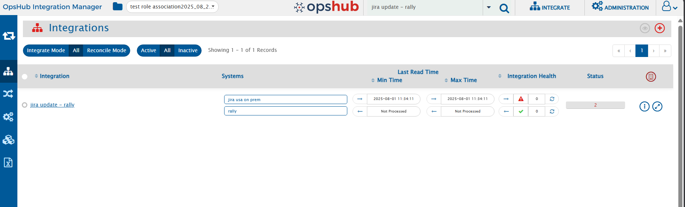

The search functionality allows users to quickly locate components such as Integrations, Mappings, Systems, Workflows, etc., within <code class="expression">space.vars.SITENAME</code>.

You can search within two scopes — depending on whether you want a focused or global search: **Current Folder** and **All Folders**.

  

### Current Folder Search

- This is the **default** search mode.
- Results are shown **within the current folder view itself**.  
  Only the components inside the folder you are currently on are filtered and displayed based on your search text.
- Useful when you already know where the component resides or want a focused search within a specific folder.

  

### All Folders Search

- This mode searches across **all folders** you have permission to access.
- Results are displayed in a **separate panel below the search bar**, so your current folder view remains unchanged.
- Useful when you are **unsure of a component’s location** or want a **global search** across all folders.
- Clicking on a component name or folder path in the results panel navigates you **directly to the folder** containing that component.
- After navigation, the folder view updates to display **all matching components** within that folder.
- This is where you can perform all standard operations, such as **editing integrations**, **creating mappings**, or performing other routine tasks.

> **Note:**
> - **Current Folder** is selected by default.
> - If you switch to **All Folders**, all searches will continue to use this mode **until you manually change it back**.
> - Your selected mode remains active across navigation and does not reset automatically.

  

  

