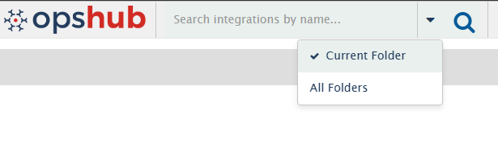
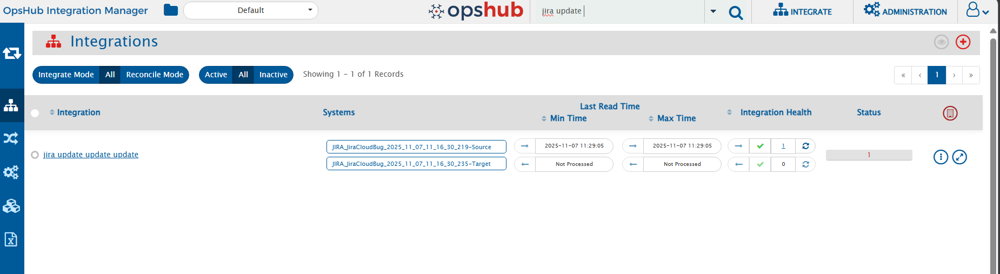
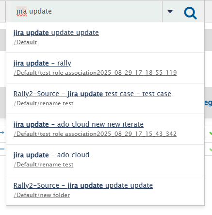

The search functionality allows users to quickly locate components within <code class="expression">space.vars.SITENAME</code>.

It offers two search scopes based on how broad or focused you want your results to be: **Current Folder** and **All Folders**.

  

### Current Folder Search

- This is the **default** search mode.
- Results are shown **within the current folder view itself**.  
  Only the components inside the folder you are currently on are filtered and displayed based on your search text.
- Useful when you already know where the component resides or want a focused search within a specific folder.

  

### All Folders Search

- This mode searches **across all folders** you have permission to access.
- Results are displayed in a **separate results panel** below the search bar, without disturbing your current folder view.
- Helpful when you are unsure in which folder the component is located or want a global search experience.
- Clicking on the component name or folder path in this panel navigates you directly to the folder where the component exists.  
  Once you navigate, the folder view updates to show all matching components in that folder.

  

