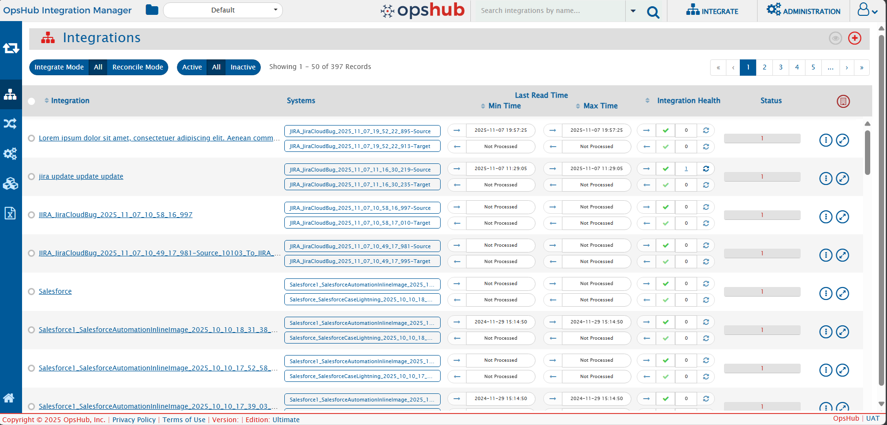

The search functionality allows users to quickly locate components such as Integrations, Mappings, Systems, Workflows, etc., within <code class="expression">space.vars.SITENAME</code>.

You can search within two scopes — depending on whether you want a focused or global search: **Current Folder** and **All Folders**.

  

For example, if you are viewing a folder that contains several integrations and no search text is entered.

  

Now, let’s see this in different search scopes

# Search Scope
## Current Folder Search

- Default search mode when you start searching.
- Shows results directly in the current folder view without changing your location.
- Filters and displays only the components within the folder you are currently viewing based on your search text.
- Ideal when you already know where the component is located or want a focused search within a specific folder

  

## All Folders Search

- Searches across **all folders** you have permission to access.
- Displays results in a separate panel below the search bar, keeping your current folder view unchanged.

  

- Useful when you are **unsure of the component’s location** or need a **global search** across all folders.
- Clicking a component name or folder path in the results panel navigates you directly to the folder where the component exists.
- After navigation, the folder view updates to show all matching components within that folder.

  

- From there, you can perform all standard operations, such as editing integrations, creating mappings, or carrying out other routine tasks

> **Note:**
> - **Current Folder** is selected by default.
> - If you switch to **All Folders**, all searches will continue to use this mode **until you manually change it back**.
> - We respect your preference—once you choose a search mode, it stays active during navigation so you don’t need to reset it each time.

