The Trends dashboard provides a quick view of synchronization activity, project configuration patterns, and failure insights across **<code class="expression">space.vars.SITENAME</code>**. Users can monitor sync volume, identify high- or low-activity areas, track project growth across systems, and drill down into specific systems, integrations, projects, and entity types for deeper analysis. 

# Trends & Metrics View

- Login into **<code class="expression">space.vars.SITENAME</code>**.
- Navigate to Metrics and Trends Dashboard on the home page 

  

# Metrics

## Projects in sync
Shows the total number of configured projects including child projects in **<code class="expression">space.vars.SITENAME</code>** across all integrated systems.

  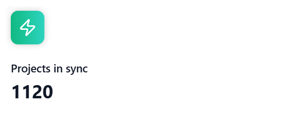

Note: Child projects are not included in the count if the integration that contains child projects is not activated at least once.

## Entities synchronized

Shows the total number of entities synchronized by **<code class="expression">space.vars.SITENAME</code>** across all integrated systems.

  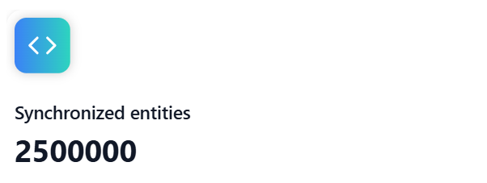

## Entity sync count by system

Displays the total count of entities synchronized by **<code class="expression">space.vars.SITENAME</code>** across all systems, including both in-sync and deleted entities.

In sync entities include all active entities that are currently part of the synchronization.

Deleted entities include all entities that have been deleted, archived, or deprecated.

  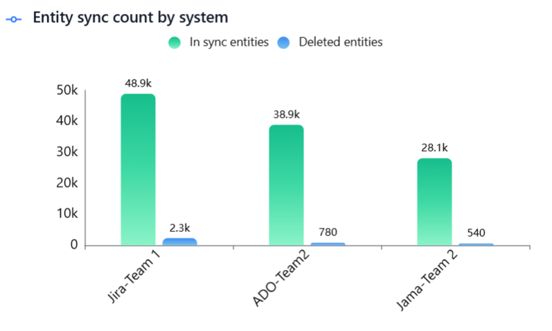

Click a bar to view the entity-type breakdown for the selected system.

  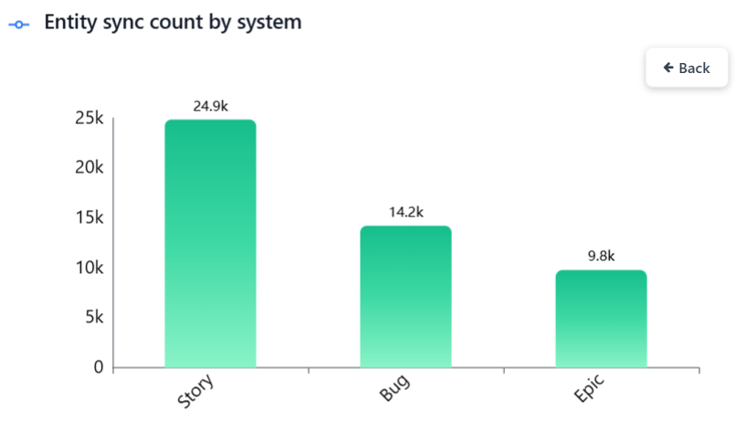

## Project pairs with high sync rate

Shows the top 10 project pairs with the highest synchronization activity, helping teams quickly identify the most active integrations, focus monitoring and optimization efforts on critical data flows.

  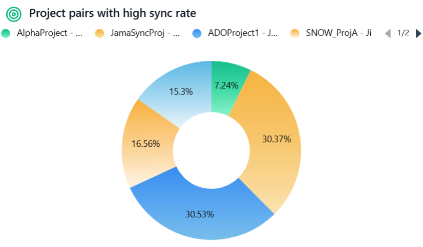

Click a pie slice to view the entity-type pair breakdown for the selected project pair.

  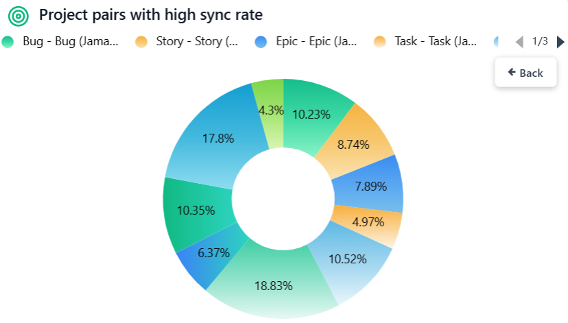

## Project growth across systems

Displays project growth trends per system over time, helping teams understand adoption patterns, compare system usage, and identify periods of rapid growth or stagnation for better planning and decision-making.

  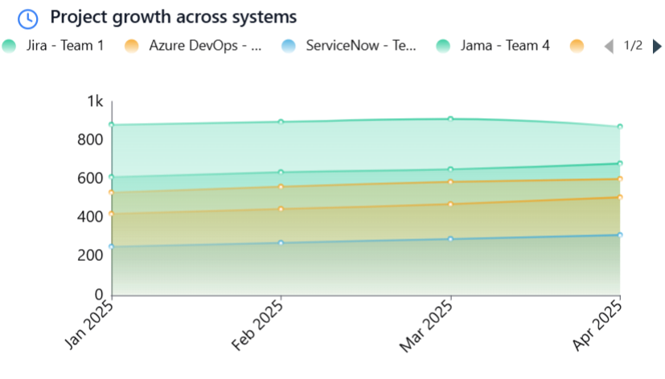

## Project pairs with low sync rate

Highlights project pairs with low synchronization activity, drawing attention to possible issues such as sync failures, misconfiguration, decommissioned projects, or candidates for archival or cleanup, enabling timely investigation and corrective action.

  

Click a bar to view the entity-type pair breakdown for the selected project pair.

  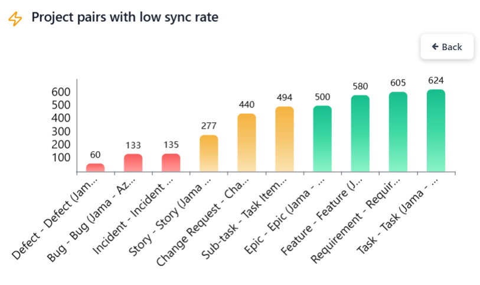

## Top 10 recent integrations with global failures

Displays the top 10 most recent integrations with active global failures, helping teams quickly spot critical issues and take prompt action for sync stability.

  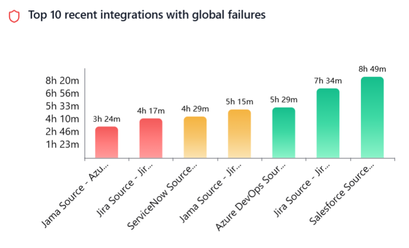

Click a bar to view the job-level breakdown, including integration, and delete jobs.

  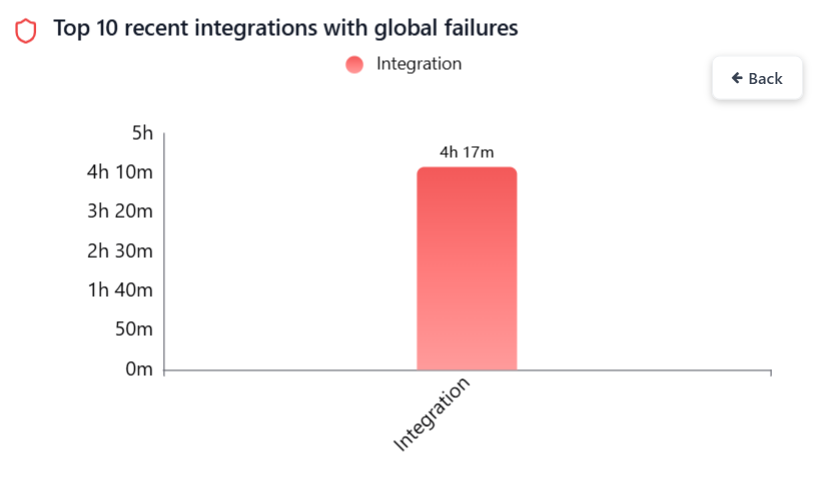

## Top 10 integrations with high processing failures

Displays the top 10 most recent integrations experiencing processing failures, helping teams quickly identify integrations with such failures, understand failure impact, and prioritize investigation 

  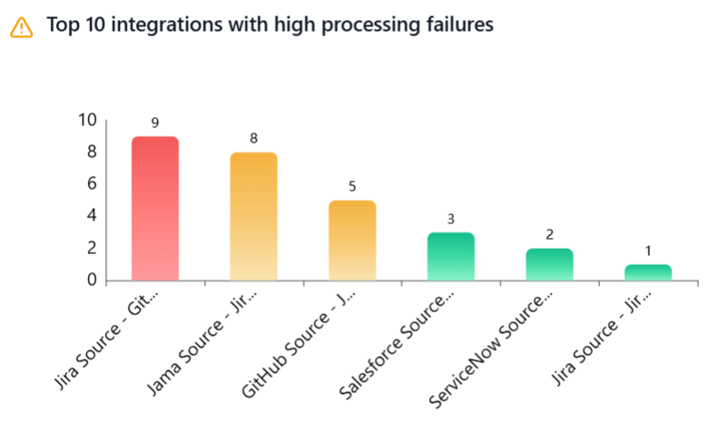

Click a bar to view the project-wise breakdown. 

  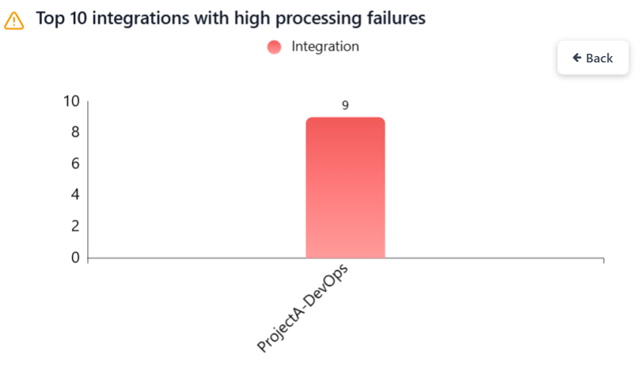

# Filtering the Dashboard

### Date Range

Select the date range to filter metrics.

Predefined options include – Last 1 Week, Last 1 Month, Last 3 Months, Last 6 Months and Last 1 Year. 

  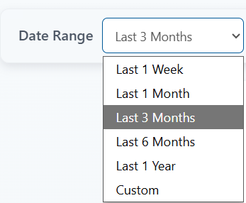

For a custom range, choose Custom option and select the start and end dates.

  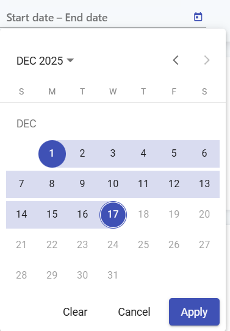

To ensure optimal performance and system reliability, chart data is aggregated at different granularities based on the selected date range.

- Daily granularity is applied when the selected date range is within the last 3 months.
- Monthly granularity is applied when the selected date range extends beyond 3 months and up to 3 years.
- Yearly granularity is applied when the selected date range extends beyond the last 3 years.

## Filter options
Click the funnel icon to view the filter options.

  

### Systems
Filter metrics by selected systems (primary filter). Other filters (integrations, projects, entity types) will remain disabled. They can be applied only after the primary filter is selected.

  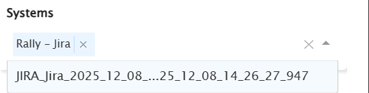

### Integrations

Filter metrics by selected integrations.

  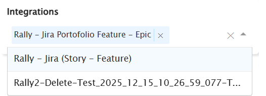

### Projects

Filter metrics by selected projects. Projects can be chosen independently. If integrations are selected, only their associated projects will be available.

  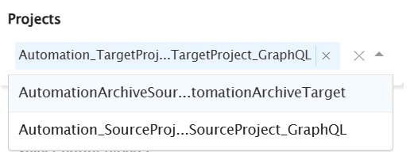

### Entity types

Filter metrics by selected entity types. Entity types can be chosen independently. If integrations are selected, only their associated entity types will be available.  

  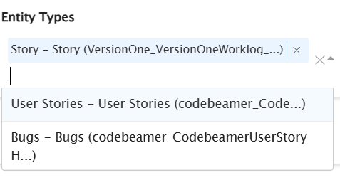

### Include from child folders

Enables including items from child folders in metrics. This option is enabled by default.

  

  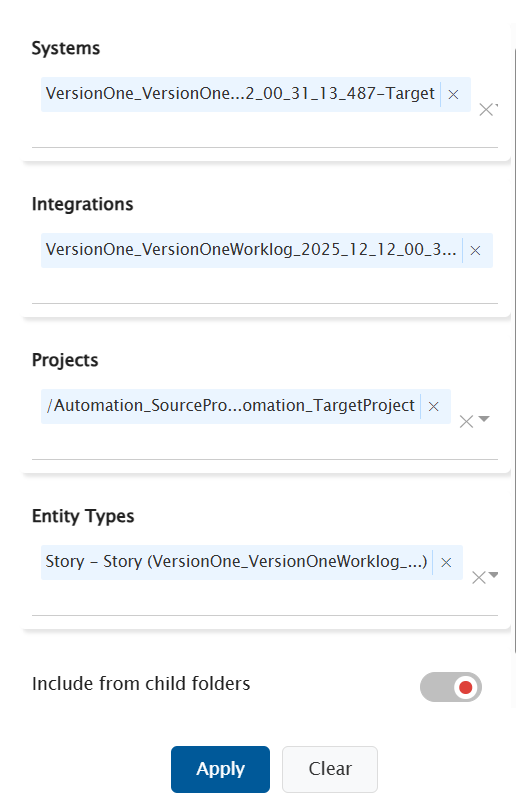

- Click **Apply** to filter metrics based on the selected options.

- Click **Clear** to remove all applied filters.

# Chart data refresh

Chart data is automatically refreshed every 12 hours to ensure optimal performance and overall system reliability.

Click the refresh icon to update the chart with the latest data. 

  

# Export

The Export feature allows you to download chart data in a single Excel file, making it easy to analyze, share, and present insights.

- For each chart, both aggregated data and raw data are included in the same Excel file, organized into separate sheets for clarity.

- The exported Excel file is automatically saved to the Downloads folder and can be shared with anyone, such as management, stakeholders, or external teams, for reporting and decision-making.

### Raw Data Limit

- To keep export operations fast and system performance optimal, raw data is limited to the top 10,000 records per chart.
- Raw data is primarily intended for debugging and deeper analysis.
- If more focused data is required, you can fine-tune the export using filters to narrow down the dataset.

  

Click the Export charts button to download the raw and aggregated chart data as an Excel file (packaged in a ZIP format). 

