# Overview
Synchronizing Release Pipelines from Azure DevOps Server (TFS) to Azure DevOps Services (ADO) enables teams to modernize their delivery workflows and leverage cloud-based CI/CD capabilities. This integration ensures that Release Pipeline configurations, references, and dependent artifacts are consistently transferred to the target ADO project—eliminating manual re-creation, reducing configuration errors, and accelerating release readiness.

**<code class="expression">space.vars.SITENAME</code>** provides bidirectional integration between Azure DevOps Server (TFS) and Azure DevOps Services (ADO).

This page covers the bidirectional integration of Release Pipelines and their dependent artifacts.

# System Prerequisites
* Configuring [system pre-requisites](../../integrate/integration-prerequisites.md) is mandatory for successful system configuration.
* Check out the pre-requisites for [Azure DevOps Server and Azure DevOps Service](../../connectors/azure-devops.md#prerequisites)
* To understand the pre-requisites for enabling Release Pipeline synchronization, refer to the section: [Release Pipeline Pre-requisites](../../connectors/azure-devops.md#release-pipeline-entity)

# Integration Configuration
* Log in into **<code class="expression">space.vars.SITENAME</code>**. The default credentials are:  
  **User Name:** admin, **Password:** password

  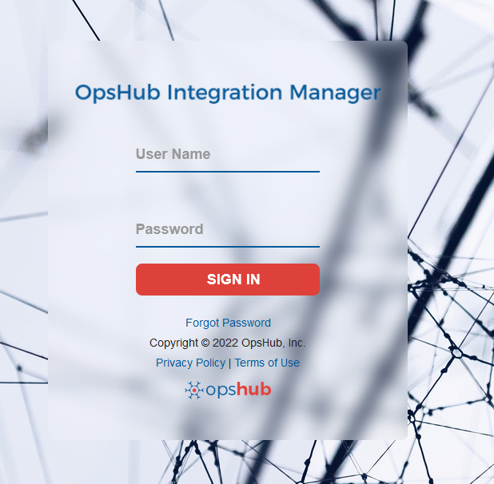

  

>**Note**: **Proxy parameters:** Before you proceed with the configuration, check whether the system is behind a proxy server. If yes, then set up [proxy parameters](../../manage/administrator/proxy-setting.md) in **<code class="expression">space.vars.SITENAME</code>**.

* Since Release Pipeline may reference dependent artifacts such as **Agent Pools**, **Service Connections**, and **Task Groups**, we will configure mappings for these dependent artifacts as well, along with the Release Pipeline.

* Click **Integrate** on the top right corner of the screen and then click the plus [+] icon.

  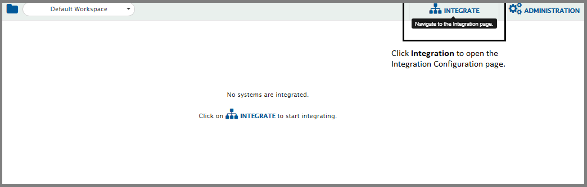

* The integration configuration page opens:
  * Integration Configuration for **Release Pipeline** Entity:
       * Enter a unique name for the integration. For example, this integration is named **Azure DevOps Server (TFS) – Azure DevOps Service (ADO) Release Pipeline Integration**.
       * Click plus [+] icon adjacent to the System 1 and System 2 fields one by one to configure Azure DevOps Server (TFS) and Azure DevOps Service (ADO).
          

              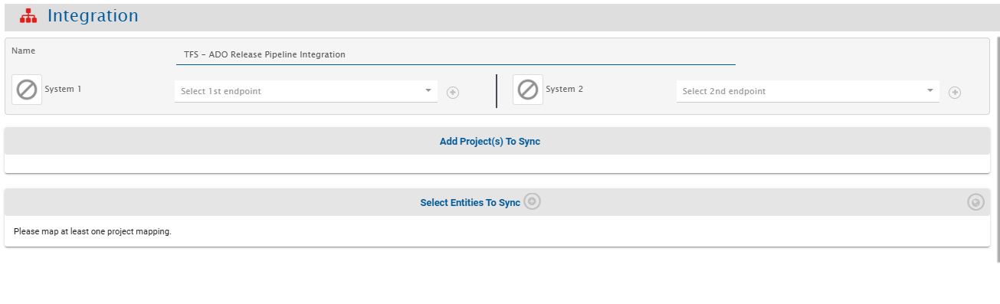
          
  

## Configure System(s)
* Configure Azure DevOps Server (TFS) –Azure DevOps Service (ADO) by following the steps given on [Azure DevOps Server/Service System Configuration](../../connectors/azure-devops.md#system-configuration).

  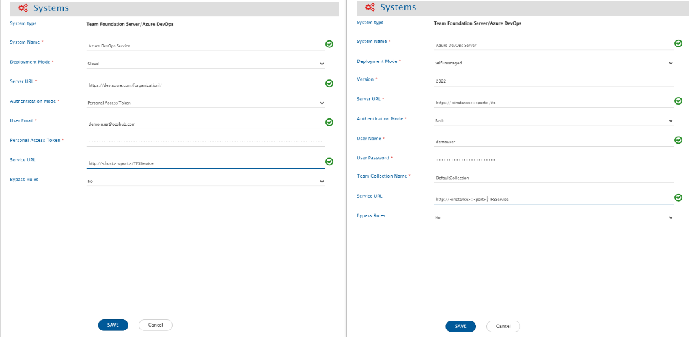

  

* When you save the respective system configuration pages after configuring the systems, the systems will automatically be added to the integration. Proceed to adding projects and entities in the integration.

  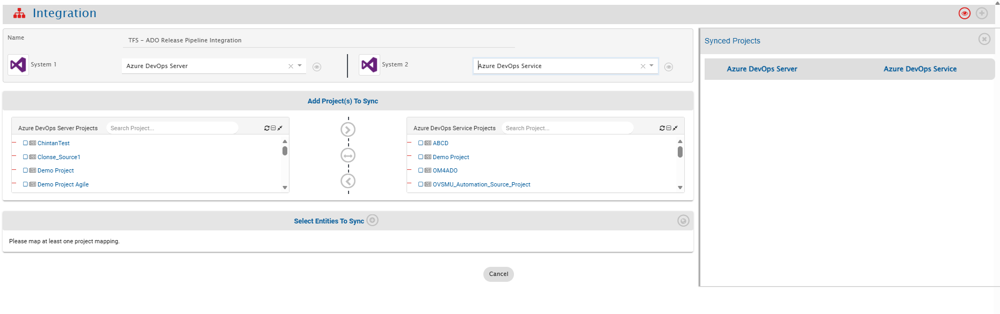

  

## Select Projects and Entities

* In the **Add Project(s) to Sync** section, select the projects you want to synchronize between Azure DevOps Server (TFS) and Azure DevOps Service (ADO) by clicking them.  
  Example: **ReleasePipeline1** from Azure DevOps Server (TFS) and **ReleasePipeline2** from Azure DevOps Service (ADO).
* Once the projects are selected, define the source project and target project:
    * **Forward (>)** → data flows from Azure DevOps Server (TFS) to Azure DevOps Service (ADO)
    * **Backward (<)** → data flows from Azure DevOps Service (ADO) to Azure DevOps Server (TFS)
    * **Bi-directional (<-->)** → data flows both ways
* Once the direction is selected, the arrows will turn grey. We have selected the bi-directional flow.

  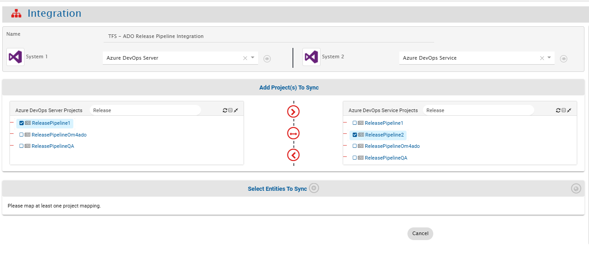

  

* **<code class="expression">space.vars.SITENAME</code>** fetches entities available in both systems and shows them in entities list for both systems. From the **Select Entities to Sync** section, select the relevant entities for both systems.  
  Example: **Release Pipeline** from both Azure DevOps Server (TFS) and Azure DevOps Service (ADO).

* The next step is to define the fields that need to be integrated for every entity mapped. Once the entities are selected, click the plus icon [+] adjacent to **Select fields to be Synced** to create the mapping between these two entities. You will now be navigated to Mapping Configuration screen.

  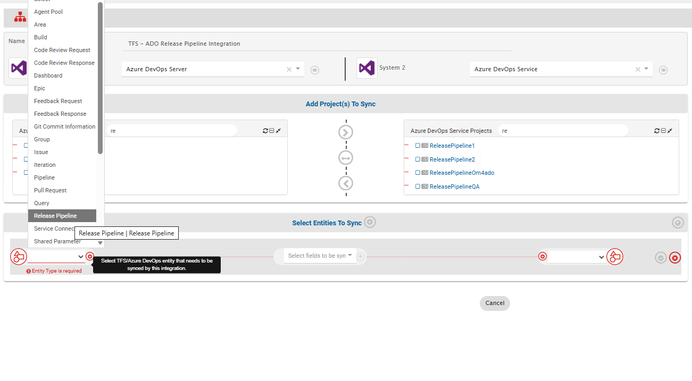

  

## Mapping Fields

### Entity: Release Pipeline
* From the **Select Entities to Sync**, select the relevant entities for both systems.  
  In this case: **Release Pipeline** from Azure DevOps Server (TFS) and Azure DevOps Service (ADO) . Create a Mapping for this entity as well.
* Following details are automatically populated in the Mapping section: **Systems, Projects, Entities, and Mapping Name**. If you wish, change the name for the mapping in the **Name** field.
* Now, either click **Create from Scratch** to define the mapping from scratch or click **Auto Map** to automatically map all fields with the same name.
* Even if you select the **Auto Map**, **<code class="expression">space.vars.SITENAME</code>** will allow you to remove or add more fields before saving mapping.
* Since a Release Pipeline may reference dependent artifacts, ensure that **Agent Pool**, **Service Connection**, and **Task Group** are mapped as reference fields.
* You can also import a mapping. Refer to [Release Pipeline field mapping](release-pipeline-field-mapping.xml) to import the default field mapping from Azure DevOps Services to Azure DevOps Server for the Release Pipeline entity.
  * You may further modify the imported mapping based on your use case.
* Once the mapping is created, click the **Create Mapping** to create & save this mapping as well.

  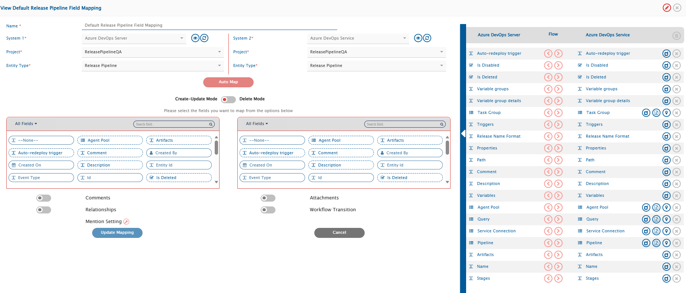

 

### Dependent Artifacts: 
#### Agent Pool 
* Similar to selecting the **Release Pipeline** entity, select the **Agent Pool** entity from the **Select Projects and Entities** section. Refer to [Select Projects and Entities](#select-projects-and-entities) and follow the steps below to create the mapping for this entity.
* Now, either click **Create from Scratch** to define the mapping from scratch or click **Auto Map** to automatically map all fields with the same name.  
* You can also import a mapping. Refer to [Agent Pool field mapping](agent-pool-field-mapping.xml) to import the default field mapping from Azure DevOps Services to Azure DevOps Server for the Agent Pool entity.
  * You may further modify the imported mapping based on your use case.

  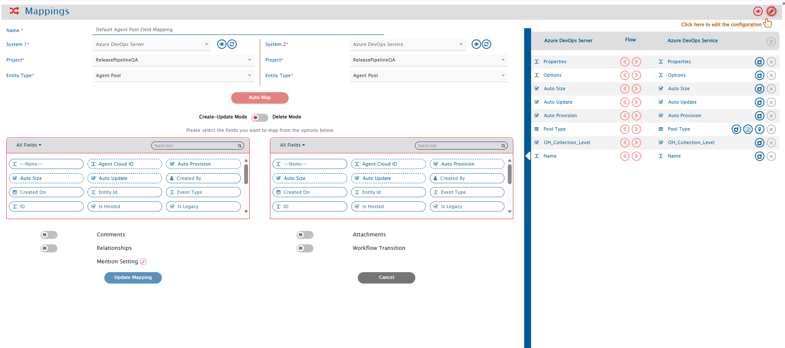

 

#### Service Connection
* Similar to selecting the **Release Pipeline** entity, select the **Service Connection** entity from the **Select Projects and Entities** section. Refer to [Select Projects and Entities](#select-projects-and-entities) and follow the steps below to create the mapping for this entity.
* Now, either click **Create from Scratch** to define the mapping from scratch or click **Auto Map** to automatically map all fields with the same name.
* You can also import a mapping. Refer to [Service Connection field mapping](service-connection-field-mapping.xml) to import the default field mapping from Azure DevOps Services to Azure DevOps Server for the Service Connection entity.
  * You may further modify the imported mapping based on your use case.

  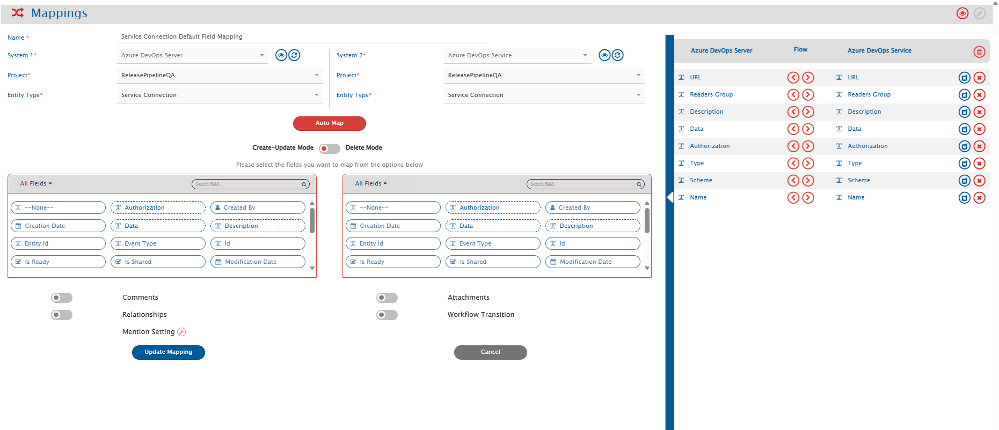

 

#### Task Group
* Similar to selecting the **Release Pipeline** entity, select the **Task Group** entity from the **Select Projects and Entities** section. Refer to [Select Projects and Entities](#select-projects-and-entities) and follow the steps below to create the mapping for this entity.
* Now, either click **Create from Scratch** to define the mapping from scratch or click **Auto Map** to automatically map all fields with the same name.
* You can also import a mapping. Refer to [Task Group field mapping](task-group-field-mapping.xml) to import the default field mapping from Azure DevOps Services to Azure DevOps Server for the Task Group entity.
  * You may further modify the imported mapping based on your use case.

  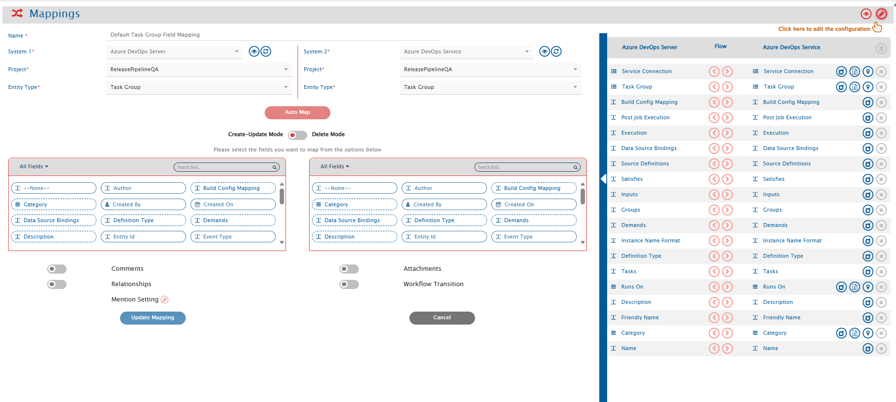

 
 

## Save Integration
* To save the integration in active mode, slide the **Activate Integration** button to the right.
* As the final step, click **Save** to save the integration.

  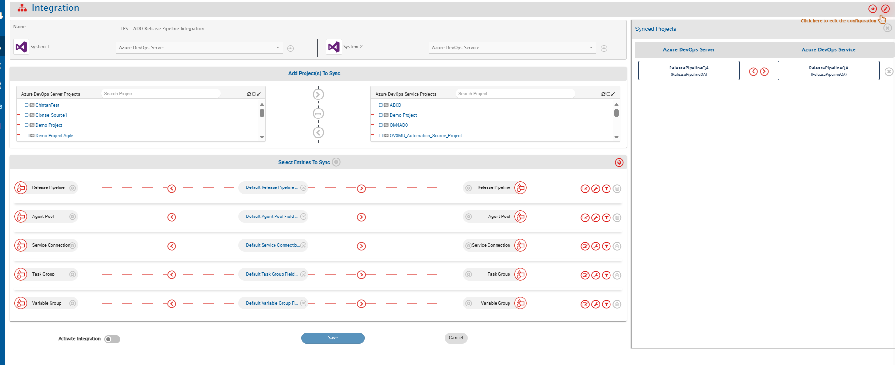

  

* The integration will be created. You will also get a confirmation pop-up at the bottom of the screen, and the integration will be listed in the integrations list.

  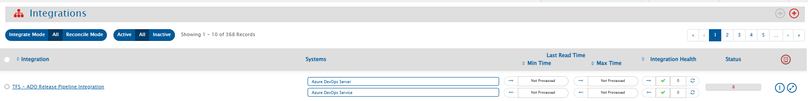

  

## Activate and Test the Integration
*  First, activate the integration for dependent artifacts such as **Agent Pool**, **Service Connection**, and **Task Group**. Test the integration by synchronizing these dependent artifacts between the configured Azure DevOps Server (TFS) and Azure DevOps Service (ADO) projects.

   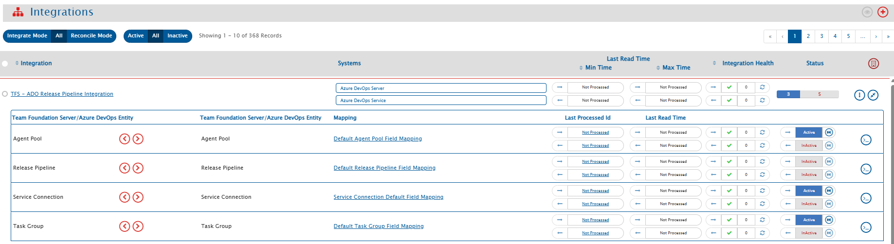 

* After the synchronization of dependent artifacts is successfully completed, activate the **Release Pipeline** integration and test it by synchronizing the Release Pipeline entity.

  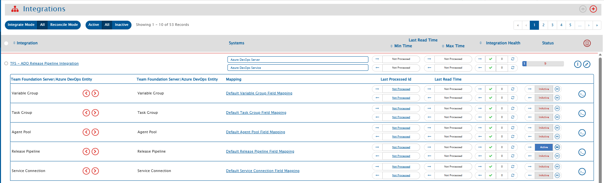

  

* Test the integration by synchronizing data between the specified Azure DevOps Server (TFS) and Azure DevOps Service (ADO)  projects.

>**Note**: Do not use the **integration user credentials** to create entities in the systems, as the integration will not work in that case.

* Create/Update event in the source system and check whether the event synchronizes to the target system. Wait for one minute for the data to synchronize.
* If you face any issue, please refer to [possible reasons and their fix](../../help-center/faqs/general-faqs.md).

