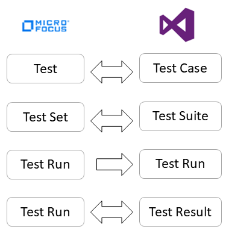

# Micro Focus ALM – Azure DevOps Server/Service Integration (Test Entities)

## Overview

This document outlines the process for configuring integration between Micro Focus ALM and Azure DevOps to enable seamless synchronization of test entities across both systems.

The image below illustrates the corresponding entities configured between Micro Focus ALM and Azure DevOps Server/Service as part of the integration.

<p align="center">
  
</p>

- The *Test Run* to *Test Run* integration is required when synchronizing from Micro Focus ALM to Azure DevOps Server/Service.
  - The *Test Run* to *Test Run* integration creates a corresponding *Test Run* in Azure DevOps Server/Service.
  - The *Test Run* to *Test Result* integration creates *Test Result* under the *Test Run* created in Azure DevOps Server/Service.
- When synchronizing Azure DevOps Server/Service to Micro Focus ALM, *Test Result* to *Test Run* integration is required.

## System Prerequisites

Configuring [system pre-requisites](../../integrate/integration-prerequisites.md) is mandatory for successful system configuration.

Check out the prerequisites for [Micro Focus ALM](../../connectors/micro-focus-alm-qc.md) and [Azure DevOps Server/Service](../../connectors/azure-devops.md) systems before you proceed with the integration.

## Integration Configuration

Follow the steps given in the [Integration Configuration](../../integrate/integration-configuration.md) page to create integrations.

## Micro Focus ALM to Azure DevOps Server/Service

### Mapping And Workflow For Integration Of Test in Micro Focus ALM to Test Case in Azure DevOps Server/Service

#### Mappings required for synchronizing Test in Micro Focus ALM to Test Case in Azure DevOps Server/Service

* **Mapping for Design Steps Micro Focus ALM to Steps in Azure DevOps Server/Service**

```xml
<Steps>
    <xsl:for-each select="SourceXML/updatedFields/Property/Design-space-Steps/list">
        <xsl:element name="{concat('_',Property/Step-hash-)}">
            <xsl:element name="id">
                <xsl:value-of select="Property/Step-space-ID"/>
            </xsl:element>
            <xsl:element name="action">
                <xsl:value-of select="utils:replaceBetweenTokens(Property/Description,' ','_','#OH_START_PARAM#','#OH_END_PARAM#')"/>
            </xsl:element>
            <xsl:element name="expectedResult">
                <xsl:value-of select="utils:replaceBetweenTokens(Property/Expected-space-Result,' ','_','#OH_START_PARAM#','#OH_END_PARAM#')"/>
            </xsl:element>
            <xsl:element name="refId">
                <xsl:value-of select="Property/Link-space-Test"/>
            </xsl:element>
            <xsl:if test="Property/OHAttachments">
                <OHAttachments>
                    <xsl:for-each select="Property/OHAttachments/OHAttachment">
                        <xsl:element name="{concat('attachment_',position())}">
                            <filename>
                                <xsl:value-of select="fileName"/>
                            </filename>
                            <addedByUser>
                                <xsl:value-of select="addedByUser"/>
                            </addedByUser>
                            <contentBase64>
                                <xsl:value-of select="contentBase64"/>
                            </contentBase64>
                            <attachmentURI>
                                <xsl:value-of select="attachmentURI"/>
                            </attachmentURI>
                            <updateTimeStamp>
                                <xsl:value-of select="updateTimeStamp"/>
                            </updateTimeStamp>
                            <label>
                                <xsl:value-of select="label"/>
                            </label>
                            <fileComment>
                                <xsl:value-of select="fileComment"/>
                            </fileComment>
                        </xsl:element>
                    </xsl:for-each>
                </OHAttachments>
            </xsl:if>
        </xsl:element>
    </xsl:for-each>
</Steps>
```
#### Workflow For Synchronization Of Test in Micro Focus ALM to Test Case in Azure DevOps Server/Service

- Workflow with name ***Default Integration Workflow - HP Test to TFS Test - Shared Steps.xml*** is provided which should be used when synchronizing *Test* in Micro Focus ALM to *Test Case* in Azure DevOps Server/Service.

### Mapping And Workflow For Integration Of Test Run in Micro Focus ALM to Test Result in Azure DevOps Server/Service

Following combination of fields should be mapped with each other:
* Cycle ID -> TestSuiteId
* Test -> TestCaseId
* Run ID -> TestRunId

Given below are custom mappings required for different fields and workflows for integration when synchronizing *Test Run* in Micro Focus ALM to *Test Result* in Azure DevOps Server/Service.

#### Mapping for Test Run in Micro Focus ALM to Test Result in Azure DevOps Server/Service

* **Run Steps field of Micro Focus ALM to MultiIterations field of Azure DevOps Server/Services**

```xml

<MultiIterations>
    <xsl:element name="_1">
        <xsl:element name="Id">
            <xsl:value-of select="'1'"/>
        </xsl:element>
        <xsl:element name="Outcome">
            <xsl:choose>
                <xsl:when test="SourceXML/updatedFields/Property/Status='Not Completed'">
                    <xsl:value-of select="'NonExecuted'"/>
                </xsl:when>
                <xsl:when test="SourceXML/updatedFields/Property/Status='No Run'">
                    <xsl:value-of select="'None'"/>
                </xsl:when>
                <xsl:when test="SourceXML/updatedFields/Property/Status='Passed'">
                    <xsl:value-of select="'Passed'"/>
                </xsl:when>
                <xsl:when test="SourceXML/updatedFields/Property/Status='Failed'">
                    <xsl:value-of select="'Failed'"/>
                </xsl:when>
                <xsl:when test="SourceXML/updatedFields/Property/Status='Blocked'">
                    <xsl:value-of select="'Blocked'"/>
                </xsl:when>
                <xsl:when test="SourceXML/updatedFields/Property/Status='N/A'">
                    <xsl:value-of select="'Unspecified'"/>
                </xsl:when>
            </xsl:choose>
        </xsl:element>
        <Step-space-Result>
            <xsl:variable select="SourceXML/updatedFields/Property/Test" name="testId"/>
            <xsl:for-each select="SourceXML/updatedFields/Property/Run-space-Steps/list">
                <xsl:element name="{concat('_',position())}">
                    <xsl:element name="id">
                        <xsl:choose>
                            <xsl:when test="Property/Virtual-space-Step-space-ID='-1'">
                                <xsl:value-of select="Property/DesignStep-space-ID"/>
                            </xsl:when>
                            <xsl:otherwise>
                                <xsl:choose>
                                    <xsl:when test="Property/Virtual-space-Step-space-ID=''">
                                        <xsl:value-of select="Property/Step-space-ID"/>
                                    </xsl:when>
                                    <xsl:otherwise>
                                        <xsl:value-of select="Property/Virtual-space-Step-space-ID"/>
                                    </xsl:otherwise>
                                </xsl:choose>
                            </xsl:otherwise>
                        </xsl:choose>
                    </xsl:element>
                    <xsl:element name="title">
                        <xsl:value-of select="Property/Step-space-Name"/>
                    </xsl:element>
                    <xsl:element name="description">
                        <xsl:value-of select="utils:convertHTMLToPlainText(Property/Description)"/>
                    </xsl:element>
                    <xsl:element name="errorMessage">
                        <xsl:value-of select="utils:convertHTMLToPlainText(Property/Actual)"/>
                    </xsl:element>
                    <xsl:element name="expectedResult">
                        <xsl:value-of select="utils:convertHTMLToPlainText(Property/Expected)"/>
                    </xsl:element>
                    <xsl:element name="output">
                        <xsl:choose>
                            <xsl:when test="Property/Status='No Run'">
                                <xsl:value-of select="'NotExecuted'"/>
                            </xsl:when>
                            <xsl:when test="Property/Status='Not Completed'">
                                <xsl:value-of select="'Aborted'"/>
                            </xsl:when>
                            <xsl:when test="Property/Status='N/A'">
                                <xsl:value-of select="'Unspecified'"/>
                            </xsl:when>
                            <xsl:otherwise>
                                <xsl:value-of select="Property/Status"/>
                            </xsl:otherwise>
                        </xsl:choose>
                    </xsl:element>
                    <xsl:element name="actionId">
                        <xsl:variable select="Property/Source-space-Test" name="sourceTestId"/>
                        <xsl:choose>
                            <xsl:when test="$testId=$sourceTestId">
                                <xsl:value-of select="''"/>
                            </xsl:when>
                            <xsl:otherwise>
                                <xsl:value-of select="Property/DesignStep-space-ID"/>
                            </xsl:otherwise>
                        </xsl:choose>
                    </xsl:element>
                    <xsl:element name="refId">
                        <xsl:value-of select="''"/>
                    </xsl:element>
                    <xsl:if test="Property/OHAttachments">
                        <OHAttachments>
                            <xsl:for-each select="Property/OHAttachments/OHAttachment">
                                <xsl:element name="{concat('attachment_',position())}">
                                    <filename>
                                        <xsl:value-of select="fileName"/>
                                    </filename>
                                    <addedByUser>
                                        <xsl:value-of select="addedByUser"/>
                                    </addedByUser>
                                    <contentBase64>
                                        <xsl:value-of select="contentBase64"/>
                                    </contentBase64>
                                    <attachmentURI>
                                        <xsl:value-of select="attachmentURI"/>
                                    </attachmentURI>
                                    <updateTimeStamp>
                                        <xsl:value-of select="updateTimeStamp"/>
                                    </updateTimeStamp>
                                    <label>
                                        <xsl:value-of select="label"/>
                                    </label>
                                    <fileComment>
                                        <xsl:value-of select="fileComment"/>
                                    </fileComment>
                                </xsl:element>
                            </xsl:for-each>
                        </OHAttachments>
                    </xsl:if>
                </xsl:element>
            </xsl:for-each>
        </Step-space-Result>
    </xsl:element>
</MultiIterations>
```

#### Workflow For Synchronization Of Test Run in Micro Focus ALM to Test Result in Azure DevOps Server/Service

* Workflow with name ***Default Integration Workflow - HPQC To TFS - Test Result.xml*** is provided which should be used when synchronizing *Test Run* in Micro Focus ALM to *Test Result* in Azure DevOps Server/Service.

## Azure DevOps Server/Service to Micro Focus ALM 

### Mapping And Workflow For Integration Of Test Case in Azure DevOps Server/Service to Test in Micro Focus ALM

#### Mappings required for synchronizing Test Case in Azure DevOps Server/Service to Test in Micro Focus ALM

* **Mapping for Steps in Azure DevOps Server/Service to Design Steps Micro Focus ALM**

```xml
<Design-space-Steps>
    <xsl:for-each select="SourceXML/updatedFields/Property/Steps/com.opshub.eai.tfs.common.TestStep">
        <op_list>
            <xsl:element name="Description">
                <xsl:value-of select="utils:convertHTMLToPlainText(utils:replaceBetweenTokens(testStep/action,'_',' ','#OH_START_PARAM#','#OH_END_PARAM#'))"/>
            </xsl:element>
            <xsl:element name="Expected-space-Result">
                <xsl:value-of select="utils:convertHTMLToPlainText(utils:replaceBetweenTokens(testStep/expectedResult,'_',' ','#OH_START_PARAM#','#OH_END_PARAM#'))"/>
            </xsl:element>
            <xsl:element name="Step-space-Name">
                <xsl:value-of select="concat('Step ',position())"/>
            </xsl:element>
            <xsl:element name="Step-hash-">
                <xsl:value-of select="position()"/>
            </xsl:element>
            <xsl:element name="SourceStepId">
                <xsl:value-of select="testStep/id"/>
            </xsl:element>
            <xsl:element name="Link-space-Test">
                <xsl:value-of select="testStep/ref"/>
            </xsl:element>
            <OHAttachments>
                <xsl:for-each select="eaiAttachment/OHAttachment">
                    <xsl:element name="{concat('attachment_',position())}">
                        <filename>
                            <xsl:value-of select="fileName"/>
                        </filename>
                        <addedByUser>
                            <xsl:value-of select="addedByUser"/>
                        </addedByUser>
                        <contentBase64>
                            <xsl:value-of select="contentBase64"/>
                        </contentBase64>
                        <attachmentURI>
                            <xsl:value-of select="attachmentURI"/>
                        </attachmentURI>
                        <updateTimeStamp>
                            <xsl:value-of select="updateTimeStamp"/>
                        </updateTimeStamp>
                        <label>
                            <xsl:value-of select="label"/>
                        </label>
                        <fileComment>
                            <xsl:value-of select="fileComment"/>
                        </fileComment>
                    </xsl:element>
                </xsl:for-each>
            </OHAttachments>
        </op_list>
    </xsl:for-each>
</Design-space-Steps>
```

#### Workflow For Synchronization Of Test Case in Azure DevOps Server/Service to Test in Micro Focus ALM

- Workflow with name ***Default Integration Workflow - TFS to HP Shared Steps.xml*** is provided which should be used when synchronizing *Test Case* in Azure DevOps Server/Service to *Test* in Micro Focus ALM.

### Mapping And Workflow For Integration Of Test Result in Azure DevOps Server/Service to Test Run in Micro Focus ALM

Following combination of fields should be mapped with each other:
* TestSuiteId -> Cycle ID
* TestCaseId -> Test
* TestRunId -> Run ID

Given below are custom mappings required for different fields and workflows for integration when synchronizing *Test Result* in Azure DevOps Server/Service to *Test Run* in Micro Focus ALM.

#### Mapping for Test Result in Azure DevOps Server/Service to Test Run in Micro Focus ALM

Following XSLTs should be used as advance mapping for given fields when synchronizing *Test Result* from Azure DevOps Server/Services to *Test Run* in Micro Focus ALM.

* **MultiIterations field of Azure DevOps Server/Services to Run Steps field of Micro Focus ALM**

```xml
<Run-space-Steps>
    <xsl:if test="SourceXML/updatedFields/Property/MultiIterations/com.opshub.eai.tfs.common.TFSIterationResult[1]">
        <xsl:variable name="iterationPath"
                      select="SourceXML/updatedFields/Property/MultiIterations/com.opshub.eai.tfs.common.TFSIterationResult[1]"/>
        <xsl:for-each select="$iterationPath/stepsResult/com.opshub.eai.tfs.common.TestStepResult">
            <op_list>
                <xsl:element name="Step-space-Name">
                    <xsl:value-of select="utils:convertHTMLToPlainText(testStepResult/title)"/>
                </xsl:element>
                <xsl:element name="Step-space-Order">
                    <xsl:value-of select="position()"/>
                </xsl:element>
                <xsl:element name="Status">
                    <xsl:choose>
                        <xsl:when test="testStepResult/output='NotExecuted'">
                            <xsl:value-of select="'No Run'"/>
                        </xsl:when>
                        <xsl:when test="testStepResult/output='Aborted'">
                            <xsl:value-of select="'No Completed'"/>
                        </xsl:when>
                        <xsl:when test="testStepResult/output='None'">
                            <xsl:value-of select="'No Run'"/>
                        </xsl:when>
                        <xsl:when test="testStepResult/output='Unspecified'">
                            <xsl:value-of select="'N/A'"/>
                        </xsl:when>
                        <xsl:otherwise>
                            <xsl:value-of select="testStepResult/output"/>
                        </xsl:otherwise>
                    </xsl:choose>
                </xsl:element>
                <xsl:element name="Expected">
                    <xsl:value-of select="utils:convertHTMLToPlainText(testStepResult/expectedResult)"/>
                </xsl:element>
                <xsl:element name="Actual">
                    <xsl:value-of select="testStepResult/errorMessage"/>
                </xsl:element>
                <OHAttachments>
                    <xsl:for-each select="eaiAttachment/OHAttachment">
                        <xsl:element name="{concat('attachment_',position())}">
                            <filename>
                                <xsl:value-of select="fileName"/>
                            </filename>
                            <addedByUser>
                                <xsl:value-of select="addedByUser"/>
                            </addedByUser>
                            <contentBase64>
                                <xsl:value-of select="contentBase64"/>
                            </contentBase64>
                            <attachmentURI>
                                <xsl:value-of select="attachmentURI"/>
                            </attachmentURI>
                            <updateTimeStamp>
                                <xsl:value-of select="updateTimeStamp"/>
                            </updateTimeStamp>
                            <label>
                                <xsl:value-of select="label"/>
                            </label>
                        </xsl:element>
                    </xsl:for-each>
                </OHAttachments>
            </op_list>
        </xsl:for-each>
    </xsl:if>
</Run-space-Steps>
```

* **Mapping for Cycle ID field of Micro Focus ALM**

```xml
<Cycle-space-ID>
    <xsl:value-of
            select="SourceXML/updatedFields/Property/OHEntityReferences/OHEntityReference[linkType='Test Suite']/links/EAILinkEntityItem/entityInternalId"/>
</Cycle-space-ID>
```
* **Mapping for Test field of Micro Focus ALM**

```xml
<Test>
    <xsl:value-of
            select="SourceXML/updatedFields/Property/OHEntityReferences/OHEntityReference[linkType='Test Case']/links/EAILinkEntityItem/entityInternalId"/>
</Test>
```
#### Workflow For Synchronization Of Test Case in Azure DevOps Server/Service to Test Run in Micro Focus ALM

* Workflow with name ***Default Integration Workflow - TFS To HPQC - Test Result.xml*** is provided which should be used when synchronizing *Test Result* in Azure DevOps Server/Service to *Test Run* in Micro Focus ALM.