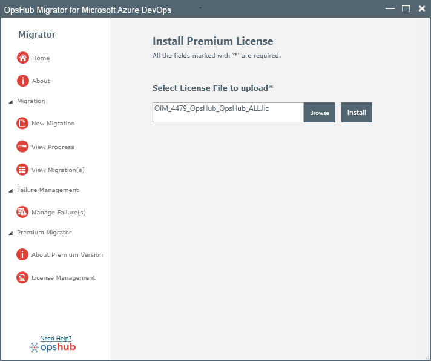

If you want to use the <code class="expression">space.vars.OM4ADO</code> outside the scope of free usage, then you will need to install the Commercial License. Please contact the OpsHub Sales team for the Commercial License. After you have received the license file (`.lic`) from OpsHub, please follow the steps given below:

1. Click **License Management** option as shown in the screenshot below:

  

2. Browse the license file (`.lic`) shared by OpsHub team and click **Install**:

  

