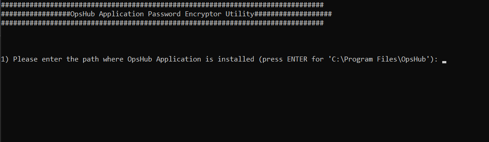
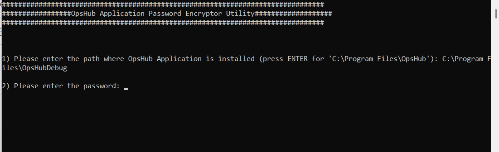
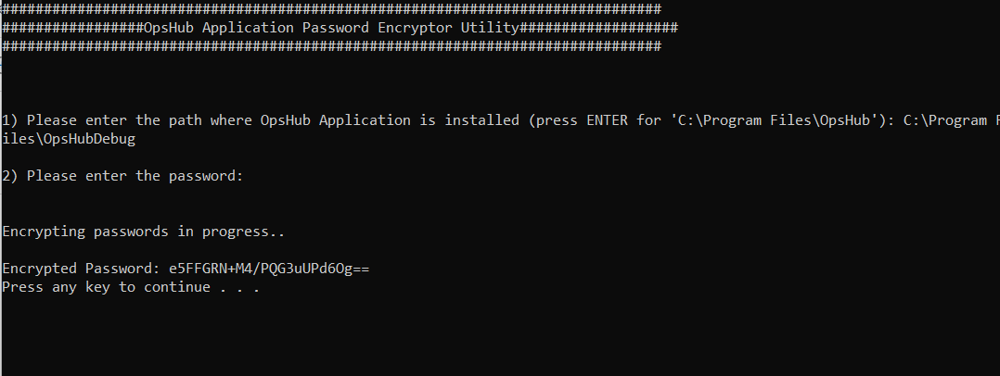

In case deployment of **<code class="expression">space.vars.SITENAME</code>**, if the user wants to encrypt the password for **<code class="expression">space.vars.SITENAME</code>** , this utility can be used.

Follow the steps given below for encrypting password in **<code class="expression">space.vars.SITENAME</code>**:

* Navigate to `<code class="expression">space.vars.SITENAME</code> Installation Folder>/Other_Resources/Resources`.
* Unzip `"Encrypt Any Password To Use Later.zip"`.
* Run `EncryptPasswordToUseLaterUtility.bat` for Windows system. In case of Linux system, run `EncryptPasswordToUseLaterUtility.sh`.
* Enter the path for OpsHub Installation Directory.

  

* Enter the keystore password.

  

* Final output as encrypted password.

  

