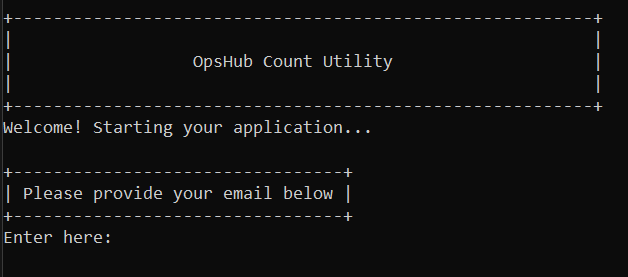
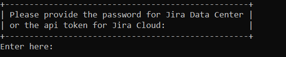

# Overview

* This utility counts the total number of issues across one or more projects. It supports the following systems:
  * Rally
  * Jira
  * OpenText ALM
  * Helix ALM

* **After Downloading the Utility**
  * Once the utility is extracted, the folder will contain the following files:
    * **OpshubCountUtility.jar** – The main executable JAR file of the utility.  
    * **run.bat** – Script to run the utility on Windows systems.  
    * **run.sh** – Script to run the utility on Linux or macOS systems.  
    * **propertyFiles** – Directory containing configuration property files.  
    * **jre** – Bundled Java Runtime Environment.  

# Configuration
Configuration should be provided in the respective properties file of the system for which you want to count the issues.

* Locate the **propertyFiles** directory. This directory contains the property files for each supported system:
  * **Jira.properties**
  * **HelixCoreALM.properties**
  * **Rally.properties**
  * **OpenTextALM.properties**
* Edit and provide the required configuration details in the property file corresponding to the system for which issue counts need to be calculated.

# Steps to Run Utility
Following are the steps to run the utility:

## STEP 01
* Open **Command Prompt**.  
* Refer to the screenshot below:  

  

## STEP 02
* Go to the **directory** where the **Utility** is located.  
* Refer to the screenshot below:  

  

## STEP 03
* Type **run.bat** and press **Enter**.  
* Refer to the screenshot mentioned below:  

  

Once you press Enter, you will see the screen shown below.  

  

## STEP 04
* Once the welcome screen appears, it will prompt you to enter your email ID.  
* Provide the **email ID** and press **Enter**.  
* Refer to the screenshot below:  

  

## STEP 05
* After providing the email ID, another screen will appear asking you to enter the system code displayed on the screen.  
* Enter the **code** corresponding to the system for which you want to count the issues.  
* Refer to the screenshot below:  

  

## STEP 06
The utility will prompt you to enter the system credentials. Provide the credentials for the system you selected.

### For Rally
Supports two types of authentication modes **Authentication Token** and **Username and Password**.  
Based on the configuration in the **Rally.properties** file:  

* If the value of the **rallyAuthType** property is set to 1, the user must provide the **Authentication Token**.  
  * Refer to the screenshot below:  

  

    
  

* If the value of the **rallyAuthType** property is set to 2, the user must provide the **Username and Password**.  
  * Refer to the screenshots below:  

  

    
  

  

    
  

### For Jira
The utility supports both **Data Center (DC)** and **Cloud** instances for Jira. Users must provide credentials based on the type of instance being used.

* If the instance type is **Cloud**, provide the **email address** as the username.  
  If the instance type is **Data Center (DC)**, provide the **username**.  
  * Refer to the screenshot below:  

  

    
  

* Provide the API token for **Cloud** instances and the Password for **Data Center (DC)** instances.  
  * Refer to the screenshot below:  

  

    
  

### For OpenText ALM
In the case of OpenText ALM, the user must provide only the Username and Password.  
* Refer to the screenshots below:  

  

  

### For Helix Core ALM
In the case of Helix, the user must provide only the Username and Password.  
* Refer to the screenshots below:  

  

  

## STEP 07
* Once the user provides all the credentials and presses Enter, a **verification code** will be sent to the registered email ID.  
* The user must enter this code to complete the validation process.  
* Refer to the screenshot below:  

  

>**Note**: 
> The above steps are explained for Windows OS. For **Linux**, the user should execute the **run.sh** file located in the utility folder and follow the steps mentioned above.

## Output
* Once the utility execution starts and all issue details are fetched, it creates an **output** folder. This folder contains subfolders named **Jira**, **Rally**, etc., based on the system selected by the user.
* Based on the system selected, the execution result will be stored in a data count CSV file. For example, for Jira, the file name will be **Jira_Count_Data.csv**.  
  * The CSV file contains counts of all issues of all issue types based on the project. Refer to the screenshot below:  

  

    
  

* In case any issue or error occurs, the utility creates another CSV file containing the error details. This CSV file is generated inside the system-specific output folder located within the main **output** directory.  
  * For example, if the utility encounters an issue while processing a project for Jira, it will store the error details in the **jira_error_report.csv** file.

* Once the utility execution starts, it stores all execution logs in the **app.log** file located in the **OpsHubCountUtility/logs** folder.
