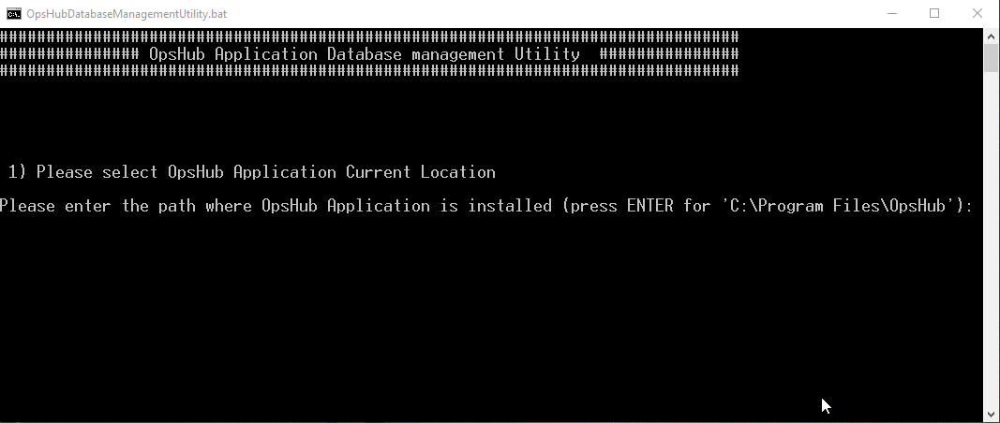
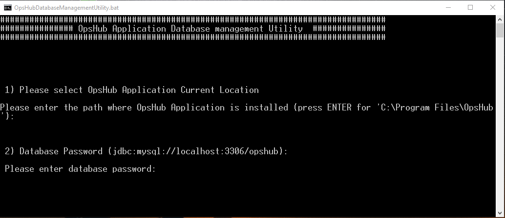
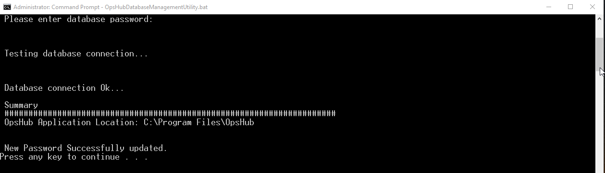

If <code class="expression">space.vars.OIM</code> database password has been modified by a user, then this utility would update the new password in **<code class="expression">space.vars.OIM</code>** application.

Follow the steps given below for updating database password in OpsHub:

  
- Stop OpsHub Server/ Service before execution of this utility.
  
  
- Close OM4ADO application before execution of the utility.
  
- Go to <code class="expression">space.vars.OIM</code> Installation Folder>/Other_Resources/Resources.
- Unzip `OpsHub Database Management utility.zip`.
- Run `OpsHubDatabaseManagementUtility.bat` for Windows system. 
  
- In case of Linux system, run `OpsHubDatabaseManagementUtility.sh`.    


- Enter path for OpsHub Installation Directory.

  

- Enter the new database password.

  

- This would update database password in OpsHub application.

  

