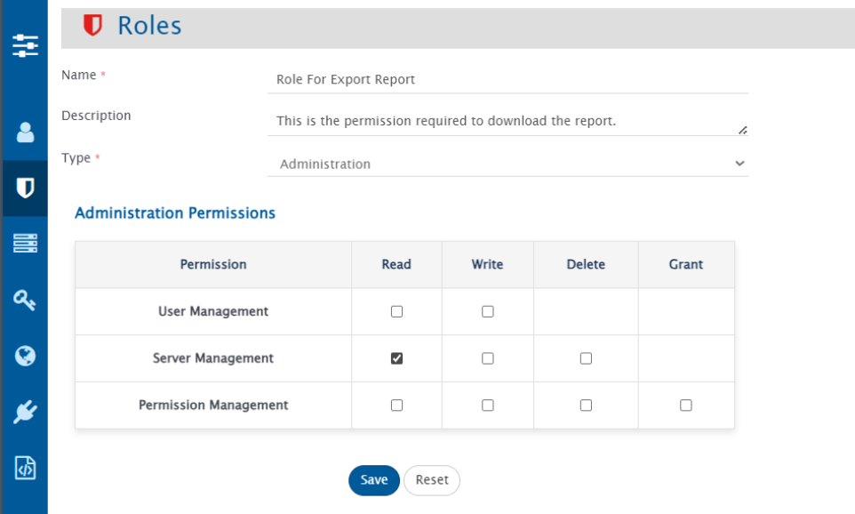
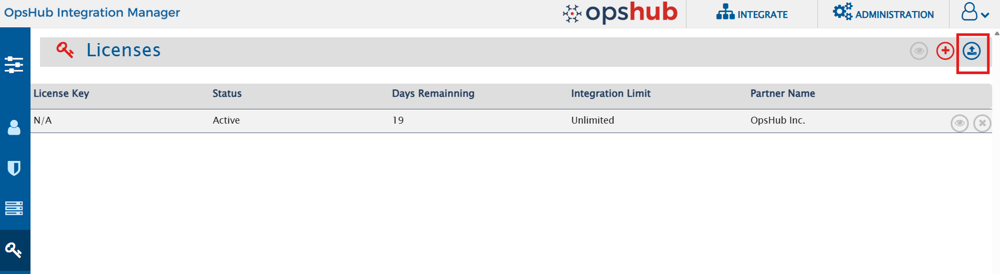
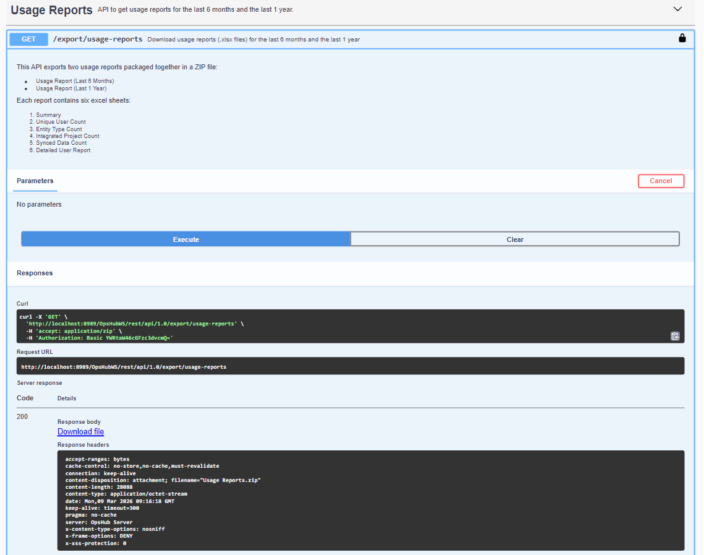
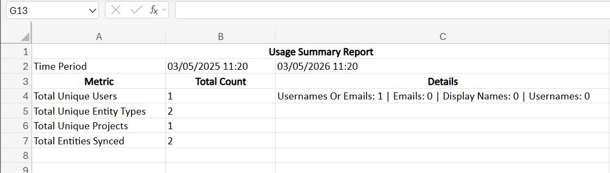
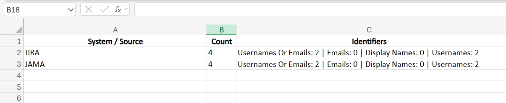
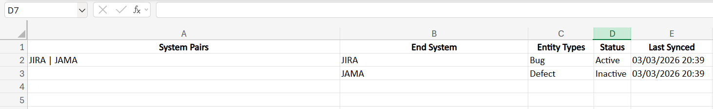
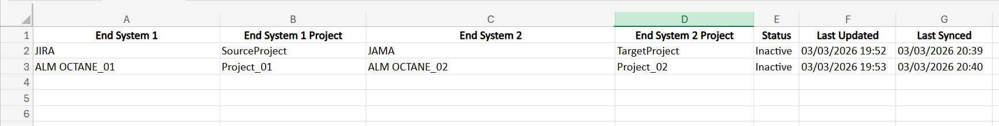
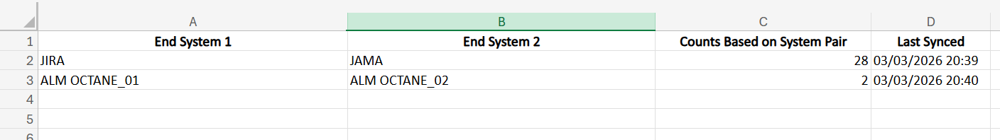
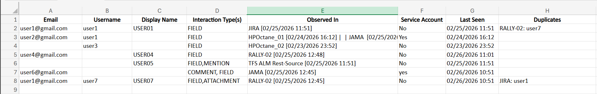

# Overview

The **Usage Reports** feature enables administrators to export detailed system usage data for analysis and licensing purposes. Reports can be downloaded directly from the **Licenses screen** or through the **Admin API**, providing a convenient and efficient way to access usage information.

The exported report is provided as a **Usage Reports.zip** file, which contains two Excel reports:

- **Usage Report (Last 6 Months)**
- **Usage Report (Last 1 Year)**

Each report includes both **summary and detailed insights** about activity across integrated systems. The reports provide information such as unique users, integrated projects, integrated entity types, synced data, and detailed information about processed users across systems.

User activity is captured across multiple interaction points, including mapped user fields, comments, attachments, user mentions, and updates. This helps provide a comprehensive view of system usage and user interactions across integrations.

These reports help administrators review usage patterns, monitor integration activity, and obtain the necessary insights for operational analysis and licensing purposes.

---

# Prerequisites

To access and download the reports, the user must:

- Have an **Administrator role**
- Have **Read permission for Server Management**

---

# Download Usage Reports 
## Using UI

Follow these steps to download the usage reports from the application:

1. Navigate to the **Licenses** screen.
2. Locate the **Export Usage Reports** button on the screen, as shown in the image below. The button is highlighted with a red rectangular box.
3. Click the **Export Usage Reports** button.
4. The **Usage Reports.zip** file will be downloaded to your browser’s default download location.
5. Extract the ZIP file to access the reports.

## Using Admin API

Administrators can also download the usage reports using the Admin API.

**Endpoint**
GET `/export/usage-reports`

**Response**

- Returns the **Usage Reports.zip** file.

---

# Contents of the Downloaded File

After extracting **Usage Reports.zip**, the following files will be available:

- `Usage Report (Last 6 Months).xlsx`
- `Usage Report (Last 1 Year).xlsx`

Each Excel report contains the following sheets:

1. `Summary`
2. `Unique User Count`
3. `Entity Type Count`
4. `Integrated Project Count`
5. `Synced Data Count`
6. `Detailed User Report`

## Summary Sheet

This sheet provides an overall summary of all the reports included in the Usage Reports. It gives a quick overview of key metrics, allowing administrators to quickly understand system usage and user activity.

### Example

### Explanation of Metrics

- **Total Unique Users** – Displays the total number of unique users observed across all systems, with a breakdown based on available identifiers such as emails, display names, and usernames.
- **Total Unique Entity Types** – Shows the total number of different entity types involved in synchronization across the systems.
- **Total Unique Projects** – Represents the total number of integrated projects observed during the selected period.
- **Total Entities Synced** – Counts all entities that were successfully synchronized between systems.

This summary sheet provides a **high-level overview of system usage**, allowing administrators to quickly assess usage from a single sheet instead of reviewing each detailed report individually.

---

## Unique User Count Sheet

Displays the total number of unique users identified across integrated systems, along with a system-wise breakdown.

### Explanation of Columns

- **System / Source** – The system where the users were detected.
- **Count** – Total number of unique users identified in the system.
- **Identifiers** – Breakdown of how users were identified, following a **priority order**:
    1. **Usernames or Emails** – Users matched using **username or email** when both fields are available. If either username or the local part of email (case-insensitive) matches an existing user, it is considered the same user. **This is the highest priority.**
    2. **Emails** – Users identified **by email only** when no match was found using username or username/email combination in the first step.
    3. **Display Names** – Users identified by display name if no email is available.
    4. **Usernames** – Users identified by username if both email and display name are empty.

This information helps administrators understand how user identities are detected and matched across different integrated systems.
### Example

---

## Entity Type Count Sheet

Displays the entity types involved in synchronization across system pairs during the selected period.

### Explanation of Columns

- **System Pairs** – The pair of systems involved in synchronization.
- **End System** – The system where the entity resides or is synced to.
- **Entity Types** – The types of entities synced between the systems.
- **Status** – The current status of the integration (Active or Inactive).
- **Last Synced** – The most recent timestamp when the entity was successfully synced.

---

## Integrated Project Count Sheet

Lists the unique project pairs that were involved in integrations during the selected timeframe, along with their status and last updated time.

### Explanation of Columns

- **End System 1 / End System 2** – The source and target systems involved in the integration.
- **End System 1 Project / End System 2 Project** – Source and target projects participating in the integration.
- **Status** – The current status of the integration (Active or Inactive).
- **Last Updated** – The timestamp when the integration was last updated.
- **Last Synced** – The timestamp when the last entity was successfully synced between the project pair.

This table provides a **clear view of project-level integrations**, helping administrators monitor integration activity and identify inactive or outdated integrations.

---

## Synced Data Count Sheet

Displays the total number of entities successfully synchronized between integrated system pairs.

### Explanation of Columns

- **End System 1 / End System 2** – The source and target systems between which entities are synchronized.
- **Counts Based on System Pair** – The total number of entities successfully synced between the two systems.
- **Last Synced** – The most recent timestamp when entities were fully synchronized.

---

## Detailed User Report Sheet

The **Detailed User Report** sheet provides comprehensive information about each observed user across integrated systems.

The report includes the following information:

- **Email** – User email address
- **Username** – Username of the user
- **Display Name** – Display name of the user
- **Interaction Types** – Areas where the user was detected (such as comment authors, attachment authors, mapped user fields, mentions in rich text fields, etc.)
- **Observed In** – Systems where the user was detected, along with timestamps
- **Service Account** – Indicates whether the user is used as a service account
- **Last Seen** – The last observed activity time of the user in the system
- **Duplicates** – Identifies users with matching email IDs but different usernames across systems

