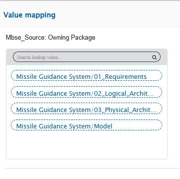
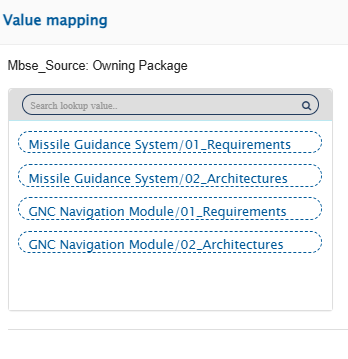

# Owning Package Configuration

## Overview
The Owning Package field is applicable to MBSE connectors. It enables users to explicitly define the target project and package where synchronized data will be written.
This field provides greater control over data placement by allowing users to override the project selected at the integration level.

## Behavior and Functionality

### Purpose

1. Displays a lookup of available Project Display Names / Package Qualified Names.

2. Allows users to specify the exact project and package where OIM should write the data.

3. Overrides the default project selected during integration configuration.

In other words, even if a project is selected at the integration level, the Owning Package selection determines the final destination for the synchronized artifact.

### Behavior at Mapping Level

1. When a specific project is selected at the mapping level:
   
    (a)The Owning Package field displays all available packages within the selected project.
   
    (b)Users can select the appropriate package where the data should reside.

   

    
    

2. When a workspace is selected as the project, the Owning Package field displays the complete hierarchical paths of:
       
    (a) All projects within the workspace
    
    (b) All packages under each project
    
    (c) This allows selection of any valid package across the entire workspace structure.

    

    
    
