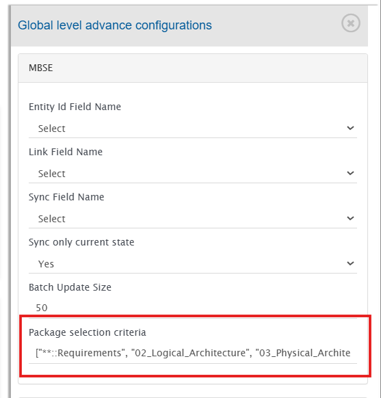

# Package Selection Criteria (MBSE)

For MBSE-based systems, OpsHub Integration Manager (OIM) provides a configurable option to control which model packages are included in synchronization.

The **Package Selection Criteria** setting enables users to define filters that determine which packages — and their nested elements — should be considered during integration. This helps optimize synchronization scope and ensures that only relevant parts of the model are processed.

---

## Overview

When configuring an MBSE integration, users can specify one or more package paths as selection criteria. OIM evaluates these criteria and includes all elements that belong to matching packages, including elements in nested (child) packages.

This feature is particularly useful for:

- Limiting synchronization to specific architectural layers (e.g., Requirements, Logical Architecture)
- Excluding non-relevant model areas
- Improving performance for large MBSE projects
- Structuring integrations by functional domains

---

## How It Works

- The input accepts a **list of package path strings**.
- Each entry represents a package selection pattern.
- Matching packages and all their nested elements are included in synchronization.
- Wildcards may be used to match multiple package levels.

---

## Configuration Steps

1. Navigate to **Configuration Integrations**.
2. Select the required integration to open the integration configuration page.
3. Click the **Global Configuration** icon.
4. In the **Global Level Advanced Configuration** section, locate **Package Selection Criteria** under the MBSE configuration.
5. Provide the selection criteria as a JSON list of strings.
6. Click **Save** to apply the configuration.

---

## Input Format

The value must be provided as a JSON array of strings.

### Example

```json
["**::Requirements", "02_Logical_Architecture", "03_Physical_Architecture"]
```

## Selection Rules

| Pattern | Behavior |
|----------|----------|
| `packageName` | Matches the specified package at the root level. |
| `parent::child` | Matches a specific nested package path. |
| `**::packageName` | Matches the package at any hierarchy level. |
| Multiple entries | All matching packages from all entries are included in synchronization. |

---

## Wildcard Usage

- `**` can be used to match packages at any hierarchy level.
- The `::` separator represents package hierarchy.

---

## Examples

| Criteria                      | Description                                                          |
|-------------------------------|----------------------------------------------------------------------|
| `["Requirements"]`            | Includes only the root-level **Requirements** package.               |
| `["**::Requirements"]`        | Includes all packages named **Requirements** at any hierarchy level. |
| `["System::Interfaces"]`      | Includes only the **Interfaces** package under **System**.           |
| `["02_Logical_Architecture"]` | Includes the complete **02_Logical_Architecture** package hierarchy. |

---

## Behavior Notes

- All elements within matching packages — including nested sub-packages — are selected.
- If no criteria are defined, default integration behavior applies.
- The configuration impacts only MBSE-based integrations.
- Package names are evaluated based on their qualified names in the model hierarchy.
- Integration level criteria configuration will be applied on filtered elements based on package selection criteria.

---

## Example Configuration Screen

<p align="center">
  
</p>

---

## Best Practices

- Define package criteria aligned with architectural layers (e.g., Requirements, Logical, Physical).
- Avoid overly broad wildcard usage for very large models unless necessary.
- Validate package names and hierarchy before saving configuration.
- Test synchronization after modifying selection criteria to confirm expected behavior.