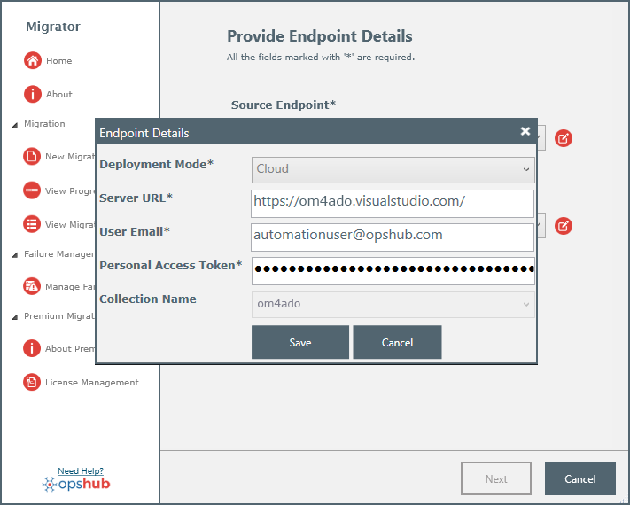
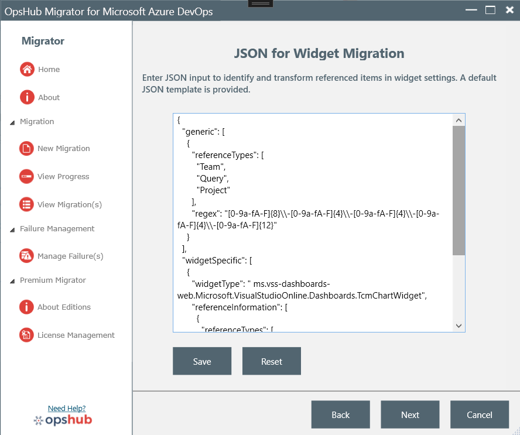
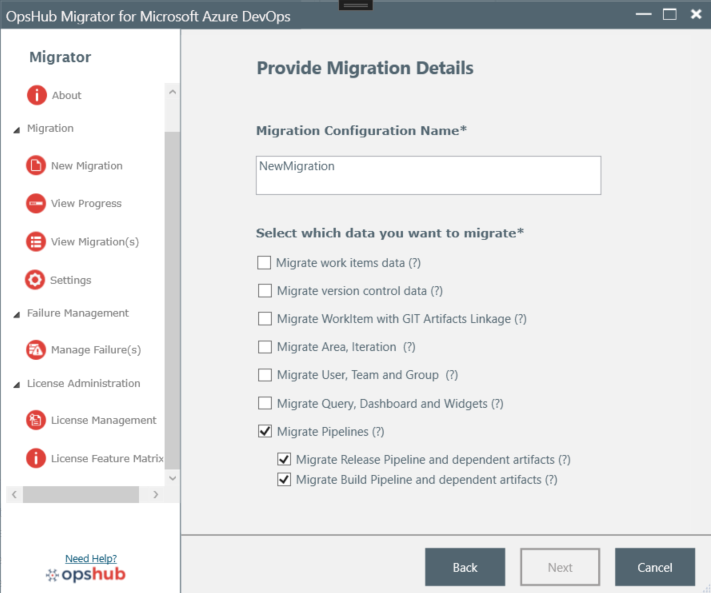
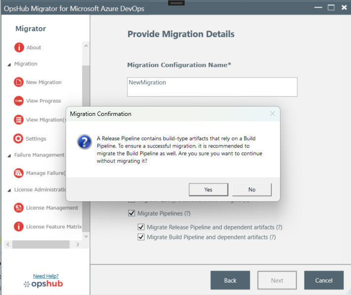

# Migration Configuration

This section explains how to configure and manage migrations using <code class="expression">space.vars.OM4ADO</code>.

---

## Create a New Migration

To create a migration:

1. Navigate to **Migration → New Migration** from the navigation panel.

<p align="center">
  
</p>

---

## Provide Endpoint Details

The first step in migration setup is selecting the **source** and **destination** endpoints.

### Source Endpoint

Select the source endpoint from the **Select Source Endpoint** dropdown.

### Destination Endpoint

Select the destination endpoint from the **Select Target Endpoint** dropdown.

If an endpoint is unavailable, select **Manage New Endpoints** to add a new **Team Foundation Server / Azure DevOps** instance.

---

## Manage Endpoint Details

To add a new endpoint:

1. Click **Manage New Endpoints** from either source or destination endpoint selection.

<p align="center">
  
</p>

### Cloud Deployment

If the deployment mode is **Cloud**:

1. Enter the required endpoint details.

<p align="center">
  
</p>

2. Click **Authenticate**.

After successful authentication:

- The connection details are validated.
- Collection name is automatically selected because cloud instances support only one collection.
- Click **Save** to store the endpoint.

<p align="center">
  
</p>

### On-Premises Deployment

If the deployment mode is **On-Premises**:

1. Enter the required server details.

<p align="center">
  
</p>

2. Click **Authenticate**.

After authentication:

- A list of accessible collections becomes available.
- Select the desired collection.
- Click **Save**.

<p align="center">
  
</p>

### Authentication Requirements for TFS (On-Premises)

#### Basic Authentication

When using **Basic Authentication**:

- For **TFS Server Version 2015 or later**, enable **Basic Authentication in IIS**.
- If disabled, authentication may fail with an **Unauthorized Access** error.

#### Personal Access Token (PAT)

When using **PAT Authentication**:

- Disable **Basic Authentication in IIS**.
- If Basic Authentication remains enabled, you may encounter authentication failures.

---

## Edit Endpoint Details

You can modify existing endpoint configurations.

To edit:

1. Select the endpoint from the dropdown.
2. Click **Edit**.
3. Update the required information.
4. Click **Save**.

<p align="center">
  
</p>

Once both endpoints are selected, the **Next** button becomes available.

<p align="center">
  
</p>

---

## Provide Migration Details

### Migration Configuration Name

A unique migration name is generated automatically in the following format:

```text
Team Foundation Server\Collection Name to Azure DevOps Endpoint
```

You may rename it if required.

### Select Migration Options

Choose the data you want to migrate.

#### Work Item Migration

- **Migrate Work Items Data**

#### Version Control Migration

- **Migrate Version Control Data**
- **Migrate Labels for Version Control Data**

#### Git Artifact Linkage

Enable **Migrate Work Item with Git Artifacts Linkage** to preserve:

- Git commits
- Git branches

This ensures artifact links remain associated with migrated work items.

##### Important Notes

- Import the source repository into the target repository first.
- Missing repositories or projects are skipped.
- Missing Git objects will be relinked during delta synchronization if later available.

#### Ultimate License Features

Available only in the **Ultimate Edition**:

- Area & Iteration Migration
- User, Team & Group Migration
- Query, Dashboard & Widget Migration
- Pipeline Migration

### Migration Sequence

Migration occurs in the following order:

1. Area, Iteration, Team, User, Group, Agent Pool, Service Connection
2. Work Items and Task Groups
3. Query, Dashboard & Widgets
4. Build Pipeline & Release Pipeline
5. Version Control

<p align="center">
  
</p>

---

## Migration Project(s)

All projects available in the source endpoint are displayed.

### Project Selection Guidelines

Before proceeding:

- Ensure the target project already exists.
- Ensure source and target projects use the **same process template**.

If mismatches are detected, <code class="expression">space.vars.OM4ADO</code> displays validation errors.

<p align="center">
  
</p>

---

## Provide Widget Transformation JSON

Widgets may reference:

- Queries
- Teams
- Projects

To correctly map these references, a **Widget Transformation JSON** is required.

The JSON specifies:

- Referenced object types
- API response locations
- Transformation rules

If no JSON is provided:

<code class="expression">space.vars.OM4ADO</code> automatically uses the default configuration.

> This is required only when **Migrate Other Entities** is selected.

<p align="center">
  
</p>

---

## Area and Iteration Migration

When **Migrate Area, Iteration, Team, User, Group** is enabled:

- Iteration and Area Paths are treated separately.
- Missing values are not created automatically.

### Enable Automatic Creation

Set:

```xml
<Area-space-Path checkAndCreate="true">
   <xsl:value-of xmlns:xsl="http://www.w3.org/1999/XSL/Transform"
   select="SourceXML/updatedFields/Property/Area-space-Path"/>
</Area-space-Path>
```

> Deleted Area or Iteration paths are synchronized using the project's base path.

---

## Version Control Migration

When **Migrate Version Control Data** is enabled:

A **TFVC Project Dependency** button becomes available.

### Why Dependency Analysis Matters

Dependency analysis helps:

- Maintain clean changeset history
- Identify related projects
- Avoid incomplete migrations

<p align="center">
  
</p>

### Analyze Dependencies

1. Click **TFVC Project Dependency**
2. Review dependency groups
3. Export results as CSV

<p align="center">
  
</p>

If no dependencies exist, a confirmation message is displayed.

---

## Pipeline Migration

By default:

- **Build Pipeline**
- **Release Pipeline**

are migrated simultaneously.

<p align="center">
  
</p>

If Build Pipeline migration is disabled:

<p align="center">
  
</p>

Disable it only when release pipelines do not depend on build artifacts.

Before migration:

The following dependencies are migrated first:

- Agent Pools
- Service Connections
- Variable Groups
- Task Groups

---

## User Mapping

All source users must be mapped.

Users are automatically mapped based on:

1. Email address
2. Display name

Remaining users can be mapped manually.

### Example

```text
Dipak Prajapati → Yash Mehta
```

Work items assigned to **Dipak Prajapati** in source will be assigned to **Yash Mehta** in target.

<p align="center">
  
</p>

---

## Migration Summary

### Step 1: Validation

The system validates:

- Endpoint details
- Project compatibility
- Customizations

Validation typically takes **4–5 minutes**.

<p align="center">
  
</p>

### Step 2: Resolve Errors

Fix any validation failures before proceeding.

<p align="center">
  
</p>

### Step 3: Configuration

After validation succeeds:

<code class="expression">space.vars.OM4ADO</code> prepares the migration environment.

<p align="center">
  
</p>

### Step 4: Start Migration

Choose whether to:

- Start immediately
- Start later

<p align="center">
  
</p>

---

## View Migration(s)

Navigate to:

**Migration → View Migration(s)**

This page shows:

- Migration name
- Status
- Running state

<p align="center">
  
</p>

---

## Migration Progress

Navigate to:

**Migration → View Progress**

You can view:

- Passed entities
- Failed entities
- Migration status

<p align="center">
  
</p>

You can also edit endpoint details directly from this page.

<p align="center">
  
</p>