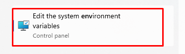
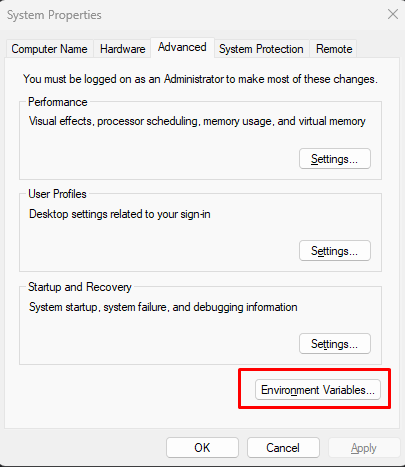
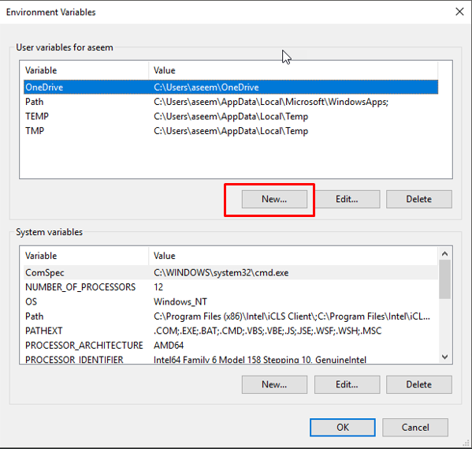
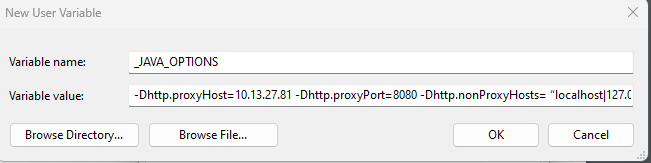

# Proxy Configuration

To start the <code class="expression">space.vars.OM4ADO</code> installer on a machine that is behind a proxy, perform the following steps before installation:

1. Open the Environment Variables configuration from:

    * **Start Menu** → **Control Panel** → **Advanced System Settings** → **Environment Variables**
    * Click **New** under **User Variables** for the current user.

<p align="center">
  
</p>

<p align="center">
  
</p>

<p align="center">
  
</p>

2. Create a new environment variable with the name `_JAVA_OPTIONS`.

<p align="center">
  
</p>

3. Set the variable value as shown below:

```text
-Dhttp.proxyHost=
-Dhttp.proxyPort=
-Dhttp.nonProxyHosts="localhost|127.0.0.1"
-Dhttp.proxyUser=
-Dhttp.proxyPassword=
-Dhttps=
```

4. Save all the changes.

## Example

```text
-Dhttp.proxyHost=proxy.example.com
-Dhttp.proxyPort=8080
-Dhttp.nonProxyHosts="localhost|127.0.0.1"
-Dhttp.proxyUser=username
-Dhttp.proxyPassword=password
-Dhttps=false
```

> **Note:** `-Dhttps=` is not mandatory if it is set to `false`. If omitted, the configuration will still work.

> **Note:** If the installation process has already started, restart both the installer and the service for the changes to take effect.

# Troubleshooting

If you are still unable to connect after performing these steps, verify the proxy credentials and restart the installer.