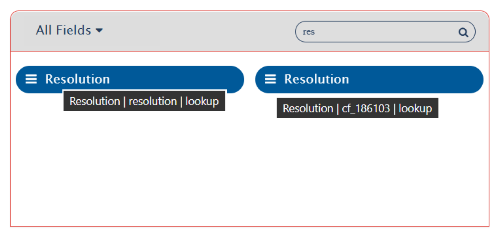

  

# New Version(s)
* Jira Data Center: 11.x

# Enhancement 

## Common
* Enhanced support for rule base routing.
  * Use case: When one source entity type needs to sync with different target entity types based on the value of a specific field, this can now be configured directly from the UI without requiring advanced scripting.
  * For more details, refer to [rule base routing](../integrate/rule-based-routing.md).
* Enhanced the UI behavior for identifying ambiguities when field names, entity types, project names, lookups, or link types share the same display name.
  * Added internal values for these items, allowing users to easily distinguish duplicates by hovering over the label.
  * For example:
  

  
  

* Enhanced performance where <code class="expression">space.vars.SITENAME</code> installed on the Microsoft SQL Server(MSSQL) that helps to reduce the high CPU usage.

## Jira Cloud
* Added support for synchronizing shared steps from Zephyr (formerly Zephyr Scale).
  * For guidance on integrating shared steps with other systems, see the Integration Combination Example: [Jira-Zephyr Shared Step Configuration](../knowledge-resources/integration-combination-examples/Jira-zephyr-shared-step-configuration.md)

# Major Bugs

## Common
* Resolved an issue where the license expiry warning did not appear as expected when the system contained both expired licenses and at least one active license that was within the warning period.
* Resolved an issue where loading integration details, mapping lists, and failure lists took longer than expected to display data.  
* Resolved an issue where a global failure occurred while retrieving comments from a deleted source entity.
  * Use case: 
    * If an item of type A was previously synced to the target and later converted to type B, <code class="expression">space.vars.SITENAME</code>are used to retrieve comments from the original entity so that no data is lost when creating the corresponding new entity in the target.
    * If a processing failure occurred during this process and the item was subsequently deleted in the source system, a global failure would occur when the system attempted to re-fetch comments from the now-deleted source item.

## Gerrit
* Resolved an issue that caused a global failure when an inactive user with an empty username was encountered. The user’s email address was used to create another user, resulting in multiple matches and an error due to the empty username.

## IBM Engineering Workflow Management
* Resolved an issue where a processing failure occurred with the error message “com.opshub.exceptions.eai.OIMRunTimeException: java.lang.NumberFormatException: Character is neither a decimal digit number, decimal point, nor ‘e’ notation exponential mark. Failed to execute method OIMCoreUtility::getEntityRevisions.”
  * The issue was caused by an extra space before a numeric field in the revision, which led to a conversion error.

  

  

  
